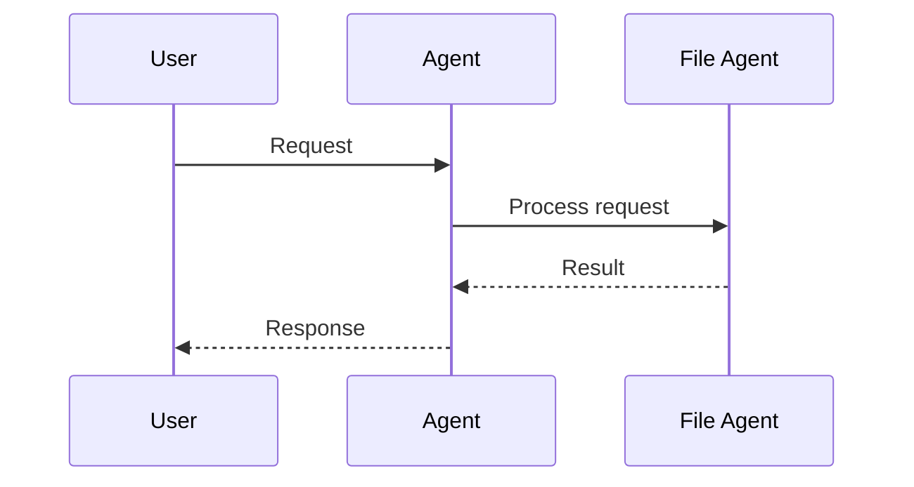

```python
from praisonaiagents import Agent
from praisonaiagents import read_file, write_file, list_files

agent = Agent(
    name="File Assistant",
    instructions="Read, write, and organise files safely.",
    tools=[read_file, write_file, list_files],
)
agent.start("List files in ./src and summarise README.md")
```

The user describes a file task; the agent uses file tools to read paths and return a concise answer.
<Note>
  **Prerequisites**
  - Python 3.10 or higher
  - PraisonAI Agents package installed
  - Basic understanding of file operations
</Note>





## File Tools

Use File Tools to perform file system operations with AI agents.

<Steps>
  <Step title="Install Dependencies">
    First, install the required package:
    ```bash
    pip install praisonaiagents
    ```
  </Step>

  <Step title="Import Components">
    Import the necessary components:
    ```python
    from praisonaiagents import Agent, Task, AgentTeam
    from praisonaiagents import read_file, write_file, list_files, get_file_info, copy_file, move_file, delete_file
    ```
  </Step>

  <Step title="Create Agent">
    Create a file management agent:
    ```python
    file_agent = Agent(
        name="FileManager",
        role="File System Specialist",
        goal="Manage files and directories efficiently.",
        backstory="Expert in file system operations and organization.",
        tools=[read_file, write_file, list_files, get_file_info, copy_file, move_file, delete_file],
        reflection=False
    )
    ```
  </Step>

  <Step title="Define Task">
    Define the file management task:
    ```python
    file_task = Task(
        description="Organize files in the downloads directory by file type.",
        expected_output="Organized directory structure with categorized files.",
        agent=file_agent,
        name="organize_files"
    )
    ```
  </Step>

  <Step title="Run Agent">
    Initialize and run the agent:
    ```python
    agents = AgentTeam(
        agents=[file_agent],
        tasks=[file_task],
        process="sequential"
    )
    agents.start()
    ```
  </Step>
</Steps>

## Understanding File Tools

<Card title="What are File Tools?" icon="question">
  File Tools provide file system management capabilities for AI agents:
  - File operations (read, write, copy, move)
  - Directory management
  - File information retrieval
  - File organization
  - Path manipulation
</Card>

## Key Components

<CardGroup cols={2}>
  <Card title="File Agent" icon="user-robot">
    Create specialized file agents:
    ```python
    Agent(tools=[read_file, write_file, list_files, get_file_info, copy_file, move_file, delete_file])
    ```
  </Card>
  <Card title="File Task" icon="list-check">
    Define file tasks:
    ```python
    Task(description="file_operation")
    ```
  </Card>
  <Card title="Process Types" icon="arrows-split-up-and-left">
    Sequential or parallel processing:
    ```python
    process="sequential"
    ```
  </Card>
  <Card title="File Options" icon="sliders">
    Customize file operations:
    ```python
    recursive=True, overwrite=False
    ```
  </Card>
</CardGroup>

## Available Functions

```python
from praisonaiagents import read_file
from praisonaiagents import write_file
from praisonaiagents import list_files
from praisonaiagents import get_file_info
from praisonaiagents import copy_file
from praisonaiagents import move_file
from praisonaiagents import delete_file
```

## Function Details

### read_file(filepath, encoding='utf-8', offset=None, limit=None, line_numbers=True, max_line_chars=2000)

Reads a windowed, line-numbered view of a file so a coding agent can reference exact lines for follow-up edits.

| Argument | Type | Default | Description |
|---|---|---|---|
| `filepath` | `str` | — | Path to the file. |
| `encoding` | `str` | `'utf-8'` | File encoding. |
| `offset` | `int \| None` | `None` (start of file) | 1-based first line to read. |
| `limit` | `int \| None` | `None` (up to 2000 lines) | Maximum lines to read. Negative → empty window. |
| `line_numbers` | `bool` | `True` | Prefix each line with its 1-based number. Set `False` (with no `offset`/`limit`) for exact raw content. |
| `max_line_chars` | `int` | `2000` | Truncate any single line longer than this with `"... (line truncated)"`. Negative disables. |

Default output is line-numbered with a right-aligned gutter (width = `max(len(str(last_line)), 6)`, tab-separated):

```
    42	const x = ...
```

When the window doesn't reach the end of the file, a paging hint is appended so the agent knows where to continue:

```
... (showing lines 1-2000 of 4573; call again with offset=2001 for more)
```

```python
# Default — line-numbered output
content = read_file("example.txt")

# With specific encoding
content = read_file("data.txt", encoding="latin-1")

# Page a large file — first page; paging hint shows where to continue
page1 = read_file("app.py", offset=1, limit=2000)

# Continue where the hint pointed
page2 = read_file("app.py", offset=2001, limit=2000)

# Restore pre-2527 raw output (no gutter, no windowing)
raw = read_file("small.txt", line_numbers=False)

# Returns: str
# Error case: Returns error message as string
```

<Note>
  **Backwards compatibility:** `read_file(path, line_numbers=False)` (with no `offset` or `limit`) returns the exact plain-string content identical to pre-2527 behaviour — useful when downstream code depends on the raw string shape.
</Note>

### write_file(filepath: str, content: str, encoding: str = 'utf-8')

Writes content to a file:
- Creates directories if they don't exist
- Supports different encodings
- Overwrites existing files

```python
# Basic usage
success = write_file("output.txt", "Hello World")

# With specific encoding and nested path
success = write_file(
    "path/to/data/output.txt",
    "Content with special chars: áéíóú",
    encoding="utf-8"
)
# Returns: bool (True if successful)
```

### list_files(directory: str, pattern: Optional[str] = None)

Lists files in a directory:
- Optional pattern matching
- Detailed file information
- Recursive directory support

```python
# List all files
files = list_files("/path/to/directory")

# With pattern matching
files = list_files("/path/to/directory", pattern="*.txt")

# Returns: List[Dict[str, Union[str, int]]]
# Example: [
#   {
#     'name': 'example.txt',
#     'path': '/path/to/directory/example.txt',
#     'size': 1024,
#     'modified': 1609459200.0,
#     'created': 1609459100.0
#   },
#   ...
# ]
```

### get_file_info(filepath: str)

Gets detailed information about a file:
- File metadata
- Size and timestamps
- Type information
- Path details

```python
# Get file information
info = get_file_info("example.txt")

# Returns: Dict[str, Union[str, int]]
# Example: {
#   'name': 'example.txt',
#   'path': '/absolute/path/to/example.txt',
#   'size': 1024,
#   'modified': 1609459200.0,
#   'created': 1609459100.0,
#   'is_file': True,
#   'is_dir': False,
#   'extension': '.txt',
#   'parent': '/absolute/path/to'
# }
```

### copy_file(src: str, dst: str)

Copies a file with metadata:
- Preserves timestamps
- Creates destination directories
- Handles existing files

```python
# Basic copy
success = copy_file("source.txt", "destination.txt")

# Copy to new directory
success = copy_file(
    "data.txt",
    "backup/2023/data_backup.txt"
)
# Returns: bool (True if successful)
```

### move_file(src: str, dst: str)

Moves or renames a file:
- Creates destination directories
- Handles existing files
- Cross-device moves

```python
# Move file
success = move_file("old/path/file.txt", "new/path/file.txt")

# Rename file
success = move_file(
    "document.txt",
    "document_v2.txt"
)
# Returns: bool (True if successful)
```

### delete_file(filepath: str)

Deletes a file:
- Safe deletion
- Error handling
- Non-recursive (files only)

```python
# Delete file
success = delete_file("unwanted.txt")
# Returns: bool (True if successful)
```

## Example Agent Configuration

```python
from praisonaiagents import Agent
from praisonaiagents import (
    read_file, write_file, list_files,
    get_file_info, copy_file, move_file, delete_file
)

agent = Agent(
    name="FileManager",
    description="An agent that manages files",
    tools=[
        read_file, write_file, list_files,
        get_file_info, copy_file, move_file, delete_file
    ]
)
```

## Error Handling

All functions include comprehensive error handling:
- File not found errors
- Permission errors
- Path errors
- I/O errors
- Encoding errors

Errors are handled consistently:
- File operations return bool for success/failure
- Information functions return error details in result
- All errors are logged for debugging

## Common Use Cases

1. File Organization:
```python
# List and organize files by extension
files = list_files("downloads", pattern="*.*")
for file in files:
    ext = file['extension']
    if ext:
        dst = f"organized/{ext[1:]}/{file['name']}"
        move_file(file['path'], dst)
```

2. File Backup:
```python
# Create timestamped backups
import time
files = list_files("important_data")
backup_time = time.strftime("%Y%m%d_%H%M%S")
for file in files:
    dst = f"backup/{backup_time}/{file['name']}"
    copy_file(file['path'], dst)
```

3. File Processing:
```python
# Read, process, and write files (use line_numbers=False for plain-string input)
content = read_file("input.txt", line_numbers=False)
processed = process_content(content)  # Your processing function
write_file("output.txt", processed)
```

## Examples

### Basic File Management Agent

```python
from praisonaiagents import Agent, Task, AgentTeam
from praisonaiagents import read_file, write_file, list_files, get_file_info

# Create file management agent
file_agent = Agent(
    name="FileExpert",
    role="File Manager",
    goal="Process and organize files efficiently.",
    backstory="Expert in file system operations and organization.",
    tools=[read_file, write_file, list_files, get_file_info],
    reflection=False
)

# Define file task
file_task = Task(
    description="Organize and process documents.",
    expected_output="Organized file structure.",
    agent=file_agent,
    name="file_organization"
)

# Run agent
agents = AgentTeam(
    agents=[file_agent],
    tasks=[file_task],
    process="sequential"
)
agents.start()
```

### Advanced File Operations with Multiple Agents

```python
# Create file IO agent
io_agent = Agent(
    name="FileIO",
    role="File IO Specialist",
    goal="Handle file read/write operations efficiently.",
    tools=[read_file, write_file],
    reflection=False
)

# Create file management agent
management_agent = Agent(
    name="FileManager",
    role="File Management Specialist",
    goal="Handle file organization and movement.",
    tools=[list_files, get_file_info, copy_file, move_file, delete_file],
    reflection=False
)

# Define tasks
io_task = Task(
    description="Read and write files.",
    expected_output="File operations completed successfully.",
    agent=io_agent,
    name="file_io"
)

management_task = Task(
    description="Organize and move files.",
    expected_output="File management completed successfully.",
    agent=management_agent,
    name="file_management"
)

# Run agents
agents = AgentTeam(
    agents=[io_agent, management_agent],
    tasks=[io_task, management_task],
    process="sequential"
)
agents.start()
```

## Best Practices

<AccordionGroup>
  <Accordion title="Agent Configuration">
    Configure agents with clear file management focus:
    ```python
    Agent(
        name="FileManager",
        role="File System Specialist",
        goal="Manage files efficiently and safely",
        tools=[read_file, write_file, list_files, get_file_info, copy_file, move_file, delete_file]
    )
    ```
  </Accordion>

  <Accordion title="Task Definition">
    Define specific file operations:
    ```python
    Task(
        description="Clean up downloads folder and organize by file type",
        expected_output="Organized directory structure"
    )
    ```
  </Accordion>
</AccordionGroup>

## Common Patterns

### File Organization Pipeline
```python
# Organization agent
organizer = Agent(
    name="Organizer",
    role="File Organizer",
    tools=[read_file, write_file, list_files, get_file_info, copy_file, move_file, delete_file]
)

# Cleanup agent
cleaner = Agent(
    name="Cleaner",
    role="File Cleaner"
)

# Define tasks
organize_task = Task(
    description="Organize files by type",
    agent=organizer
)

cleanup_task = Task(
    description="Remove temporary files",
    agent=cleaner
)

# Run workflow
agents = AgentTeam(
    agents=[organizer, cleaner],
    tasks=[organize_task, cleanup_task]
)

## Related

<CardGroup cols={2}>
  <Card title="Custom Tools" icon="wrench" href="/docs/tools/custom">
    Build your own agent tools
  </Card>
  <Card title="Tools Overview" icon="toolbox" href="/docs/tools/tools">
    Browse PraisonAI tool documentation
  </Card>
</CardGroup>
