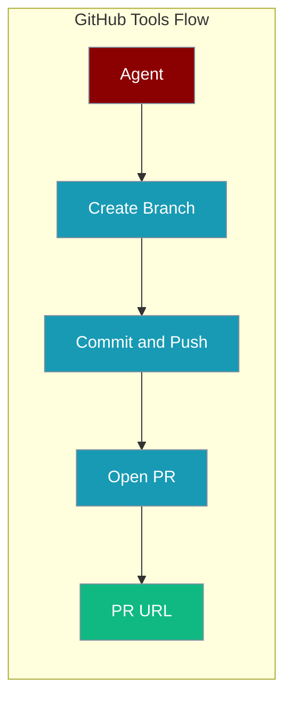
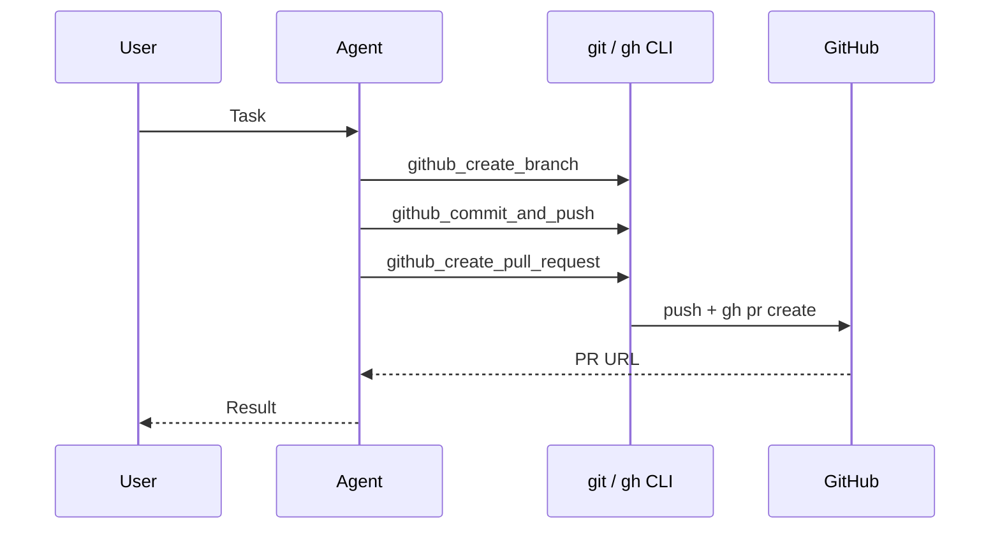

GitHub tools wrap local **git** and the **GitHub CLI (`gh`)** so agents can branch, commit, push, and open pull requests from a repo checkout.

```python
from praisonaiagents import Agent
from praisonaiagents.tools import (
    github_create_branch,
    github_commit_and_push,
    github_create_pull_request,
)

agent = Agent(
    name="GitHub Release Agent",
    instructions="Create a branch, commit staged work, and open a pull request.",
    tools=[github_create_branch, github_commit_and_push, github_create_pull_request],
)

agent.start(
    "Create branch 'feature/auth', commit with message 'Add JWT auth', "
    "then open a PR titled 'Add user authentication feature' targeting main."
)
```



<Note>
**Prerequisites:** **git** installed with the working directory inside a repository (`github_create_branch`, `github_commit_and_push`); **`origin` remote** configured for push; **`gh` CLI** installed and authenticated via `gh auth login` (`github_create_pull_request`).
</Note>

## Quick Start

<Steps>
<Step title="Import tools">
```python
from praisonaiagents import Agent
from praisonaiagents.tools import (
    github_create_branch,
    github_commit_and_push,
    github_create_pull_request,
)
```
</Step>

<Step title="Attach to an agent">
```python
agent = Agent(
    name="GitHub Agent",
    tools=[github_create_branch, github_commit_and_push, github_create_pull_request],
)
```
</Step>
</Steps>

## How It Works



## Tools

### `github_create_branch(branch_name: str) -> str`

Creates and checks out a new branch (`git checkout -B`).

| Parameter | Type | Description |
|-----------|------|-------------|
| `branch_name` | `str` | Branch to create and check out |

Returns a success message or an error string.

### `github_commit_and_push(commit_message: str) -> str`

Stages all changes, commits, and pushes to `origin` on the current branch.

| Parameter | Type | Description |
|-----------|------|-------------|
| `commit_message` | `str` | Commit message |

Returns a success message, `"No changes to commit."`, or an error string.

### `github_create_pull_request(title, body, head_branch, base_branch="main") -> str`

Creates a pull request via `gh pr create`.

| Parameter | Type | Default | Description |
|-----------|------|---------|-------------|
| `title` | `str` | — | PR title in the GitHub UI — descriptive and concise |
| `body` | `str` | — | PR description (markdown, issue refs such as `#123`) |
| `head_branch` | `str` | — | Source branch with your changes |
| `base_branch` | `str` | `"main"` | Target branch (`main`, `master`, `develop`, …) |

```python
github_create_pull_request(
    title="Add user authentication feature",
    body="Implements secure login with JWT tokens\n\nFixes #123",
    head_branch="feature/auth",
    base_branch="main",
)
# -> 'Successfully created Pull Request:\nhttps://github.com/user/repo/pull/456'
```

Returns a success message with the PR URL, or an error if `gh` is missing or unauthenticated.

## Common patterns

<Tabs>
<Tab title="Full PR flow">
```python
github_create_branch("feature/docs-update")
github_commit_and_push("docs: update README")
github_create_pull_request(
    title="Update README",
    body="Clarifies setup steps.",
    head_branch="feature/docs-update",
)
```
</Tab>

<Tab title="Non-main base">
```python
github_create_pull_request(
    title="Hotfix for release branch",
    body="Patch login timeout.",
    head_branch="hotfix/login",
    base_branch="release/2.1",
)
```
</Tab>

<Tab title="PR only">
```python
# After you have already pushed head_branch
github_create_pull_request(
    title="Fix login validation bug",
    body="Validates email before sign-in.",
    head_branch="fix/login-validation",
)
```
</Tab>
</Tabs>

## Best practices

<AccordionGroup>
<Accordion title="Authenticate gh once">
Run `gh auth login` before agents call `github_create_pull_request`. The tool checks `gh auth status` first.
</Accordion>

<Accordion title="Keep commits scoped">
`github_commit_and_push` stages **all** changes (`git add .`). Review the working tree before the agent commits.
</Accordion>

<Accordion title="Write descriptive PR bodies">
Include what changed, why, and linked issues — the `body` field supports markdown.
</Accordion>

<Accordion title="Handle missing CLI gracefully">
Tools return error strings rather than raising — check return values in hooks if you need hard failures.
</Accordion>
</AccordionGroup>

## Related

<CardGroup cols={2}>
  <Card title="Linear Bot" icon="robot" href="/features/linear-bot">
    Example workflow using GitHub tools
  </Card>
  <Card title="Shell Tools" icon="terminal" href="/tools/shell_tools">
    Similar CLI-wrapping tools
  </Card>
</CardGroup>
