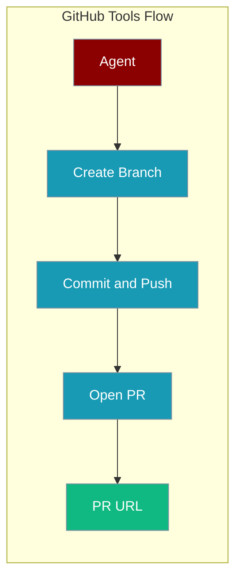
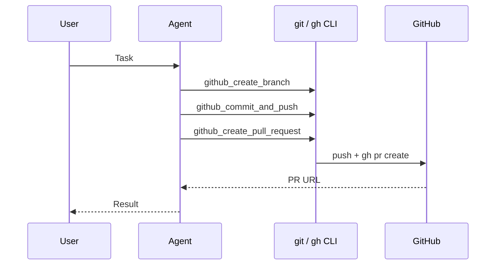
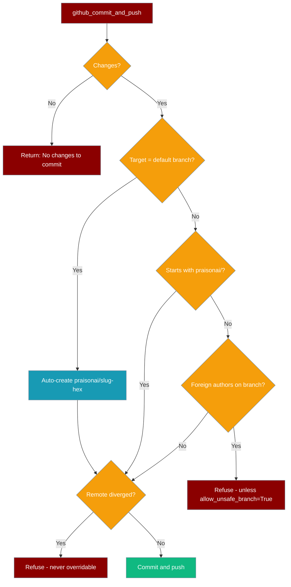

GitHub tools wrap local **git** and the **GitHub CLI (`gh`)** so agents can branch, commit, push, and open pull requests from a repo checkout.

```python
from praisonaiagents import Agent
from praisonaiagents.tools import (
    github_create_branch,
    github_commit_and_push,
    github_create_pull_request,
)

agent = Agent(
    name="GitHub Release Agent",
    instructions="Create a branch, commit staged work, and open a pull request.",
    tools=[github_create_branch, github_commit_and_push, github_create_pull_request],
)

agent.start(
    "Create branch 'feature/auth', commit with message 'Add JWT auth', "
    "then open a PR titled 'Add user authentication feature' targeting main."
)
```

The user describes a git workflow; the agent runs GitHub tools to branch, commit, push, and open a pull request.


```mermaid
graph LR
    subgraph "GitHub Tools Flow"
        A[Agent] --> B[Create Branch]
        B --> C[Commit and Push]
        C --> D[Open PR]
        D --> E[PR URL]
    end

    classDef agent fill:#8B0000,stroke:#7C90A0,color:#fff
    classDef action fill:#189AB4,stroke:#7C90A0,color:#fff
    classDef result fill:#10B981,stroke:#7C90A0,color:#fff

    class A agent
    class B,C,D action
    class E result
    classDef tool fill:#189AB4,color:#fff
    classDef agent fill:#8B0000,color:#fff
```

<Note>
**Prerequisites:** **git** installed with the working directory inside a repository (`github_create_branch`, `github_commit_and_push`); **`origin` remote** configured for push; **`gh` CLI** installed and authenticated via `gh auth login` (`github_create_pull_request`). `user.email` should match the identity you expect to author commits — the foreign-author guard reads `git config user.email`.
</Note>

## Quick Start

<Steps>
<Step title="Simple Usage">
```python
from praisonaiagents import Agent
from praisonaiagents.tools import (
    github_create_branch,
    github_commit_and_push,
    github_create_pull_request,
)
```
</Step>

<Step title="With Configuration">
```python
agent = Agent(
    name="GitHub Agent",
    tools=[github_create_branch, github_commit_and_push, github_create_pull_request],
)
```
</Step>
</Steps>

## How It Works


```mermaid
sequenceDiagram
    participant User
    participant Agent
    participant Git as git / gh CLI
    participant GitHub

    User->>Agent: Task
    Agent->>Git: github_create_branch
    Agent->>Git: github_commit_and_push
    Agent->>Git: github_create_pull_request
    Git->>GitHub: push + gh pr create
    GitHub-->>Agent: PR URL
    Agent-->>User: Result
```

You don't have to think about branch safety — the tool quietly does the right thing.

> **User:** "Commit and push what I have."
> **Agent:** *(tool auto-creates `praisonai/fix-login-a1b2c3`, pushes there, and reports the branch name back)*

## Tools

### `github_create_branch(branch_name: str) -> str`

Creates and checks out a new branch (`git checkout -B`).

| Parameter | Type | Description |
|-----------|------|-------------|
| `branch_name` | `str` | Branch to create and check out |

Returns a success message or an error string.

### `github_commit_and_push(commit_message, branch=None, allow_unsafe_branch=False) -> str`

Stages all changes, commits, and pushes to `origin` — with branch-safety guardrails that refuse unsafe pushes and never force-push.

| Parameter | Type | Default | Description |
|-----------|------|---------|-------------|
| `commit_message` | `str` | — | Commit message |
| `branch` | `Optional[str]` | `None` | Target branch. Defaults to the current branch. |
| `allow_unsafe_branch` | `bool` | `False` | Opt-in override for default-branch and foreign-author refusals. Divergence is never overridable. |

Returns a success message, `"No changes to commit."`, or an error string.

#### Branch-safety rules

The tool checks these rules before committing, so a refusal leaves your changes intact.

1. **Agent branches are always allowed.** Any branch whose name starts with `praisonai/` skips the default and foreign-author checks.
2. **The default branch is never pushed directly.** On `main` (or when `branch="main"`), the tool creates a fresh `praisonai/{slug}-{6hex}` branch from HEAD and pushes there instead.
3. **Foreign commits are refused.** If the target branch carries commits authored by someone other than your `git config user.email`, the push stops.
4. **Divergence is refused, never forced.** If the remote branch is not an ancestor of HEAD, the push stops — this is never overridable.
5. **Override with care.** `allow_unsafe_branch=True` (or env `PRAISONAI_GIT_ALLOW_UNSAFE_BRANCH=true`) bypasses rules 2 and 3, but never rule 4.

```python
from praisonaiagents.tools import github_commit_and_push

# On main: direct push refused, tool creates and pushes an agent branch.
github_commit_and_push("docs: clarify setup steps")
# -> "Successfully committed and pushed changes to new agent branch
#     'praisonai/docs-clarify-setup-steps-a1b2c3' (refused direct push
#     to default branch 'main')"
```


```mermaid
graph TB
    Start[github_commit_and_push] --> HasChanges{Changes?}
    HasChanges -->|No| Noop[Return: No changes to commit]
    HasChanges -->|Yes| IsDefault{Target = default branch?}
    IsDefault -->|Yes| AutoBranch[Auto-create praisonai/slug-hex]
    IsDefault -->|No| IsAgent{Starts with praisonai/?}
    AutoBranch --> DivCheck
    IsAgent -->|Yes| DivCheck{Remote diverged?}
    IsAgent -->|No| ForeignCheck{Foreign authors on branch?}
    ForeignCheck -->|Yes| Refuse1[Refuse - unless allow_unsafe_branch=True]
    ForeignCheck -->|No| DivCheck
    DivCheck -->|Yes| Refuse2[Refuse - never overridable]
    DivCheck -->|No| Push[Commit and push]

    classDef start fill:#8B0000,stroke:#7C90A0,color:#fff
    classDef check fill:#F59E0B,stroke:#7C90A0,color:#fff
    classDef action fill:#189AB4,stroke:#7C90A0,color:#fff
    classDef refuse fill:#8B0000,stroke:#7C90A0,color:#fff
    classDef ok fill:#10B981,stroke:#7C90A0,color:#fff

    class Start start
    class HasChanges,IsDefault,IsAgent,ForeignCheck,DivCheck check
    class AutoBranch action
    class Refuse1,Refuse2,Noop refuse
    class Push ok
```

### `github_create_pull_request(title, body, head_branch, base_branch="main") -> str`

Creates a pull request via `gh pr create`.

| Parameter | Type | Default | Description |
|-----------|------|---------|-------------|
| `title` | `str` | — | PR title in the GitHub UI — descriptive and concise |
| `body` | `str` | — | PR description (markdown, issue refs such as `#123`) |
| `head_branch` | `str` | — | Source branch with your changes |
| `base_branch` | `str` | `"main"` | Target branch (`main`, `master`, `develop`, …) |

```python
github_create_pull_request(
    title="Add user authentication feature",
    body="Implements secure login with JWT tokens\n\nFixes #123",
    head_branch="feature/auth",
    base_branch="main",
)
# -> 'Successfully created Pull Request:\nhttps://github.com/user/repo/pull/456'
```

Returns a success message with the PR URL, or an error if `gh` is missing or unauthenticated.

## Common patterns

<Tabs>
<Tab title="Auto-branch (safest)">
```python
from praisonaiagents.tools import github_commit_and_push

# Agent is on main; direct push refused, tool creates praisonai/<slug>-<hex>.
github_commit_and_push("docs: clarify setup steps")
# -> "Successfully committed and pushed changes to new agent branch
#     'praisonai/docs-clarify-setup-steps-a1b2c3' (refused direct push
#     to default branch 'main')"

# Explicit target — same auto-branch behaviour if it is the default.
github_commit_and_push("fix parser", branch="main")

# Opt in to push a non-default, non-agent branch you own.
github_commit_and_push(
    "release notes",
    branch="release/v2",
    allow_unsafe_branch=True,
)
```
</Tab>

<Tab title="Full PR flow">
```python
github_create_branch("praisonai/docs-update")
github_commit_and_push("docs: update README")
github_create_pull_request(
    title="Update README",
    body="Clarifies setup steps.",
    head_branch="praisonai/docs-update",
)
```

Any branch name starting with `praisonai/` skips the default and foreign-author refusals.
</Tab>

<Tab title="Non-main base">
```python
github_create_pull_request(
    title="Hotfix for release branch",
    body="Patch login timeout.",
    head_branch="hotfix/login",
    base_branch="release/2.1",
)
```
</Tab>

<Tab title="PR only">
```python
# After you have already pushed head_branch
github_create_pull_request(
    title="Fix login validation bug",
    body="Validates email before sign-in.",
    head_branch="fix/login-validation",
)
```
</Tab>
</Tabs>

## Best practices

<AccordionGroup>
<Accordion title="Authenticate gh once">
Run `gh auth login` before agents call `github_create_pull_request`. The tool checks `gh auth status` first.
</Accordion>

<Accordion title="Keep commits scoped">
`github_commit_and_push` stages **all** changes (`git add .`), so review the working tree for a tidy commit. An over-broad `git add .` no longer risks an over-broad push to `main` — the tool refuses unsafe pushes before committing.
</Accordion>

<Accordion title="Prefer the auto-branch flow">
Leaving `branch=None` while on the default branch is the safest, one-line way to ship a change. The tool picks a `praisonai/…` name, pushes there, and reports the name in its return string.
</Accordion>

<Accordion title="When to set allow_unsafe_branch">
Only for a branch you own (e.g. `release/v2`) that carries commits by someone other than the current committer — never for the default branch as a habit. Set env `PRAISONAI_GIT_ALLOW_UNSAFE_BRANCH=true` for CI. Divergence (force-push) is never allowed regardless.
</Accordion>

<Accordion title="Write descriptive PR bodies">
Include what changed, why, and linked issues — the `body` field supports markdown.
</Accordion>

<Accordion title="Handle missing CLI gracefully">
Tools return error strings rather than raising — check return values in hooks if you need hard failures.
</Accordion>
</AccordionGroup>

## Related

<CardGroup cols={2}>
  <Card title="Linear Bot" icon="robot" href="/features/linear-bot">
    Example workflow using GitHub tools
  </Card>
  <Card title="Shell Tools" icon="terminal" href="/tools/shell_tools">
    Similar CLI-wrapping tools
  </Card>
</CardGroup>
