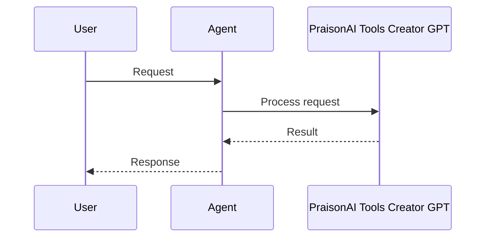

```python
from praisonaiagents import Agent, tool

@tool
def hello(name: str) -> str:
    """Greet someone by name."""
    return f"Hello, {name}!"

agent = Agent(name="Demo", tools=[hello])
agent.start("Say hello to Alex using the hello tool")
```

The user prototypes a custom tool with the Tools Creator GPT, then runs it through a PraisonAI agent.





# PraisonAI Tools Creator GPT

Use [PraisonAI Tools Creator GPT](https://chatgpt.com/g/g-LrJH1K6Ao-praisonai-tools-creator) to get started quickly.


## Quick Start

<Steps>
<Step title="Set API key">
```bash
export OPENAI_API_KEY=your_openai_api_key
```
</Step>
<Step title="Create an agent">
```python
from praisonaiagents import Agent

agent = Agent(
    name="GPTAgent",
    instructions="Answer questions accurately and concisely.",
    llm="gpt-4o",
)

agent.start("Explain quantum entanglement in simple terms")
```
</Step>
</Steps>


## Best Practices

<AccordionGroup>
  <Accordion title="Use GPT-4o for complex reasoning">
    GPT-4o handles multi-step reasoning and tool use better than smaller models.
  </Accordion>
  <Accordion title="Set temperature appropriately">
    Use lower temperature (0.1-0.3) for factual tasks and higher (0.7-0.9) for creative tasks.
  </Accordion>
  <Accordion title="Use structured outputs for predictable responses">
    Enable JSON mode when you need parseable, structured output from the agent.
  </Accordion>
  <Accordion title="Use GPT-4o-mini for simpler subtasks">
    Route simpler subtasks to GPT-4o-mini to reduce costs while keeping quality high.
  </Accordion>
</AccordionGroup>


## Related

<CardGroup cols={2}>
  <Card title="Custom Tools" icon="wrench" href="/docs/tools/custom">
    Build your own agent tools
  </Card>
  <Card title="Tools Overview" icon="toolbox" href="/docs/tools/tools">
    Browse PraisonAI tool documentation
  </Card>
</CardGroup>
