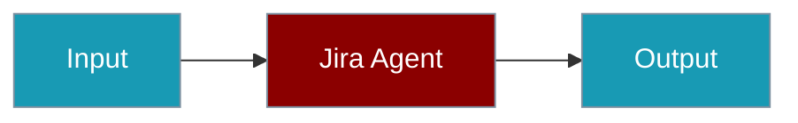
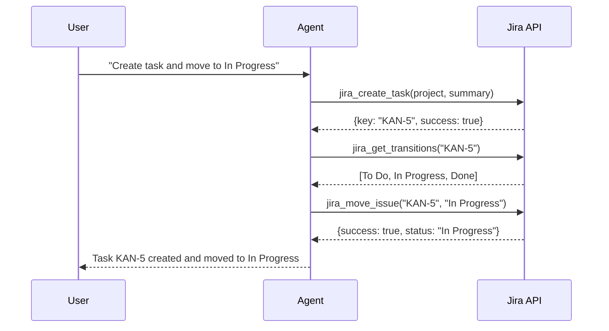
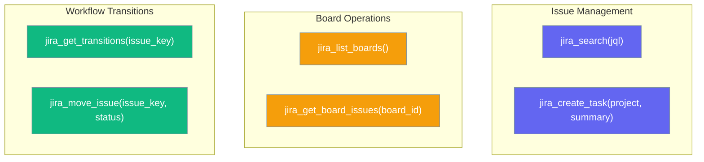
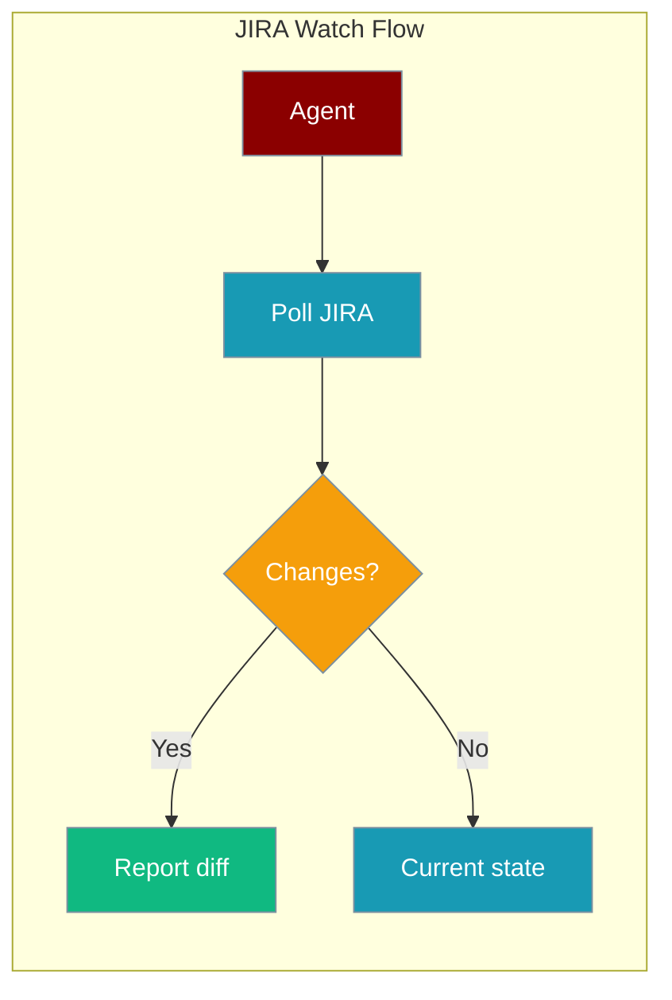
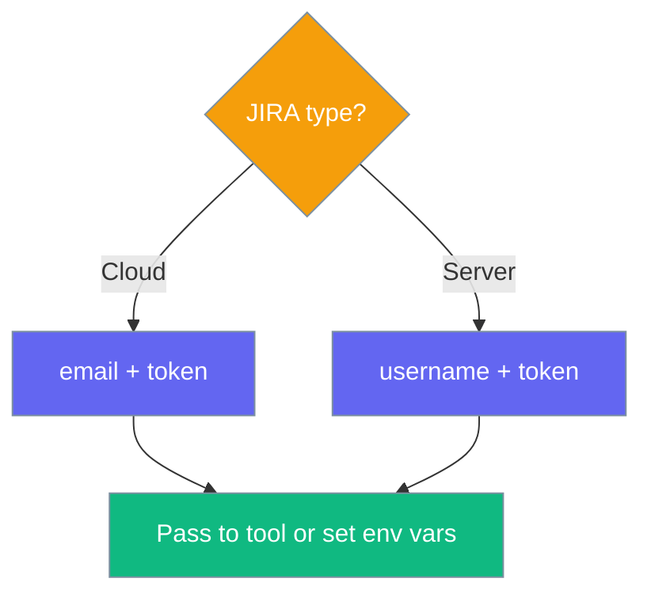

<Note>
  **Prerequisites**
  - Python 3.10 or higher
  - `pip install praisonaiagents jira`
  - Jira Cloud API token ([generate here](https://id.atlassian.com/manage-profile/security/api-tokens))
</Note>



## Quick Start

<Steps>
<Step title="Set Environment Variables">
```bash
export JIRA_URL="https://your-domain.atlassian.net"
export JIRA_EMAIL="your-email@example.com"
export JIRA_API_TOKEN="your-api-token"
```
</Step>

<Step title="Create a Jira Agent">
```python
from praisonaiagents import Agent
from praisonai_tools import (
    jira_create_task,
    jira_search,
    jira_list_boards,
    jira_get_board_issues,
    jira_get_transitions,
    jira_move_issue,
)

agent = Agent(
    name="JiraManager",
    role="Jira Project Manager",
    goal="Manage Jira Kanban board and track tasks through workflow stages",
    instructions="You manage a Jira project. The project key is 'PROJ' and the board ID is 1.",
    tools=[
        jira_create_task,
        jira_search,
        jira_list_boards,
        jira_get_board_issues,
        jira_get_transitions,
        jira_move_issue,
    ],
)

agent.start("List all boards, then create a task called 'Setup CI pipeline' and move it to In Progress")
```
</Step>
</Steps>

---

## How It Works



---

## Available Tools



| Function | Description |
|----------|-------------|
| `jira_search(jql)` | Search issues with JQL queries |
| `jira_create_task(project, summary, ...)` | Create a new task |
| `jira_list_boards(board_type)` | List all Kanban/Scrum boards |
| `jira_get_board_issues(board_id, jql)` | Get issues on a board |
| `jira_get_transitions(issue_key)` | Get available status transitions |
| `jira_move_issue(issue_key, status)` | Move issue to a status (e.g., "In Progress", "Done") |

---

## Common Patterns

### Kanban Workflow Agent

An agent that manages the full Kanban lifecycle — creates tasks, moves them through stages, and verifies completion.

```python
from praisonaiagents import Agent
from praisonai_tools import (
    jira_create_task,
    jira_search,
    jira_list_boards,
    jira_get_board_issues,
    jira_get_transitions,
    jira_move_issue,
)

agent = Agent(
    name="KanbanManager",
    role="Kanban Board Manager",
    goal="Manage tasks through the Kanban workflow",
    instructions="""You manage a Jira Kanban board.
    
The project key is 'KAN' and the board ID is 2.

Follow these steps:
1. List boards to confirm the board exists
2. Get current board issues to see what's there
3. Create a new task
4. Get transitions for the new issue
5. Move it to 'In Progress'
6. Move it to 'Done'
7. Search to confirm final status""",
    tools=[
        jira_create_task,
        jira_search,
        jira_list_boards,
        jira_get_board_issues,
        jira_get_transitions,
        jira_move_issue,
    ],
    llm="gpt-4o-mini",
)

result = agent.start(
    "Create a task 'Setup CI pipeline' in KAN project, "
    "move it through In Progress to Done, and verify the final status."
)
print(result)
```

### Issue Search and Reporting

```python
from praisonaiagents import Agent
from praisonai_tools import jira_search

agent = Agent(
    name="JiraReporter",
    role="Jira Reporter",
    goal="Search and report on Jira issues",
    tools=[jira_search],
)

agent.start("Find all open bugs in project KAN and summarize them")
```

### Multi-Agent Project Management

```python
from praisonaiagents import Agent, Task, PraisonAIAgents
from praisonai_tools import (
    jira_create_task,
    jira_search,
    jira_get_transitions,
    jira_move_issue,
)

# Planner creates tasks
planner = Agent(
    name="Planner",
    role="Sprint Planner",
    goal="Plan and create sprint tasks",
    tools=[jira_create_task, jira_search],
)

# Tracker moves tasks through workflow
tracker = Agent(
    name="Tracker",
    role="Progress Tracker",
    goal="Track and update task statuses",
    tools=[jira_get_transitions, jira_move_issue, jira_search],
)

plan_task = Task(
    description="Create 3 tasks for a 'User Auth' feature in project KAN: Login page, Session management, Password reset",
    agent=planner,
    name="plan_sprint"
)

track_task = Task(
    description="Move all newly created auth tasks to 'In Progress'",
    agent=tracker,
    name="track_progress"
)

agents = PraisonAIAgents(
    agents=[planner, tracker],
    tasks=[plan_task, track_task],
    process="sequential"
)
agents.start()
```

---

## Configuration

### Environment Variables

| Variable | Required | Description |
|----------|----------|-------------|
| `JIRA_URL` | ✅ | Jira instance URL (e.g., `https://your-domain.atlassian.net`) |
| `JIRA_EMAIL` | ✅ | Email associated with your Jira account |
| `JIRA_API_TOKEN` | ✅ | API token from [Atlassian API tokens](https://id.atlassian.com/manage-profile/security/api-tokens) |

### Create Task Parameters

| Parameter | Type | Required | Description |
|-----------|------|----------|-------------|
| `project` | `str` | ✅ | Project key (e.g., `"KAN"`) |
| `summary` | `str` | ✅ | Task title |
| `description` | `str` | ❌ | Task description |
| `issue_type` | `str` | ❌ | Issue type (default: `"Task"`) |
| `priority` | `str` | ❌ | Priority level |
| `assignee` | `str` | ❌ | Assignee username |

---

## Best Practices

<AccordionGroup>
  <Accordion title="Give agents the project key and board ID">
    Include the project key and board ID directly in the agent's instructions so it doesn't need to guess:
    ```python
    instructions="The project key is 'KAN' and the board ID is 2."
    ```
  </Accordion>
  
  <Accordion title="Use JQL for precise searches">
    JQL gives exact control over search results:
    ```python
    jira_search("project = KAN AND status = 'In Progress' ORDER BY created DESC")
    ```
  </Accordion>
  
  <Accordion title="Chain transitions through get_transitions first">
    Always let the agent call `jira_get_transitions` before `jira_move_issue` so it knows what transitions are available for the current status.
  </Accordion>
  
  <Accordion title="Use gpt-4o-mini for cost efficiency">
    Jira operations are straightforward tool calls. `gpt-4o-mini` handles them well at lower cost.
  </Accordion>
</AccordionGroup>

---

## Watch & Monitor

Monitor issues and projects for changes over time. These tools live in **`praisonaiagents.tools`** (not `praisonai_tools` board tools above).

```python
from praisonaiagents import Agent
from praisonaiagents.tools import jira_tools

agent = Agent(
    name="JIRA Watcher",
    instructions="Monitor JIRA issues and report changes. Always include the JIRA URL.",
    tools=jira_tools(),
)

agent.start("Get info on issue PROJ-123 at https://mycompany.atlassian.net")
```



### Watch tools

| Tool | Description |
|------|-------------|
| `jira_watch_issue` | Current issue state, or field/comment diff since `since_timestamp` |
| `jira_watch_project` | Recent project activity, or new/updated issues since `since_timestamp` |
| `jira_get_issue_info` | Status, priority, assignee, description, recent comments |
| `jira_search_issues` | JQL search with human-readable summary (`max_results` default `20`) |
| `jira_tools()` | Returns all four tools as a list |

Every call requires **`url`** (e.g. `https://yourcompany.atlassian.net`).

### Auth

| Mode | Credentials | Env vars |
|------|-------------|----------|
| Cloud (Atlassian.net) | `email` + `token` | `JIRA_EMAIL`, `JIRA_API_TOKEN` |
| Self-hosted Server | `username` + `token` | `JIRA_USERNAME`, `JIRA_API_TOKEN` |



### Examples

```python
from praisonaiagents import Agent
from praisonaiagents.tools import jira_watch_issue, jira_watch_project, schedule_add

# Diff since a timestamp
Agent(
    name="Issue Watcher",
    tools=[jira_watch_issue],
).start(
    "Check PROJ-123 at https://mycompany.atlassian.net "
    "for changes since 2026-06-21T00:00:00Z"
)

# Recurring project monitor
Agent(
    name="Project Monitor",
    tools=jira_tools() + [schedule_add],
).start("Schedule a check of project PROJ every 30 minutes")
```

<AccordionGroup>
<Accordion title="Pass the JIRA URL in prompts">
All watch tools require `url`. Include it in user prompts or hard-code it in agent instructions.
</Accordion>

<Accordion title="Use since_timestamp for diffs">
Without `since_timestamp`, watch tools return current state only — no change detection.
</Accordion>

<Accordion title="Combine with schedule_tools">
Watch tools are one-shot polls. Pair with `schedule_add` for interval monitoring.
</Accordion>

<Accordion title="Project keys are validated">
`jira_watch_project` accepts keys matching `^[A-Z][A-Z0-9_]*$` to prevent JQL injection.
</Accordion>
</AccordionGroup>

---

## Related

<CardGroup cols={2}>
  <Card title="Custom Tools" icon="wrench" href="/docs/tools/custom">
    Create your own tools
  </Card>
  <Card title="Schedule Tools" icon="clock" href="/tools/schedule-tools">
    Interval polling for JIRA watch agents
  </Card>
  <Card title="GitHub Tools" icon="github" href="/docs/tools/github_tools">
    Branch, commit, and PR tools
  </Card>
</CardGroup>
