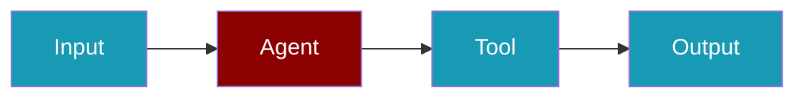

```python
from praisonaiagents import Agent
from langchain_community.tools import WikipediaQueryRun

agent = Agent(
    name="LangChain Wrapper",
    instructions="Use wrapped LangChain tools when helpful.",
    tools=[WikipediaQueryRun()],
)
agent.start("Summarise the Wikipedia article on transformer models")
```

The user asks a research question; the agent calls a LangChain tool wrapped for PraisonAI.



# Langchain Tools


## Quick Start

<Steps>
<Step title="Install">
```bash
pip install praisonaiagents langchain langchain-community
```
</Step>
<Step title="Wrap a LangChain tool">
```python
from praisonaiagents import Agent
from langchain_community.tools import WikipediaQueryRun
from langchain_community.utilities import WikipediaAPIWrapper

wiki_tool = WikipediaQueryRun(api_wrapper=WikipediaAPIWrapper())

def wikipedia_search(query: str) -> str:
    return wiki_tool.run(query)

agent = Agent(
    name="WikiAgent",
    instructions="Search Wikipedia for information.",
    tools=[wikipedia_search],
)

agent.start("What is quantum computing?")
```
</Step>
</Steps>


## Integrate Langchain Direct Tools

```bash
pip install youtube_search praisonai langchain_community langchain
```

```python
# tools.py
from langchain_community.tools import YouTubeSearchTool
```

```yaml
# agents.yaml
framework: crewai
topic: research about the causes of lung disease
agents:  # Canonical: use 'agents' instead of 'roles'
  research_analyst:
    instructions:  # Canonical: use 'instructions' instead of 'backstory' Experienced in analyzing scientific data related to respiratory health.
    goal: Analyze data on lung diseases
    role: Research Analyst
    tasks:
      data_analysis:
        description: Gather and analyze data on the causes and risk factors of lung
          diseases.
        expected_output: Report detailing key findings on lung disease causes.
    tools:
    - 'YouTubeSearchTool'
```

## Integrate Langchain with Wrappers

```bash
pip install wikipedia langchain_community
```

```python
# tools.py
from langchain_community.utilities import WikipediaAPIWrapper
class WikipediaSearchTool(BaseTool):
    name: str = "WikipediaSearchTool"
    description: str = "Search Wikipedia for relevant information based on a query."

    def _run(self, query: str):
        api_wrapper = WikipediaAPIWrapper(top_k_results=4, doc_content_chars_max=100)
        results = api_wrapper.load(query=query)
        return results
```

```yaml
# agents.yaml
framework: crewai
topic: research about nvidia growth
agents:  # Canonical: use 'agents' instead of 'roles'
  data_collector:
    instructions:  # Canonical: use 'instructions' instead of 'backstory' An experienced researcher with the ability to efficiently collect and
      organize vast amounts of data.
    goal: Gather information on Nvidia's growth by providing the Ticket Symbol to YahooFinanceNewsTool
    role: Data Collector
    tasks:
      data_collection_task:
        description: Collect data on Nvidia's growth from various sources such as
          financial reports, news articles, and company announcements.
        expected_output: A comprehensive document detailing data points on Nvidia's
          growth over the years.
    tools:
    - 'WikipediaSearchTool'
```

## Best Practices

<AccordionGroup>
  <Accordion title="Wrap tools as plain functions">
    Convert LangChain tools to plain Python functions with `tool.run()` for cleaner integration.
  </Accordion>
  <Accordion title="Use LangChain for specialized tools only">
    Prefer PraisonAI native tools for search and memory - use LangChain only when there is no native equivalent.
  </Accordion>
  <Accordion title="Handle LangChain exceptions">
    LangChain tools can raise ToolException - wrap calls in try/except and return error strings.
  </Accordion>
  <Accordion title="Prefer simple function signatures">
    Tools with str-to-str signatures integrate most reliably with PraisonAI agents.
  </Accordion>
</AccordionGroup>


## Related

<CardGroup cols={2}>
  <Card title="Custom Tools" icon="wrench" href="/docs/tools/custom">
    Build your own agent tools
  </Card>
  <Card title="Tools Overview" icon="toolbox" href="/docs/tools/tools">
    Browse PraisonAI tool documentation
  </Card>
</CardGroup>
