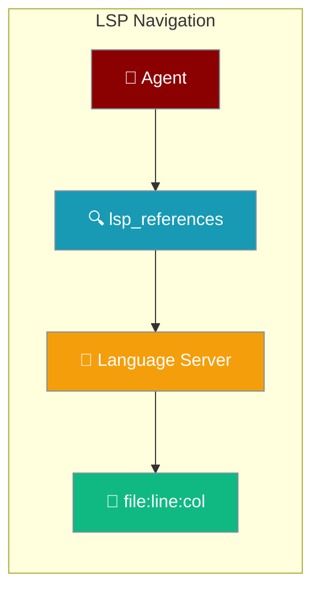
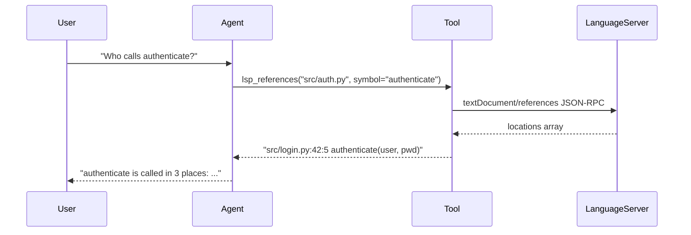
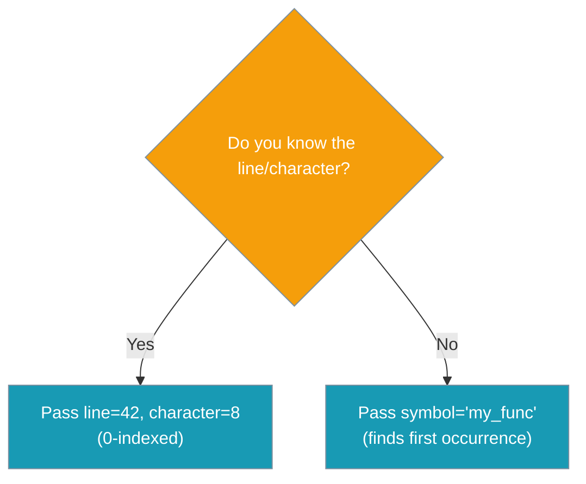

LSP tools give your agent language-server-accurate "go to definition" and "find references" instead of relying on text grep.



## Quick Start

<Steps>
<Step title="Enable LSP navigation tools">

```python
from praisonaiagents import Agent
from praisonaiagents.tools import lsp_definition, lsp_references

agent = Agent(
    name="Coder",
    instructions="You are a coding agent. Use lsp_references to find callers before changing a function.",
    tools=[lsp_definition, lsp_references],
)

agent.start("Where is the function `authenticate` called?")
```

</Step>

<Step title="Use tool names as strings">

```python
from praisonaiagents import Agent

agent = Agent(
    name="Coder",
    instructions="Navigate code with language-server accuracy before making any edits.",
    tools=["lsp_definition", "lsp_references", "lsp_hover",
           "lsp_document_symbols", "lsp_workspace_symbols"],
)

agent.start("List all symbols in src/auth.py, then find every call to `login`.")
```

</Step>
</Steps>

---

## How It Works



| Step | What happens |
|------|-------------|
| Agent receives request | Agent picks the correct LSP tool based on the question |
| Tool prepares | Resolves path inside workspace, detects language from extension |
| Language server query | LSP client spawns server (if needed), sends JSON-RPC request |
| Result returned | Compact `file:line:col  snippet` string — no raw JSON |

---

## The Five Tools

### lsp_definition

Go to the definition of a symbol.

```python
from praisonaiagents.tools import lsp_definition

print(lsp_definition("src/utils.py", symbol="compute"))
# Definition:
#   src/utils.py:10:5  def compute(x, y):
```

| Parameter | Type | Default | Description |
|-----------|------|---------|-------------|
| `file_path` | `str` | required | File to query (workspace-relative or absolute) |
| `line` | `Optional[int]` | `None` | 0-indexed line. Optional when `symbol` is given |
| `character` | `Optional[int]` | `None` | 0-indexed column. Optional |
| `symbol` | `Optional[str]` | `None` | Symbol name; first word-boundary occurrence is used |

---

### lsp_references

Find all references to a symbol across the codebase.

```python
from praisonaiagents.tools import lsp_references

print(lsp_references("src/utils.py", symbol="compute"))
# References:
#   src/main.py:25:12  result = compute(a, b)
#   tests/test_utils.py:8:5  assert compute(1, 2) == 3
```

| Parameter | Type | Default | Description |
|-----------|------|---------|-------------|
| `file_path` | `str` | required | File to query |
| `line` | `Optional[int]` | `None` | 0-indexed line |
| `character` | `Optional[int]` | `None` | 0-indexed column |
| `symbol` | `Optional[str]` | `None` | Symbol name |
| `include_declaration` | `bool` | `True` | Include the declaration itself in results |

---

### lsp_hover

Get type, signature, or documentation at an exact position.

```python
from praisonaiagents.tools import lsp_hover

print(lsp_hover("src/utils.py", line=9, character=4))
# Hover:
# def compute(x: int, y: int) -> int
```

| Parameter | Type | Default | Description |
|-----------|------|---------|-------------|
| `file_path` | `str` | required | File to query |
| `line` | `int` | required | 0-indexed line (LSP convention) |
| `character` | `int` | required | 0-indexed column |

<Note>
`lsp_hover` requires exact `(line, character)` — it does not accept a `symbol` name. Use `lsp_document_symbols` first to find the position.
</Note>

---

### lsp_document_symbols

List every symbol defined in a file — classes, functions, methods, variables.

```python
from praisonaiagents.tools import lsp_document_symbols

print(lsp_document_symbols("src/auth.py"))
# Document symbols:
#   class AuthManager  5:1
#   method login (in AuthManager)  10:5
#   method logout (in AuthManager)  20:5
#   function hash_password  35:1
```

| Parameter | Type | Default | Description |
|-----------|------|---------|-------------|
| `file_path` | `str` | required | File to query |

Nested symbols (methods inside classes) are flattened and tagged with their parent's name.

---

### lsp_workspace_symbols

Search for a symbol by name across the entire workspace.

```python
from praisonaiagents.tools import lsp_workspace_symbols

print(lsp_workspace_symbols("parse_config"))
# Workspace symbols:
#   function parse_config (in config)  src/config.py:12:1
#   function parse_config_from_env (in env)  src/env.py:5:1
```

| Parameter | Type | Default | Description |
|-----------|------|---------|-------------|
| `query` | `str` | required | Symbol name or substring to search for |
| `file_path` | `Optional[str]` | `None` | Hint which language server to use; defaults to Python |

---

## Choosing Between Position and Symbol



- **Explicit position** — `line` and `character` are **0-indexed** (LSP convention). Output shows them 1-indexed so results are human-readable.
- **Symbol name** — `symbol="my_func"` finds the first word-boundary occurrence in the file automatically. Recommended when you don't know the exact column.

---

## Language Server Installation

Each supported language needs its server binary on `PATH`. If the server is missing, the tool returns a clear error — it never crashes the agent.

| Language | Extensions | Install command |
|----------|-----------|-----------------|
| Python | `.py`, `.pyi` | `pip install python-lsp-server` |
| JavaScript | `.js`, `.jsx`, `.mjs`, `.cjs` | `npm install -g typescript-language-server typescript` |
| TypeScript | `.ts`, `.tsx` | `npm install -g typescript-language-server typescript` |
| Rust | `.rs` | `rustup component add rust-analyzer` |
| Go | `.go` | `go install golang.org/x/tools/gopls@latest` |

<Info>
When the server is missing, the tool returns `Error: python language server not installed; install it to use lsp navigation (falling back to grep is advised)` — the agent keeps running and can fall back to other search tools.
</Info>

---

## User Interaction Flow

A typical agent session using LSP tools:

> **User:** "Who calls the `login` function?"
>
> **Agent** picks `lsp_references("src/auth.py", symbol="login")` and calls it.
>
> **Tool returns:**
> ```
> References:
>   src/views/user.py:45:12  result = login(username, password)
>   src/api/endpoints.py:88:5  if not login(data["user"], data["pass"]):
>   tests/test_auth.py:22:5  assert login("admin", "secret") is True
> ```
>
> **Agent replies:** "The `login` function is called in 3 places: in `user.py` at line 45 when handling a user view, in `endpoints.py` at line 88 inside an API endpoint guard, and in `test_auth.py` at line 22 in a unit test."

---

## Common Patterns

**Refactor safely: find all references before changing a signature**

```python
from praisonaiagents import Agent
from praisonaiagents.tools import lsp_definition, lsp_references

agent = Agent(
    name="Refactorer",
    instructions="Always find all references before changing any function signature.",
    tools=[lsp_definition, lsp_references],
)

agent.start("Change the signature of `compute` to accept keyword arguments only.")
```

**Explore an unfamiliar file: symbols first, then hover**

```python
from praisonaiagents import Agent
from praisonaiagents.tools import lsp_document_symbols, lsp_hover

agent = Agent(
    name="Explorer",
    instructions="List file symbols, then hover over interesting ones to understand their types.",
    tools=[lsp_document_symbols, lsp_hover],
)

agent.start("What does src/parser.py expose and what are the types of the main functions?")
```

---

## Best Practices

<AccordionGroup>
<Accordion title="Prefer symbol= over hard-coded (line, character)">

The LLM rarely knows exact column numbers. Pass `symbol="my_func"` instead — the tool locates the first word-boundary occurrence and converts it to a position automatically.

</Accordion>
<Accordion title="Combine lsp_references with lsp_definition for full context">

Before editing anything, use `lsp_definition` to find where it's defined, then `lsp_references` to see every call site. This prevents breaking callers you didn't know existed.

</Accordion>
<Accordion title="Fall back to grep only when the server is unavailable">

LSP is more accurate than text search but takes a moment to start. Use `ast_grep_search` or `shell_tools` only when the tool returns an `Error: … not installed` message.

</Accordion>
<Accordion title="Keep workspace-symbol queries narrow">

Results are capped at 100. If you see `... (N more; narrow your query)`, use a more specific substring — `"parse_config"` instead of `"parse"`.

</Accordion>
</AccordionGroup>

---

## Related

<CardGroup cols={2}>
  <Card title="AST-Grep Tools" icon="code-branch" href="/docs/tools/ast-grep-tools">
    Structural code search and rewrite with AST patterns
  </Card>
  <Card title="Shell Tools" icon="terminal" href="/docs/tools/shell_tools">
    Execute shell commands and system operations
  </Card>
  <Card title="File Tools" icon="file" href="/docs/tools/file_tools">
    File system read, write, and search operations
  </Card>
  <Card title="LSP Navigation (Feature)" icon="magnifying-glass-code" href="/docs/features/lsp-navigation-tools">
    Deep dive into how LSP navigation works
  </Card>
</CardGroup>
