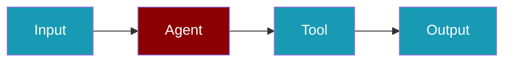
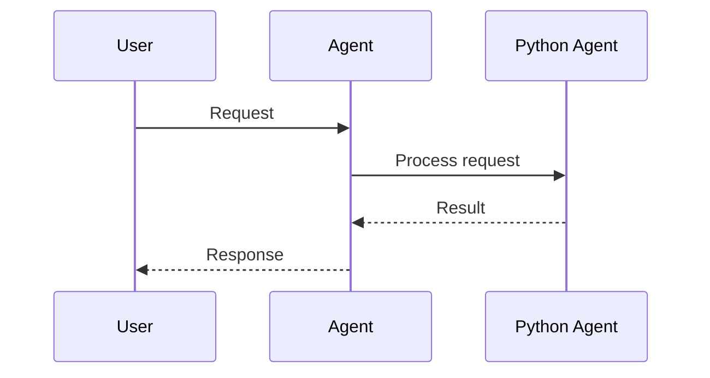
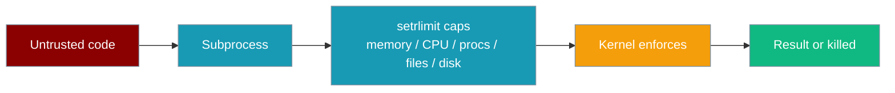

```python
from praisonaiagents import Agent, ExecutionConfig

agent = Agent(
    name="Python Runner",
    instructions="Run short Python snippets safely to answer questions.",
    execution=ExecutionConfig(code_execution=True, code_mode="safe"),
)
agent.start("Compute the first ten Fibonacci numbers and show the list")
```

The user asks for a computed result; the agent executes vetted Python and returns the output.





<Note>
  **Prerequisites**
  - Python 3.10 or higher
  - PraisonAI Agents package installed
  - Basic understanding of Python programming
</Note>

## Python Tools

Use Python Tools to execute and manage Python code with AI agents.

<Steps>
  <Step title="Install Dependencies">
    First, install the required package:
    ```bash
    pip install praisonaiagents
    ```
  </Step>

  <Step title="Import Components">
    Import the necessary components:
    ```python
    from praisonaiagents import Agent, Task, AgentTeam
    # Preferred (matches SDK)
    from praisonaiagents.tools import (
        execute_code, analyze_code, format_code,
        lint_code, disassemble_code
    )
    
    # Top-level shortcut also works
    # from praisonaiagents import execute_code
    ```
  </Step>

  <Step title="Create Agent">
    Create a Python execution agent:
    ```python
    python_agent = Agent(
        name="PythonExecutor",
        role="Python Code Specialist",
        goal="Execute Python code efficiently and safely.",
        backstory="Expert in Python programming and code execution.",
        tools=[
            execute_code, analyze_code, format_code,
            lint_code, disassemble_code
        ],
        reflection=False
    )
    ```
  </Step>

  <Step title="Define Task">
    Define the Python execution task:
    ```python
    python_task = Task(
        description="Execute and manage Python code.",
        expected_output="Code execution results.",
        agent=python_agent,
        name="code_execution"
    )
    ```
  </Step>

  <Step title="Run Agent">
    Initialize and run the agent:
    ```python
    agents = AgentTeam(
        agents=[python_agent],
        tasks=[python_task],
        process="sequential"
    )
    agents.start()
    ```
  </Step>
</Steps>

## Available Functions

### Import Paths

```python
# Preferred (matches SDK)
from praisonaiagents.tools import (
    execute_code, analyze_code, format_code,
    lint_code, disassemble_code
)

# Top-level shortcut also works
from praisonaiagents import execute_code
```

## Function Details

### execute_code(code: str, globals_dict: Optional[Dict[str, Any]] = None, locals_dict: Optional[Dict[str, Any]] = None, timeout: int = 30, max_output_size: int = 10000)

Safely executes Python code:
- Isolated execution environment
- Output capture
- Error handling
- Timeout protection
- Output size limits

<Warning>
When using the **default in-process path**, `execute_code` runs Python in the host process (with a timeout). That path is **not** a sandbox — do not pass untrusted code from end-users without isolating the host process yourself (subprocess, container, or VM). For untrusted code use **[Sandbox mode](#sandbox-mode)**, which runs the snippet in a subprocess with enforced resource caps.
</Warning>

```python
# Basic execution
result = execute_code("print('Hello, World!')")

# With custom environment
result = execute_code(
    """
    x = 10
    y = 20
    print(f'Sum: {x + y}')
    """,
    globals_dict={'__builtins__': __builtins__},
    timeout=5
)

# Returns: Dict[str, Any]
# Example output:
# {
#     'result': None,
#     'stdout': 'Hello, World!\n',
#     'stderr': '',
#     'success': True
# }
```

## Sandbox Mode

Sandbox mode runs each snippet in a fresh subprocess whose resource limits are enforced by the kernel.

Enable it with `ExecutionConfig(code_execution=True, code_mode="safe")`. On POSIX the subprocess applies the full `ResourceLimits` bundle via `resource.setrlimit` in a `preexec_fn` before your code runs, so untrusted code cannot exhaust host memory, CPU, processes, files, or disk.



Caps applied per snippet: memory (`RLIMIT_AS`), CPU seconds (`RLIMIT_CPU`, derived from `timeout_seconds`), process count (`RLIMIT_NPROC`), open files (`RLIMIT_NOFILE`), and disk-write size (`RLIMIT_FSIZE`).

```python
from praisonaiagents import Agent, ExecutionConfig

agent = Agent(
    name="Python Runner",
    instructions="Run short Python snippets safely to answer questions.",
    execution=ExecutionConfig(code_execution=True, code_mode="safe"),
)

# This attempts an 8GB allocation. Before the resource caps landed it ran
# to OOM; now the child is killed by the memory cap.
agent.start("Run this Python: x = [0] * (10**9)")
```

<Note>
On non-POSIX platforms (Windows), only the wall-clock timeout applies — the SDK emits a `logging.warning` at launch so operators can see the gap. Run the sandbox on POSIX for untrusted code.
</Note>

### Configuration

Sandbox caps come from the `ResourceLimits` dataclass. Untrusted snippets use `ResourceLimits.minimal()` by default — the defaults below are that minimal profile.

| Name | Type | Default | Description |
|------|------|---------|-------------|
| `memory_mb` | `int` | `128` | Maximum memory in megabytes (`RLIMIT_AS`). `0` = unlimited. |
| `cpu_percent` | `int` | `50` | Maximum CPU percentage. `0` = unlimited. |
| `timeout_seconds` | `int` | `30` | Maximum execution time; also drives the `RLIMIT_CPU` cap. |
| `max_processes` | `int` | `5` | Maximum number of processes (`RLIMIT_NPROC`). |
| `max_open_files` | `int` | `50` | Maximum number of open files (`RLIMIT_NOFILE`). |
| `network_enabled` | `bool` | `False` | Whether network access is allowed. |
| `disk_write_mb` | `int` | `10` | Maximum disk write in megabytes (`RLIMIT_FSIZE`). `0` = unlimited. |

Constants absent on a given POSIX platform, and caps the platform rejects, are skipped without aborting the launch — the wall-clock timeout still applies as a backstop.

### analyze_code(code: str)

Analyzes Python code structure:
- Import statements
- Function definitions
- Class definitions
- Variable usage
- Code complexity

```python
# Analyze code structure
analysis = analyze_code("""
def greet(name):
    return f"Hello, {name}!"

class Person:
    def __init__(self, name):
        self.name = name
""")

# Returns: Dict[str, Any]
# Example output:
# {
#     'imports': [],
#     'functions': [
#         {
#             'name': 'greet',
#             'args': ['name'],
#             'decorators': []
#         }
#     ],
#     'classes': [
#         {
#             'name': 'Person',
#             'bases': [],
#             'decorators': []
#         }
#     ],
#     'variables': ['name'],
#     'complexity': {
#         'lines': 6,
#         'functions': 2,
#         'classes': 1,
#         'branches': 0
#     }
# }
```

### format_code(code: str, style: str = 'black', line_length: int = 88)

Formats Python code:
- Multiple style options
- Line length control
- PEP 8 compliance
- Consistent formatting

```python
# Format with black
formatted = format_code("""
def messy_function(x,y,   z):
    if x>0:
     return y+z
    else:
     return y-z
""")

# Format with PEP 8
formatted = format_code(
    """
    def messy_function(x,y,   z):
        if x>0:
         return y+z
        else:
         return y-z
    """,
    style='pep8',
    line_length=79
)

# Returns: str
# Example output:
# def messy_function(x, y, z):
#     if x > 0:
#         return y + z
#     else:
#         return y - z
```

### lint_code(code: str)

Lints Python code for issues:
- Code quality checks
- Style violations
- Potential bugs
- Best practices

```python
# Lint code for issues
results = lint_code("""
def bad_function():
    unused_var = 42
    return 'result'
""")

# Returns: Dict[str, List[Dict[str, Any]]]
# Example output:
# {
#     'errors': [],
#     'warnings': [
#         {
#             'type': 'warning',
#             'module': 'bad_function',
#             'obj': 'unused_var',
#             'line': 2,
#             'column': 4,
#             'path': '<string>',
#             'symbol': 'unused-variable',
#             'message': 'Unused variable "unused_var"',
#             'message-id': 'W0612'
#         }
#     ],
#     'conventions': []
# }
```

### disassemble_code(code: str)

Disassembles Python code to bytecode:
- Bytecode inspection
- Performance analysis
- Code optimization
- Debugging support

```python
# Disassemble code to bytecode
bytecode = disassemble_code("""
def add(a, b):
    return a + b
""")

# Returns: str
# Example output:
#  1           0 LOAD_CONST               0 (<code object add at ...>)
#              2 LOAD_CONST               1 ('add')
#              4 MAKE_FUNCTION            0
#              6 STORE_NAME               0 (add)
#              8 LOAD_CONST               2 (None)
#             10 RETURN_VALUE
```

## Example Agent Configuration

```python
from praisonaiagents import Agent
from praisonaiagents.tools import (
    execute_code, analyze_code, format_code,
    lint_code, disassemble_code
)

agent = Agent(
    name="PythonDeveloper",
    description="An agent that helps with Python development",
    tools=[
        execute_code, analyze_code, format_code,
        lint_code, disassemble_code
    ]
)
```

## Dependencies

`execute_code`, `analyze_code`, and `disassemble_code` work out of the box — they only require the Python standard library.

The remaining tools need optional packages installed manually:

| Tool | Optional Dependency | Install |
|------|--------------------|----------|
| `format_code` (black style)  | `black`    | `pip install black` |
| `format_code` (pep8 style)   | `autopep8` | `pip install autopep8` |
| `lint_code`                  | `pylint`   | `pip install pylint` |

If the dependency is missing, the tool returns a clear error rather than crashing the agent.

## Error Handling

All functions include comprehensive error handling:
- Code execution errors
- Syntax errors
- Import errors
- Timeout errors
- Memory errors

Errors are handled consistently:
- Success cases return expected data type
- Error cases return None or error details
- All errors are logged for debugging

## Common Use Cases

1. Code Testing:
```python
# Test code execution
test_code = """
def factorial(n):
    return 1 if n <= 1 else n * factorial(n - 1)

result = factorial(5)
print(f"Factorial: {result}")
"""
result = execute_code(test_code)
print(f"Output: {result['stdout']}")
```

2. Code Quality:
```python
# Check code quality
code = """
def process_data(data):
    processed = []
    for item in data:
        if item > 0:
            processed.append(item * 2)
    return processed
"""
analysis = analyze_code(code)
lint_results = lint_code(code)
formatted = format_code(code)
```

3. Code Analysis:
```python
# Analyze code structure
code = """
class DataProcessor:
    def __init__(self, data):
        self.data = data
    
    def process(self):
        return [x * 2 for x in self.data]
"""
structure = analyze_code(code)
bytecode = disassemble_code(code)
print(f"Classes: {structure['classes']}")
print(f"Functions: {structure['functions']}")
```

## Understanding Python Tools

<Card title="What are Python Tools?" icon="question">
  Python Tools provide code execution capabilities for AI agents:
  - Code execution
  - Module management
  - Error handling
  - Output capture
  - Environment control
</Card>

## Examples

### Basic Python Execution Agent

```python
from praisonaiagents import Agent, Task, AgentTeam
from praisonaiagents.tools import (
    execute_code, analyze_code, format_code,
    lint_code, disassemble_code
)

# Create Python agent
python_agent = Agent(
    name="PythonExpert",
    role="Code Execution Specialist",
    goal="Execute Python code efficiently and safely.",
    backstory="Expert in Python programming and execution.",
    tools=[
        execute_code, analyze_code, format_code,
        lint_code, disassemble_code
    ],
    reflection=False
)

# Define Python task
python_task = Task(
    description="Execute data processing scripts.",
    expected_output="Processing results.",
    agent=python_agent,
    name="data_processing"
)

# Run agent
agents = AgentTeam(
    agents=[python_agent],
    tasks=[python_task],
    process="sequential"
)
agents.start()
```

### Advanced Python Operations with Multiple Agents

```python
# Create execution agent
executor_agent = Agent(
    name="CodeExecutor",
    role="Code Execution Specialist",
    goal="Execute Python code efficiently.",
    tools=[
        execute_code, analyze_code, format_code,
        lint_code, disassemble_code
    ],
    reflection=False
)

# Create monitoring agent
monitor_agent = Agent(
    name="CodeMonitor",
    role="Execution Monitor",
    goal="Monitor code execution and handle errors.",
    backstory="Expert in code monitoring and error handling.",
    reflection=False
)

# Define tasks
execution_task = Task(
    description="Execute Python scripts.",
    agent=executor_agent,
    name="code_execution"
)

monitoring_task = Task(
    description="Monitor execution and handle errors.",
    agent=monitor_agent,
    name="execution_monitoring"
)

# Run agents
agents = AgentTeam(
    agents=[executor_agent, monitor_agent],
    tasks=[execution_task, monitoring_task],
    process="sequential"
)
agents.start()
```

## Best Practices

<AccordionGroup>
  <Accordion title="Agent Configuration">
    Configure agents with clear Python focus:
    ```python
    from praisonaiagents.tools import (
        execute_code, analyze_code, format_code,
        lint_code, disassemble_code
    )
    
    Agent(
        name="PythonExecutor",
        role="Code Execution Specialist",
        goal="Execute code safely and efficiently",
        tools=[
            execute_code, analyze_code, format_code,
            lint_code, disassemble_code
        ]
    )
    ```
  </Accordion>

  <Accordion title="Task Definition">
    Define specific Python operations:
    ```python
    Task(
        description="Execute data processing scripts",
        expected_output="Processing results"
    )
    ```
  </Accordion>
</AccordionGroup>

## Common Patterns

### Python Execution Pipeline
```python
from praisonaiagents.tools import (
    execute_code, analyze_code, format_code,
    lint_code, disassemble_code
)

# Execution agent
executor = Agent(
    name="Executor",
    role="Code Executor",
    tools=[
        execute_code, analyze_code, format_code,
        lint_code, disassemble_code
    ]
)

# Monitor agent
monitor = Agent(
    name="Monitor",
    role="Execution Monitor"
)

# Define tasks
execute_task = Task(
    description="Execute Python code",
    agent=executor
)

monitor_task = Task(
    description="Monitor execution",
    agent=monitor
)

# Run workflow
agents = AgentTeam(
    agents=[executor, monitor],
    tasks=[execute_task, monitor_task]
)

## Related

<CardGroup cols={2}>
  <Card title="Custom Tools" icon="wrench" href="/docs/tools/custom">
    Build your own agent tools
  </Card>
  <Card title="Tools Overview" icon="toolbox" href="/docs/tools/tools">
    Browse PraisonAI tool documentation
  </Card>
</CardGroup>
