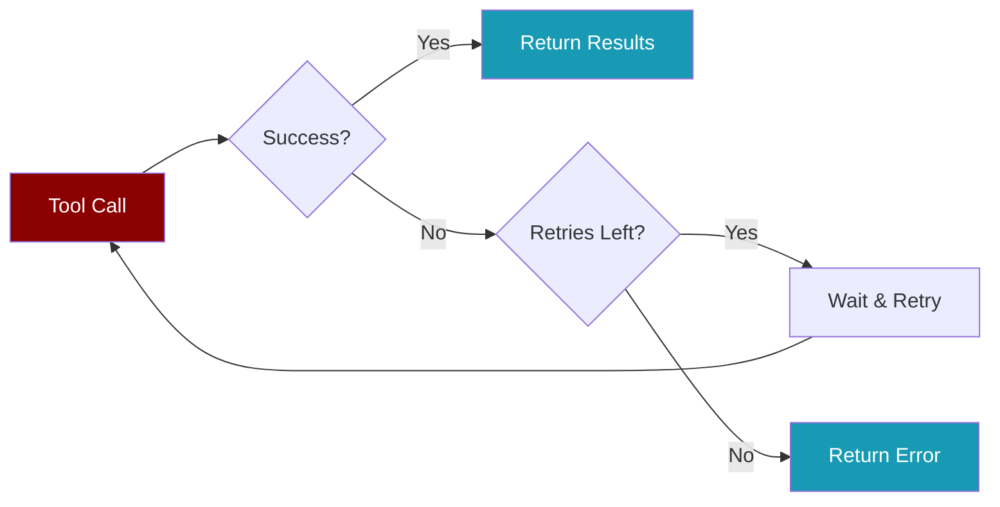
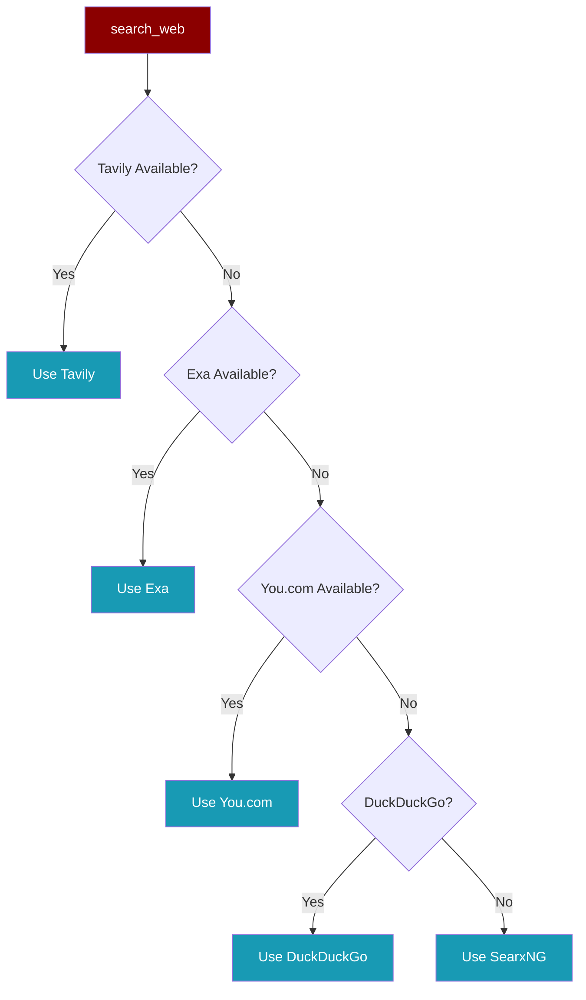

PraisonAI tools are designed with **reliability-first** principles.



## Search Provider Priority



<CardGroup cols={2}>
  <Card title="Automatic Fallback" icon="rotate">
    `search_web` tries providers in order until one succeeds
  </Card>
  <Card title="Retry Logic" icon="repeat">
    Each provider retries **3 times** with exponential backoff
  </Card>
</CardGroup>

## Quick Start

<Tabs>
  <Tab title="search_web (Recommended)">
    ```python
    from praisonaiagents.tools import search_web
    
    # Automatically uses best available provider
    results = search_web("AI news 2024")
    ```
  </Tab>
  <Tab title="internet_search (DuckDuckGo only)">
    ```python
    from praisonaiagents.tools import internet_search
    
    # Direct DuckDuckGo access with retry
    results = internet_search("Python tutorials", retries=3)
    ```
  </Tab>
</Tabs>

## Error Handling

<AccordionGroup>
  <Accordion title="Check for errors">
    ```python
    results = search_web("query")
    if results and "error" in results[0]:
        print(f"Failed: {results[0]['error']}")
    ```
  </Accordion>
  
  <Accordion title="list_processes handles None">
    System processes may return `None` for CPU/memory. Defaults to `0.0`.
  </Accordion>
</AccordionGroup>

## API Keys

| Provider | Environment Variable | Quality |
|----------|---------------------|---------|
| Tavily | `TAVILY_API_KEY` | ⭐⭐⭐ Best |
| Exa | `EXA_API_KEY` | ⭐⭐⭐ Best |
| You.com | `YDC_API_KEY` | ⭐⭐ Good |
| DuckDuckGo | None needed | ⭐ Basic |

<Tip>
Set `TAVILY_API_KEY` for best search quality. DuckDuckGo is the free fallback.
</Tip>

## Auto-Approve Tools

```yaml
approve:
  - write_file
  - execute_command

agents:
  writer:
    tools:
      - write_file
```

<Warning>
Only auto-approve tools you trust.
</Warning>
