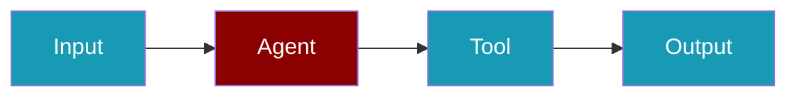
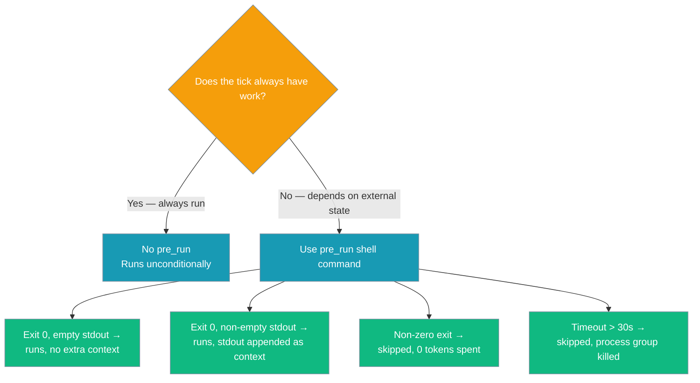

```python
from praisonaiagents import Agent
from praisonaiagents.tools import schedule_add, schedule_list, schedule_remove

agent = Agent(
    name="Scheduler",
    instructions="Add and list scheduled reminders for the user.",
    tools=[schedule_add, schedule_list, schedule_remove],
)
agent.start("Remind me daily at 9:00 to review the inbox")
```

The user describes a recurring reminder; the agent registers a schedule job via schedule tools.



<Note>
  **Built-in** — no extra dependencies required. Schedule tools are included in the core `praisonaiagents` package.
</Note>

Schedule tools let your agents self-schedule reminders, recurring tasks, and one-shot jobs — all via simple tool calls. Optionally gate each tick with a cheap shell check via `pre_run` so expensive model turns only happen when there's real work to do. No changes to the `Agent` class are needed.

## Quick Start

<Steps>
<Step title="Simple Usage">
```python
from praisonaiagents import Agent
from praisonaiagents.tools import schedule_add, schedule_list, schedule_remove

agent = Agent(
    name="assistant",
    instructions="You can set reminders and schedules for the user.",
    tools=[schedule_add, schedule_list, schedule_remove],
)

agent.start("Remind me to check email every morning at 7am")
```
</Step>
<Step title="With Configuration">
```python
from praisonaiagents.tools import schedule_list

print(schedule_list())
```
</Step>
</Steps>

The agent will call `schedule_add` with the appropriate schedule expression, and the job will be persisted to disk.

## Available Tools

### schedule_add

Add a new scheduled job.

| Parameter | Type | Required | Description |
|-----------|------|----------|-------------|
| `name` | `str` | Yes | Human-readable name (e.g. `"morning-email-check"`) |
| `schedule` | `str` | Yes | When to run (see [Schedule Expressions](#schedule-expressions)) |
| `message` | `str` | No | Prompt or reminder text to deliver when triggered |

**Returns:** Confirmation string with the job id.

### schedule_list

List all scheduled jobs. Takes no parameters.

**Returns:** Formatted string listing every job with id, name, schedule, status, and message.

### schedule_remove

Remove a scheduled job by name.

| Parameter | Type | Required | Description |
|-----------|------|----------|-------------|
| `name` | `str` | Yes | Name of the schedule to remove |

**Returns:** Confirmation or not-found message.

## Schedule Expressions

| Format | Example | Description |
|--------|---------|-------------|
| Keyword | `"hourly"`, `"daily"` | Predefined intervals |
| Interval | `"*/30m"`, `"*/6h"`, `"*/10s"` | Custom interval (minutes, hours, seconds) |
| Cron | `"cron:0 7 * * *"` | 5-field cron expression |
| One-shot | `"at:2026-03-01T09:00:00"` | ISO 8601 timestamp |
| Relative | `"in 20 minutes"` | Relative to now |
| Seconds | `"3600"` | Raw seconds |

## Examples

### Recurring Schedule

```python
from praisonaiagents import Agent
from praisonaiagents.tools import schedule_add, schedule_list, schedule_remove

agent = Agent(
    name="news-bot",
    instructions="""You help users stay informed.
    When asked, create schedules for news summaries.
    Use schedule_add with cron expressions for precise timing.""",
    tools=[schedule_add, schedule_list, schedule_remove],
)

# Agent will create: schedule_add("morning-news", "cron:0 7 * * *", "Summarize AI news")
agent.start("Send me an AI news summary every morning at 7am")
```

### One-Shot Reminder

```python
# Agent will create: schedule_add("meeting-prep", "in 20 minutes", "Prepare for standup")
agent.start("Remind me in 20 minutes to prepare for standup")
```

### List and Manage

```python
# Agent will call schedule_list() and schedule_remove("old-task")
agent.start("Show me my schedules and remove 'old-task'")
```

### Using String Tool Names

```python
agent = Agent(
    name="scheduler",
    tools=["schedule_add", "schedule_list", "schedule_remove"],
)
```

## Storage

Jobs are persisted to `~/.praisonai/config.yaml` under the `schedules` key by default via `ConfigYamlScheduleStore`. The store is:

- **Thread-safe** for multi-agent scenarios
- **Atomic writes** (tmp + rename) to prevent corruption
- **Auto-created** on first use
- **Auto-migrates** legacy `jobs.json` data on first load

### Custom Store (ScheduleStoreProtocol)

Swap the default file store for any backend that implements `ScheduleStoreProtocol`:

```python
from praisonaiagents.scheduler import ScheduleStoreProtocol

class MyDatabaseStore:
    """Any object with these methods works."""
    def add(self, job): ...
    def get(self, job_id) -> Optional[Any]: ...
    def list(self, agent_id=None) -> list: ...
    def update(self, job): ...
    def remove(self, job_id) -> bool: ...
    def get_by_name(self, name) -> Optional[Any]: ...
    def remove_by_name(self, name) -> bool: ...

assert isinstance(MyDatabaseStore(), ScheduleStoreProtocol)  # ✅
```

Inject it at startup so all agent `schedule_add/list/remove` calls use your store:

```python
from praisonaiagents.tools.schedule_tools import set_store

my_store = MyDatabaseStore()
set_store(my_store)  # All schedule tools now use this store
```

<Info>
PraisonAIUI and BotOS use the same `config.yaml` store. You can also call `set_store()` to inject any custom backend.
</Info>

## Schedule Runner

The `ScheduleRunner` checks which jobs are due for execution:

```python
from praisonaiagents.scheduler import ScheduleRunner, ConfigYamlScheduleStore

store = ConfigYamlScheduleStore()
runner = ScheduleRunner(store=store)

# Get jobs that are due right now
due_jobs = runner.get_due_jobs()

for job in due_jobs:
    print(f"Due: {job.name} — {job.message}")
    runner.mark_run(job)  # Updates last_run_at
```

## Hook Events

Schedule lifecycle events are available via the hook system:

| Event | When |
|-------|------|
| `SCHEDULE_ADD` | A new schedule is created |
| `SCHEDULE_REMOVE` | A schedule is deleted |
| `SCHEDULE_TRIGGER` | A scheduled job fires |

## Execution History

Every scheduled job execution is logged as a `RunRecord` for auditing:

```python
from praisonaiagents.scheduler import FileScheduleStore

store = FileScheduleStore()

# Get last 10 executions for a job
history = store.get_history("job-abc123", limit=10)

for run in history:
    print(f"{run.job_name}: {run.status} ({run.duration:.1f}s)")
    if run.error:
        print(f"  Error: {run.error}")
```

| Field | Type | Description |
|-------|------|-------------|
| `job_id` | `str` | Job that was executed |
| `job_name` | `str` | Human-readable job name |
| `status` | `str` | `"succeeded"`, `"failed"`, or `"skipped"` (when a `pre_run` gate returned `run=False`) |
| `result` | `str` | Agent output (truncated) |
| `error` | `str` | Error message if failed |
| `duration` | `float` | Execution time in seconds |
| `delivered` | `bool` | Whether result was delivered to channel |
| `timestamp` | `float` | Epoch timestamp |

## Executing Scheduled Jobs

Schedule tools **create and persist** jobs, but to actually **execute** them when they're due, use `ScheduleLoop`:

```python
from praisonaiagents.scheduler import ScheduleLoop

def handle_job(job):
    print(f"🔔 {job.name}: {job.message}")

loop = ScheduleLoop(on_trigger=handle_job, tick_seconds=30)
loop.start()
```

<Info>
See [Background Tasks — ScheduleLoop](/docs/features/background-tasks#scheduleloop) for the full API and combined examples with `BackgroundRunner`.
</Info>

## Pre-Run Condition Gate

Gate a scheduled tick on a cheap shell check so no model tokens are spent when there's nothing to do.



<Steps>
<Step title="Add pre_run to a schedule in bot.yaml">
```yaml
# bot.yaml
schedules:
  - name: new-issue-triage
    schedule: "*/5m"
    message: "Triage any new issues from the queue."
    pre_run: "gh issue list --state open --json number,title --search 'created:>1h ago'"
```
</Step>
<Step title="Every tick, PraisonAI evaluates pre_run before spending tokens">
| Exit code | stdout | Outcome |
|-----------|--------|---------|
| `0` | empty | Job runs with original message; no context added |
| `0` | non-empty | Job runs; stdout appended as context (capped at 8 000 chars) |
| non-zero | — | Job **skipped**; truncated stderr in `reason` (max 500 chars) |
| timed out (>30 s) | — | Job skipped; process group killed; reason: `pre-run gate timed out` |
</Step>
</Steps>

<Note>
`pre_run` is a **cost gate** (decides *whether* to run). It is not a **safety gate** (`RunPolicy`, which decides *what* a run may do). Use both when you need both.
</Note>

### Real-World Examples

**Only triage when new issues exist:**
```yaml
pre_run: "gh issue list --state open --search 'created:>10m ago' --json title"
```

**Only summarise inbox when there's unread mail:**
```yaml
pre_run: "test -s $HOME/.mail/inbox/unread"
```

**Guard against off-hours runs (Monday–Friday, 09:00–18:00):**
```yaml
pre_run: "test $(date +%u) -lt 6 && test $(date +%H) -ge 9 && test $(date +%H) -lt 18"
```

### Custom Condition Gate

Any object implementing `JobConditionProtocol` can replace the default shell gate — a Python callable, an MCP probe, a database check.

```python
from praisonaiagents.scheduler.protocols import GateResult, JobConditionProtocol
from praisonai_bot.scheduler.executor import ScheduledAgentExecutor

class DatabaseGate:
    def should_run(self, job) -> GateResult:
        rows = pending_rows()
        if rows == 0:
            return GateResult(run=False, reason="no pending rows")
        return GateResult(run=True, context=f"{rows} rows waiting")

executor = ScheduledAgentExecutor(
    runner=runner,
    agent_resolver=lambda agent_id: gateway.get_agent(agent_id),
    condition_resolver=lambda job: DatabaseGate(),
)
```

Pass `condition_resolver=False` to disable gating entirely. The default resolver automatically activates `ShellConditionGate` for any job that has a `pre_run` value.

## BotOS Integration

When using BotOS (multi-platform bot orchestrator), scheduled jobs execute **automatically** — no `ScheduleLoop` needed. BotOS runs its own 30-second schedule tick alongside all bots:

- Agents create jobs via `schedule_add` during conversations
- BotOS detects due jobs every 30 seconds
- The originating agent processes the job message
- Results are delivered back to the originating platform (Telegram, Discord, etc.)

```yaml
# bot.yaml — schedules work out of the box
agent:
  name: assistant
  tools:
    - schedule_add
    - schedule_list
    - schedule_remove

channels:
  telegram:
    token: ${TELEGRAM_BOT_TOKEN}
```

```bash
praisonai bot start --config bot.yaml
# Agent can now self-schedule and BotOS executes + delivers results
```

## Architecture

Schedule tools follow PraisonAI's core principles:

- **Agent-centric** — tools, not Agent parameters
- **Lazy-loaded** — zero import cost until used
- **Protocol-driven** — `ScheduleStoreProtocol` makes stores swappable
- **No Agent bloat** — the `Agent` class is unchanged
- **Thread-safe** — safe for multi-agent workflows
- **Pluggable** — `set_store()` lets any backend replace the default file store

## See Also

<CardGroup cols={2}>
  <Card title="Background Tasks" icon="clock" href="/docs/features/background-tasks">
    Sync wrappers, ScheduleLoop, and combined recipes
  </Card>
  <Card title="Scheduler CLI" icon="terminal" href="/docs/cli/scheduler">
    24/7 autonomous agent scheduling via CLI
  </Card>
</CardGroup>

## Best Practices

<AccordionGroup>
  <Accordion title="Use cron expressions for precise schedules">
    Cron expressions give exact control over scheduling - prefer them for production use.
  </Accordion>
  <Accordion title="Log scheduled job execution">
    Add logging to scheduled agent tasks so you can verify they ran and diagnose failures.
  </Accordion>
  <Accordion title="Test with short intervals first">
    Use 1-minute intervals during testing, then switch to production schedules before deployment.
  </Accordion>
  <Accordion title="Handle job failures gracefully">
    Scheduled jobs should catch exceptions and report errors rather than silently failing.
  </Accordion>
  <Accordion title="Use pre_run to avoid paying for empty ticks">
    If a schedule only has work when some external state changes (new emails, new PRs, a queue with pending rows), put the cheap check in `pre_run`. Model tokens are spent only for ticks that actually have work to do.
  </Accordion>
</AccordionGroup>


## Related

<CardGroup cols={2}>
  <Card title="Custom Tools" icon="wrench" href="/docs/tools/custom">
    Build your own agent tools
  </Card>
  <Card title="Tools Overview" icon="toolbox" href="/docs/tools/tools">
    Browse PraisonAI tool documentation
  </Card>
</CardGroup>
