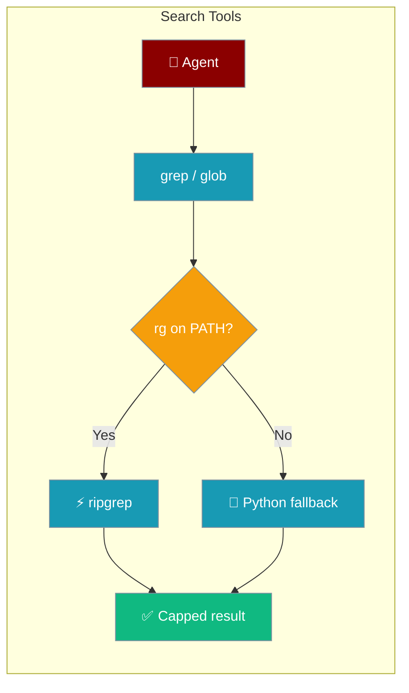
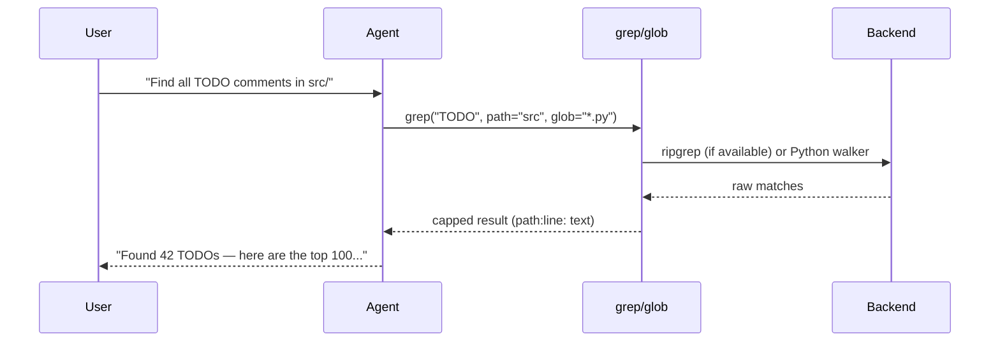
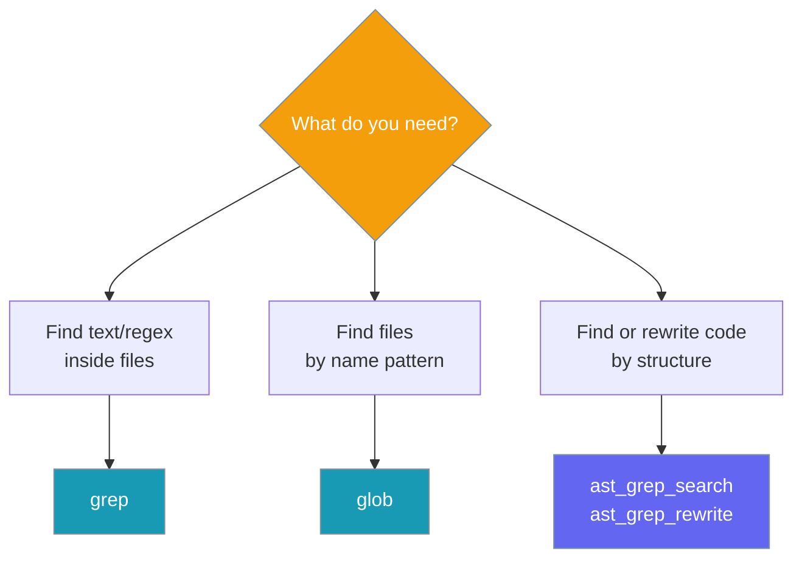

```python
from praisonaiagents import Agent
from praisonaiagents.tools import grep, glob

agent = Agent(
    name="Code Search",
    instructions="Find symbols and files in the repository.",
    tools=[grep, glob],
)
agent.start("Find all TODO comments under src/")
```

The user describes what to locate in the codebase; the agent runs grep and glob with safe caps.

Give your agent two zero-config primitives — `grep` to find text, `glob` to find files — bounded, path-safe, and ripgrep-accelerated when available.


## Quick Start

<Steps>
<Step title="Agent-Centric Usage">
Attach `grep` and `glob` to an agent — no configuration needed.

```python
from praisonaiagents import Agent
from praisonaiagents.tools import grep, glob

agent = Agent(
    name="Coder",
    instructions="Find and explore code in this repo.",
    tools=[grep, glob],
)

agent.start("Where is `deprecated_fn` used?")
```
</Step>

<Step title="Direct Usage">
Call both tools directly outside an agent.

```python
from praisonaiagents.tools import grep, glob

print(grep("deprecated_fn", path="src", glob="*.py"))
print(glob("**/*.py", path="src"))
```
</Step>
</Steps>

<Tabs>
<Tab title="Python">
```python
from praisonaiagents import Agent
from praisonaiagents.tools import grep, glob

agent = Agent(
    name="Coder",
    instructions="Find and explore code in this repo.",
    tools=[grep, glob],
)

agent.start("List all Python files in src and find TODO comments")
```
</Tab>
<Tab title="YAML">
```yaml
agents:
  - name: coder
    instructions: Find and explore code.
    tools:
      - grep
      - glob
```
</Tab>
</Tabs>

---

## How It Works



| Backend | When used | Notes |
|--------|-----------|-------|
| `ripgrep` (`rg`) | Auto-detected on `PATH` | Faster; linear-time RE2 engine; 30s timeout |
| Pure-Python | Fallback | Zero deps; regex pattern length capped at 1000 chars |

---

## Configuration Options

### `grep` Parameters

| Parameter | Type | Default | Description |
|-----------|------|---------|-------------|
| `pattern` | `str` | *(required)* | Regex or literal string to search for |
| `path` | `str` | `"."` | Directory or single file to search under |
| `glob` | `str` | `None` | Filename glob to restrict the search (e.g. `"*.py"`) |
| `case_insensitive` | `bool` | `False` | Case-insensitive matching when `True` |
| `max_results` | `int` | `100` | Hard cap on matching lines returned; invalid/≤0 snaps back to 100 |

**Returns:** `path:line: matched line` entries (newline-joined), hard-capped with a truncation hint. Returns `"No matches found."` or `"Error: …"` on error.

### `glob` Parameters

| Parameter | Type | Default | Description |
|-----------|------|---------|-------------|
| `pattern` | `str` | *(required)* | Glob pattern (e.g. `"**/*.ts"`, `"src/**/test_*.py"`) |
| `path` | `str` | `"."` | Directory to search under |
| `max_results` | `int` | `100` | Hard cap on paths returned; invalid/≤0 snaps back to 100 |

**Returns:** Newline-joined workspace-relative file paths, sorted by modification time (newest first), hard-capped with a truncation hint. Returns `"No files found."` on empty results.

---

## Common Patterns

**Case-insensitive search across `.py` files only:**
```python
from praisonaiagents.tools import grep

result = grep("TODO", glob="*.py", case_insensitive=True)
print(result)
```

**Recursive TypeScript file listing:**
```python
from praisonaiagents.tools import glob

files = glob("**/*.ts", path="src")
print(files)
```

**Bounded search in a large repo:**
```python
from praisonaiagents.tools import grep

result = grep("error", max_results=50)
print(result)
```

---

## Choosing Between `grep`, `glob`, and AST-Grep



---

## Best Practices

<AccordionGroup>
<Accordion title="Install ripgrep for speed (optional)">
`ripgrep` is an optional accelerator — the tools always work without it. Install for significantly faster searches on large codebases.

```bash
# macOS
brew install ripgrep

# Ubuntu/Debian
apt install ripgrep

# Windows
choco install ripgrep
```
</Accordion>

<Accordion title="Narrow with glob and path early">
Both tools default to a cap of 100 results. Use `glob` and `path` to narrow the search before hitting the limit.

```python
from praisonaiagents.tools import grep

# Narrow: search only Python files under src/
result = grep("authenticate", path="src", glob="*.py")
```
</Accordion>

<Accordion title="Read the truncation hint">
When results are capped, the last line contains a truncation hint like:

```
... 100+ matches (truncated at 100); refine the pattern or narrow `path`/`glob`.
```

Agents can detect this string and automatically refine their query.
</Accordion>

<Accordion title="Trust .gitignore — it's already honoured">
Both tools automatically respect `.gitignore` (including negation patterns like `!keep.log` and directory-only rules like `build/`). Noise directories like `.git`, `node_modules`, `__pycache__`, and `.venv` are always skipped.
</Accordion>
</AccordionGroup>

---

## User Interaction Flow

A typical agent conversation using `grep` and `glob`:

```
User:  "Find all TODO comments in the src/ directory"

Agent: calls grep("TODO", path="src", case_insensitive=True)
       → "src/auth.py:42: # TODO: add rate limiting
          src/api.py:87: # TODO: handle edge case
          ... 100+ matches (truncated at 100); refine the pattern or narrow `path`/`glob`."

User:  "Too many — only show the ones in auth files"

Agent: calls grep("TODO", path="src", glob="*auth*")
       → "src/auth.py:42: # TODO: add rate limiting
          src/auth_middleware.py:15: # TODO: validate tokens"

User:  "Which Python files exist in that folder?"

Agent: calls glob("**/*.py", path="src")
       → "src/auth.py
          src/auth_middleware.py
          src/api.py
          ..."
```

---

## Related

<CardGroup cols={2}>
  <Card title="AST-Grep Tools" icon="code-branch" href="/docs/tools/ast-grep-tools">
    Structural code search and rewrite using AST patterns
  </Card>
  <Card title="File Tools" icon="file" href="/docs/tools/file_tools">
    File system operations and management utilities
  </Card>
</CardGroup>
