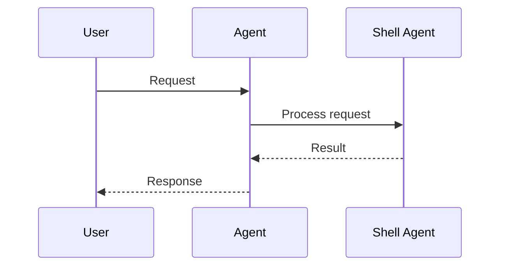
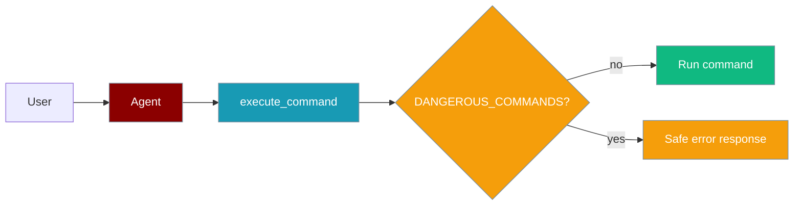
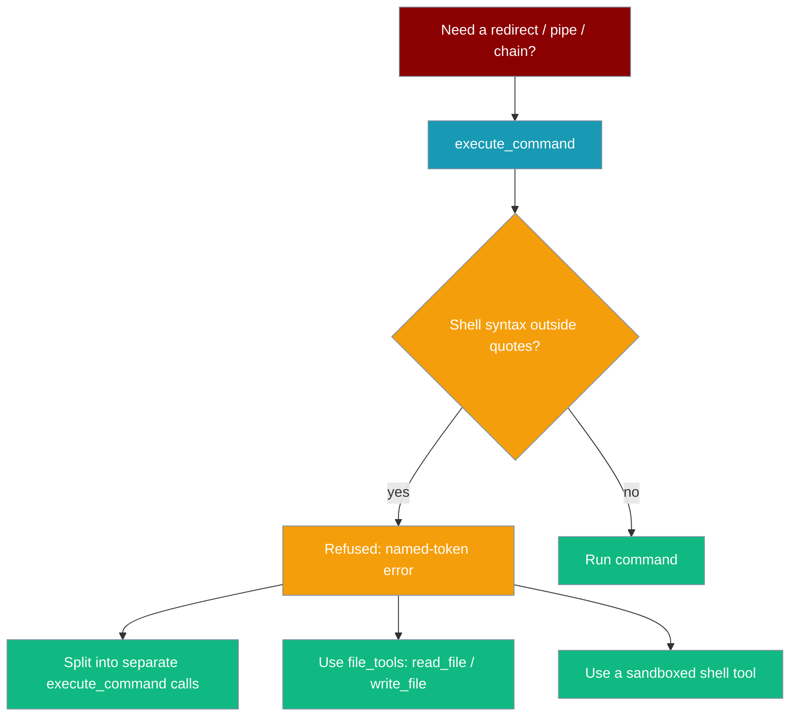

```python
from praisonaiagents import Agent
from praisonaiagents import execute_command

agent = Agent(
    name="Shell Assistant",
    instructions="Run approved shell commands and report output.",
    tools=[execute_command],
)
agent.start("Show disk usage for the current project directory")
```

The user requests a system check; the agent runs bounded shell commands and returns stdout safely.

Shell tools let AI agents execute commands, manage processes, and monitor system resources.





<Note>
  **Prerequisites**
  - Python 3.10 or higher
  - PraisonAI Agents package installed
  - Basic understanding of shell commands
</Note>

## Shell Tools

Use Shell Tools to execute shell commands with AI agents.

<Steps>
  <Step title="Install Dependencies">
    First, install the required package:
    ```bash
    pip install praisonaiagents
    ```
  </Step>

  <Step title="Import Components">
    Import the necessary components:
    ```python
    from praisonaiagents import Agent, Task, AgentTeam
    from praisonaiagents import execute_command, list_processes, kill_process, get_system_info
    ```
  </Step>

  <Step title="Create Agent">
    Create a shell command agent:
    ```python
    shell_agent = Agent(
        name="ShellCommander",
        role="Shell Command Specialist",
        goal="Execute shell commands efficiently and safely.",
        backstory="Expert in command-line operations and automation.",
        tools=[execute_command, list_processes, kill_process, get_system_info],
        reflection=False
    )
    ```
  </Step>

  <Step title="Define Task">
    Define the shell task:
    ```python
    shell_task = Task(
        description="List and organize files in the current directory.",
        expected_output="Organized file structure with detailed listing.",
        agent=shell_agent,
        name="file_organization"
    )
    ```
  </Step>

  <Step title="Run Agent">
    Initialize and run the agent:
    ```python
    agents = AgentTeam(
        agents=[shell_agent],
        tasks=[shell_task],
        process="sequential"
    )
    agents.start()
    ```
  </Step>
</Steps>

## Understanding Shell Tools

<Card title="What are Shell Tools?" icon="question">
  Shell Tools provide command-line capabilities for AI agents:
  - Command execution
  - Process management
  - Output handling
  - Error handling
  - Environment management
</Card>

## Key Components

<CardGroup cols={2}>
  <Card title="Shell Agent" icon="user-robot">
    Create specialized shell agents:
    ```python
    Agent(tools=[execute_command, list_processes, kill_process, get_system_info])
    ```
  </Card>
  <Card title="Shell Task" icon="list-check">
    Define shell tasks:
    ```python
    Task(description="shell_operation")
    ```
  </Card>
  <Card title="Process Types" icon="arrows-split-up-and-left">
    Sequential or parallel processing:
    ```python
    process="sequential"
    ```
  </Card>
  <Card title="Shell Options" icon="sliders">
    Customize shell operations:
    ```python
    timeout=30
    ```
  </Card>
</CardGroup>

```python
from praisonaiagents import Agent, Task, AgentTeam
from praisonaiagents import execute_command, list_processes, kill_process, get_system_info

# Create shell agent
shell_agent = Agent(
    name="CommandExecutor",
    role="Shell Command Specialist",
    goal="Execute shell commands efficiently and safely.",
    backstory="Expert in command-line operations and scripting.",
    tools=[execute_command, list_processes, kill_process, get_system_info],
    reflection=False
)

# Define shell task
shell_task = Task(
    description="Clean up temporary files and organize downloads.",
    expected_output="Cleaned and organized file system.",
    agent=shell_agent,
    name="system_cleanup"
)

# Run agent
agents = AgentTeam(
    agents=[shell_agent],
    tasks=[shell_task],
    process="sequential"
)
agents.start()
```

### Advanced Shell Management with Multiple Agents

```python
# Create command agent
command_agent = Agent(
    name="Commander",
    role="Command Executor",
    goal="Execute shell commands systematically.",
    tools=[execute_command, list_processes, kill_process, get_system_info],
    reflection=False
)

# Create monitoring agent
monitor_agent = Agent(
    name="Monitor",
    role="Process Monitor",
    goal="Monitor and manage running processes.",
    backstory="Expert in system monitoring and process control.",
    reflection=False
)

# Define tasks
command_task = Task(
    description="Execute system maintenance commands.",
    agent=command_agent,
    name="system_maintenance"
)

monitor_task = Task(
    description="Monitor system resources and processes.",
    agent=monitor_agent,
    name="process_monitoring"
)

# Run agents
agents = AgentTeam(
    agents=[command_agent, monitor_agent],
    tasks=[command_task, monitor_task],
    process="sequential"
)
agents.start()
```

## Available Functions

```python
from praisonaiagents import execute_command
from praisonaiagents import list_processes
from praisonaiagents import kill_process
from praisonaiagents import get_system_info
```

## Function Details

### execute_command(command, cwd=None, timeout=30, env=None, max_output_size=10000, spill=True, spill_dir=None)

Safely executes shell commands:
- Timeout protection
- Output capture
- **Dangerous command blocking** (PR #2062) — `rm`, `mkfs`, `dd`, `shutdown`, etc.
- Environment and working directory control
- **Large output spill** — over-budget output is saved to a retrievable artifact
- **Shell syntax refusal** (PR #4968) — redirects, pipes, chains, substitutions and newlines are refused with a named-token error rather than silently mangled

| Parameter | Type | Default | Description |
|-----------|------|---------|-------------|
| `command` | `str` | — | Command to execute (split with `shlex`, no shell). |
| `cwd` | `Optional[str]` | `None` | Working directory. |
| `timeout` | `int` | `30` | Maximum execution time in seconds. |
| `env` | `Optional[Dict[str, str]]` | `None` | Extra environment variables. |
| `max_output_size` | `int` | `10000` | Byte/char budget for the inline preview. |
| `spill` | `bool` | `True` | Save over-budget output to an artifact instead of dropping the middle. |
| `spill_dir` | `Optional[str]` | `None` | Directory for artifacts (overrides `PRAISONAI_TOOL_OUTPUT_DIR`). |

<Note>
Commands always run with `shell=False` for security — the string is split with `shlex`, not handed to a shell. To keep agents from being told an unsupported redirect/pipe/chain succeeded, this tool now **refuses** those commands with an error naming the token. To combine steps, call `execute_command` once per step.
</Note>

### Dangerous Command Protection

By default, commands whose base name is in `DANGEROUS_COMMANDS` are blocked:

```python
# Returns: success=False, exit_code=-1
# error: "Command 'rm' is in DANGEROUS_COMMANDS; pass allow_dangerous=True to override."
```

The check uses `shlex.split` + `os.path.basename`, so `rm` and `/usr/bin/rm` are both classified as `rm`. Unparseable commands fall through to later validation.

```python
from praisonaiagents import Agent, execute_command
from functools import partial

agent = Agent(
    name="SafeShellAgent",
    instructions="Run shell commands safely; refuse destructive operations.",
    tools=[execute_command],
)

agent.start("List files in current directory")  # works
agent.start("Delete /tmp/test")                 # blocked — rm in pipeline

# Explicit override (use sparingly; combine with approval)
risky_exec = partial(execute_command, allow_dangerous=True)
```



```python
# Basic command execution
result = execute_command("ls -la")

# Advanced execution (shell=False — deprecated param omitted)
result = execute_command(
    "python script.py",
    cwd="/path/to/scripts",
    timeout=60,
    env={"PYTHONPATH": "/custom/path"},
)

# Returns: Dict[str, Union[str, int, bool]]
# Example output:
# {
#     'stdout': 'command output...',
#     'stderr': 'error output if any',
#     'exit_code': 0,
#     'success': True,
#     'execution_time': 0.123,
#     # Only present on overflow with spill=True:
#     'stdout_artifact': '/tmp/praisonai_tool_output/stdout_xxxxx.txt',
#     'stderr_artifact': '/tmp/praisonai_tool_output/stderr_xxxxx.txt'
# }
```

### Refused Shell Syntax

`execute_command` refuses shell metacharacters it cannot honour so agents get a clear error instead of a silent no-op.

Because commands run with `shell=False`, a redirect like `>` is never interpreted — it becomes a literal argument. Before PR #4968, `execute_command("echo written > redir.txt")` returned `success=True` with `stdout="written > redir.txt\n"` and no file, so the agent was told its redirect had succeeded with nothing to correct on. Now the tool refuses the command and names the offending token, so the agent can run the steps separately instead.

Tokens refused when they appear **outside quotes**:

| Command | Refused? | Reason |
|---|---|---|
| `echo written > redir.txt` | Yes (`>`) | unquoted redirect |
| `echo a >> log.txt` | Yes (`>>`) | unquoted redirect |
| `cd .. && pwd` | Yes (`&&`) | unquoted chain |
| `false \|\| echo fallback` | Yes (`\|\|`) | unquoted chain |
| `ls \| head` | Yes (`\|`) | unquoted pipe |
| `echo a; echo b` | Yes (`;`) | unquoted separator |
| `echo $(whoami)` | Yes (`$(`) | unquoted substitution |
| `echo "$(whoami)"` | Yes (`$(`) | POSIX shells evaluate `$(...)` inside double quotes |
| ``echo "`whoami`"`` | Yes (`` ` ``) | same for backticks |
| `echo 'a \| b'` | No | single-quoted, literal |
| `echo '$(whoami)'` | No | single-quoted, literal |
| `git commit -m "fix: a > b"` | No | `>` inside double quotes is inert |
| `echo first\ntouch proof.txt` | Yes (`\n`) | newline separates commands like `;` |

The `\r` carriage return is also treated as a separator.

When refused, the result names the token and reports failure:

```python
{
    "error": "Shell syntax '>' is not supported by this executor, which runs commands directly (shell=False) so untrusted input cannot reach a shell. Run the steps separately, or use a tool that provides a real shell inside a sandbox.",
    "stdout": "",
    "stderr": "",
    "exit_code": 1,
    "success": False,
}
```

An agent that tries a redirect is refused, then writes the file with `write_file` instead:

```python
from praisonaiagents import Agent, execute_command
from praisonaiagents.tools import write_file

agent = Agent(
    name="ShellAssistant",
    instructions="Run shell commands. If a redirect or pipe is refused, use write_file or run the steps separately.",
    tools=[execute_command, write_file],
)

# The agent tries: execute_command("echo hello > out.txt")
#   → refused with "Shell syntax '>' is not supported by this executor..."
# The agent recovers by calling write_file("out.txt", "hello") instead.
agent.start("Save 'hello' to out.txt")
```

<Tip>
Quotes decide what counts as syntax. Single-quoted content is left alone (`echo '$(whoami)'` runs literally), but `$(...)` and backticks are still refused inside **double** quotes because POSIX shells evaluate them there.
</Tip>

Users seeing this for the first time need to know what to do instead:



### Large Output Handling

When output exceeds `max_output_size`, the full buffer is saved to a disk artifact and the preview keeps a bounded head/tail plus a pointer to that file.

```
<head bytes...>
...[52,318 chars / 894 lines truncated in preview]...
Full output saved to: /tmp/praisonai_tool_output/stdout_xxxxx.txt
Use read_file/grep on that path to inspect the omitted region (do NOT re-run the command through head/tail).
<tail bytes...>
```

The agent reads the omitted region straight from the artifact path.

```python
from praisonaiagents.tools import read_file

read_file("/tmp/praisonai_tool_output/stdout_xxxxx.txt")
```

Set `spill=False` to keep the legacy middle-truncated preview with no persistence. See [Tool Output Spill](/features/tool-output-spill) for the full mechanism.

### list_processes()

Lists running system processes:
- Process details
- Resource usage
- User information
- Performance metrics

```python
# Get list of running processes
processes = list_processes()

# Sort by CPU usage
cpu_intensive = sorted(
    processes,
    key=lambda x: x['cpu_percent'],
    reverse=True
)[:5]

# Returns: List[Dict[str, Union[int, str, float]]]
# Example output:
# [
#     {
#         'pid': 1234,
#         'name': 'python',
#         'username': 'user',
#         'memory_percent': 2.5,
#         'cpu_percent': 15.3
#     },
#     ...
# ]
```

### kill_process(pid: int, force: bool = False)

Terminates system processes:
- Graceful termination
- Force kill option
- Error handling
- Access control

```python
# Graceful termination
result = kill_process(1234)

# Force kill
result = kill_process(
    pid=1234,
    force=True  # Use SIGKILL
)

# Returns: Dict[str, Union[bool, str]]
# Example output:
# {
#     'success': True,
#     'message': 'Process 1234 killed successfully'
# }
# or
# {
#     'success': False,
#     'message': 'Access denied to kill process 1234'
# }
```

### get_system_info()

Retrieves system information:
- CPU statistics
- Memory usage
- Disk space
- Platform details
- Boot time

```python
# Get system information
info = get_system_info()

# Access specific metrics
print(f"CPU Usage: {info['cpu']['percent']}%")
print(f"Memory Free: {info['memory']['free']} bytes")

# Returns: Dict[str, Union[float, int, str, Dict]]
# Example output:
# {
#     'cpu': {
#         'percent': 45.2,
#         'cores': 8,
#         'physical_cores': 4
#     },
#     'memory': {
#         'total': 16000000000,
#         'available': 8000000000,
#         'percent': 50.0,
#         'used': 8000000000,
#         'free': 4000000000
#     },
#     'disk': {
#         'total': 500000000000,
#         'used': 250000000000,
#         'free': 250000000000,
#         'percent': 50.0
#     },
#     'boot_time': 1641544800,
#     'platform': 'Darwin'
# }
```

## Example Agent Configuration

```python
from praisonaiagents import Agent
from praisonaiagents import (
    execute_command, list_processes,
    kill_process, get_system_info
)

agent = Agent(
    name="SystemManager",
    description="An agent that manages system processes and executes commands",
    tools=[
        execute_command, list_processes,
        kill_process, get_system_info
    ]
)
```

## Dependencies

The shell tools require the following package:
- psutil: For system and process information

This will be automatically installed when needed.

## Error Handling

All functions include comprehensive error handling:
- Command execution errors
- Process access errors
- Permission errors
- Timeout errors
- Resource errors

Errors are handled consistently:
- Success cases return expected data type
- Error cases return error details in result
- All errors are logged for debugging

## Common Use Cases

1. System Monitoring:
```python
# Monitor system resources
info = get_system_info()
if info['cpu']['percent'] > 90:
    print("High CPU usage detected!")
if info['memory']['percent'] > 80:
    print("Low memory warning!")

# List resource-intensive processes
processes = sorted(
    list_processes(),
    key=lambda x: x['memory_percent'],
    reverse=True
)[:5]
print("Top memory users:", processes)
```

2. Process Management:
```python
# Find and kill zombie processes
for process in list_processes():
    if process['name'] == 'zombie_process':
        result = kill_process(
            process['pid'],
            force=True
        )
        print(f"Kill result: {result['message']}")
```

3. Command Execution:
```python
# Run maintenance commands one at a time — call the binary directly, no shell syntax
commands = [
    "apt-get update",
    "apt-get upgrade -y",
    "apt-get autoremove -y",
]
for cmd in commands:
    result = execute_command(cmd, timeout=300)
    if result['success']:
        print(f"Command succeeded: {cmd}")
    else:
        print(f"Command failed: {result['stderr']}")
```

Chaining these with `&&` or piping with `|` would be refused; run each command as its own `execute_command` call, as shown.

## Best Practices

<AccordionGroup>
  <Accordion title="Agent Configuration">
    Configure agents with clear shell focus:
    ```python
    Agent(
        name="ShellManager",
        role="Command Line Specialist",
        goal="Execute shell commands safely and efficiently",
        tools=[execute_command, list_processes, kill_process, get_system_info]
    )
    ```
  </Accordion>

  <Accordion title="Task Definition">
    Define specific shell operations:
    ```python
    Task(
        description="Clean up system temp files and optimize storage",
        expected_output="Optimized system storage"
    )
    ```
  </Accordion>
</AccordionGroup>

## Common Patterns

### Shell Command Pipeline
```python
# Command agent
commander = Agent(
    name="Commander",
    role="Shell Commander",
    tools=[execute_command]
)

# Monitor agent
monitor = Agent(
    name="Monitor",
    role="Process Monitor"
)

# Define tasks
command_task = Task(
    description="Execute maintenance commands",
    agent=commander
)

monitor_task = Task(
    description="Monitor command execution",
    agent=monitor
)

# Run workflow
agents = AgentTeam(
    agents=[commander, monitor],
    tasks=[command_task, monitor_task]
)
agents.start()
```

## Related

<CardGroup cols={2}>
  <Card title="Custom Tools" icon="wrench" href="/docs/tools/custom">
    Build your own agent tools
  </Card>
  <Card title="Tools Overview" icon="toolbox" href="/docs/tools/tools">
    Browse PraisonAI tool documentation
  </Card>
  <Card title="Tool Output Spill" icon="file-arrow-down" href="/docs/features/tool-output-spill">
    Save large command output to a retrievable artifact
  </Card>
  <Card title="Protected Paths" icon="shield" href="/docs/features/protected-paths">
    Guard sensitive files from tool writes
  </Card>
</CardGroup>
