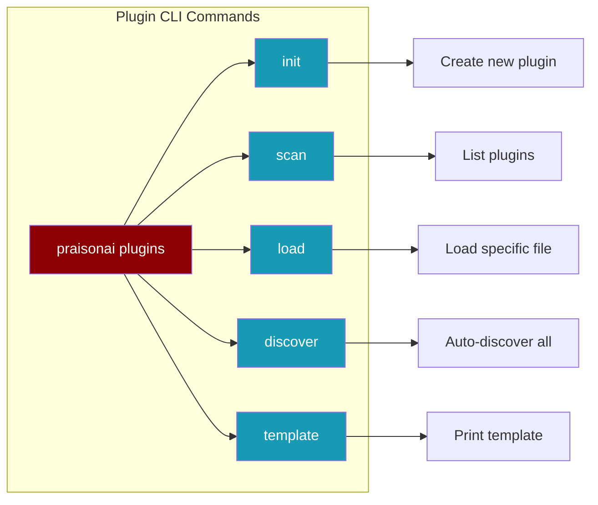

# Single-File Plugins

PraisonAI supports a simplified plugin format inspired by WordPress - just a single Python file with metadata in a docstring header.

<Info>
Single-file plugins are the **easiest way** to extend PraisonAI with custom tools and hooks. No package structure, no configuration files - just one `.py` file.
</Info>

## Quick Start

### 1. Create a Plugin

Create a file in `~/.praisonai/plugins/` or `./.praison/plugins/`:

```python
"""
Plugin Name: Weather Tools
Description: Get weather information for any city
Version: 1.0.0
Author: Your Name
"""

from praisonaiagents import tool

@tool
def get_weather(city: str) -> str:
    """Get the current weather for a city.
    
    Args:
        city: Name of the city
        
    Returns:
        Weather information string
    """
    # Your implementation here
    return f"The weather in {city} is sunny, 72°F"

@tool
def get_forecast(city: str, days: int = 5) -> str:
    """Get weather forecast for a city.
    
    Args:
        city: Name of the city
        days: Number of days to forecast
        
    Returns:
        Forecast information
    """
    return f"{days}-day forecast for {city}: Sunny with occasional clouds"
```

### 2. Use in Your Agent

Tools from plugins are automatically discovered:

```python
from praisonaiagents import Agent

# Tools are auto-discovered from plugin directories
agent = Agent(
    name="Weather Assistant",
    instructions="Help users with weather information",
    tools=["get_weather", "get_forecast"]  # Reference by name
)

response = agent.start("What's the weather in Paris?")
```

## Plugin Header Format

The plugin header is a docstring at the top of the file with WordPress-style metadata:

```python
"""
Plugin Name: My Plugin          # Required - Display name
Description: What it does       # Optional - Brief description
Version: 1.0.0                  # Optional - Semantic version
Author: Your Name               # Optional - Author name
Hooks: before_tool, after_tool  # Optional - Hooks this plugin uses
Dependencies: requests, pandas  # Optional - Required packages
"""
```

### Required Fields

| Field | Description |
|-------|-------------|
| `Plugin Name` | The display name of your plugin |

### Optional Fields

| Field | Description | Default |
|-------|-------------|---------|
| `Description` | Brief description of functionality | Empty |
| `Version` | Semantic version (e.g., 1.0.0) | 1.0.0 |
| `Author` | Plugin author name | None |
| `Hooks` | Comma-separated list of hooks used | None |
| `Dependencies` | Comma-separated list of required packages | None |

## Plugin Directories

Plugins are discovered from these directories (in order):

1. **Project-level**: `./.praison/plugins/` - Plugins specific to your project
2. **User-level**: `~/.praisonai/plugins/` - Plugins available to all your projects

<Tip>
Use project-level plugins for project-specific tools and user-level plugins for tools you want everywhere.
</Tip>

## Adding Tools

Use the `@tool` decorator to create tools:

```python
"""
Plugin Name: Math Tools
Description: Mathematical operations
Version: 1.0.0
"""

from praisonaiagents import tool

@tool
def calculate(expression: str) -> float:
    """Safely evaluate a mathematical expression.
    
    Args:
        expression: Math expression like "2 + 2" or "sqrt(16)"
        
    Returns:
        The calculated result
    """
    import ast
    import operator
    
    # Safe evaluation implementation
    return eval(expression)  # Use safe eval in production!

@tool
def convert_units(value: float, from_unit: str, to_unit: str) -> float:
    """Convert between units.
    
    Args:
        value: The value to convert
        from_unit: Source unit (e.g., "km")
        to_unit: Target unit (e.g., "miles")
        
    Returns:
        Converted value
    """
    conversions = {
        ("km", "miles"): 0.621371,
        ("miles", "km"): 1.60934,
    }
    factor = conversions.get((from_unit, to_unit), 1.0)
    return value * factor
```

## Adding Hooks

Use the `add_hook` decorator to intercept agent lifecycle events:

```python
"""
Plugin Name: Logging Plugin
Description: Log all tool calls
Version: 1.0.0
Hooks: before_tool, after_tool
"""

from praisonaiagents import tool
from praisonaiagents.hooks import add_hook

@add_hook("before_tool")
def log_tool_call(tool_name: str, args: dict) -> dict:
    """Log before each tool call."""
    print(f"[LOG] Calling tool: {tool_name} with args: {args}")
    return args  # Return args (can modify them)

@add_hook("after_tool")
def log_tool_result(tool_name: str, result: any) -> any:
    """Log after each tool call."""
    print(f"[LOG] Tool {tool_name} returned: {result}")
    return result  # Return result (can modify it)

@tool
def my_tool(query: str) -> str:
    """A sample tool."""
    return f"Result for: {query}"
```

### Available Hooks

| Hook | Description | Parameters |
|------|-------------|------------|
| `before_tool` | Before a tool is called | `tool_name`, `args` |
| `after_tool` | After a tool returns | `tool_name`, `result` |
| `before_agent` | Before agent processes | `agent`, `context` |
| `after_agent` | After agent completes | `agent`, `result` |
| `before_llm` | Before LLM call | `messages`, `config` |
| `after_llm` | After LLM response | `response`, `usage` |

## CLI Commands



<Tabs>
  <Tab title="Create Plugin">
```bash
# Create a new plugin with template
praisonai plugins init my_plugin

# With options
praisonai plugins init weather_tools --author "John Doe" --with-hook

# In a specific directory
praisonai plugins init custom --output ./my_plugins/
```
  </Tab>
  <Tab title="List & Scan">
```bash
# List all discovered plugins
praisonai plugins scan

# With details
praisonai plugins scan --verbose

# JSON output
praisonai plugins scan --json
```
  </Tab>
  <Tab title="Load & Discover">
```bash
# Load a specific plugin file
praisonai plugins load ./my_plugin.py

# Discover and load all plugins
praisonai plugins discover --verbose
```
  </Tab>
  <Tab title="Template">
```bash
# Print a plugin template to stdout
praisonai plugins template

# Save to file
praisonai plugins template > my_plugin.py

# With hook example
praisonai plugins template --with-hook
```
  </Tab>
</Tabs>

## Programmatic Usage

### Load Plugins Manually

```python
from praisonaiagents import (
    load_plugin,
    discover_plugins,
    discover_and_load_plugins,
)

# Load a single plugin
result = load_plugin("./my_plugin.py")
print(f"Loaded: {result['name']}, tools: {result['tools']}")

# Discover plugins without loading
plugins = discover_plugins(["./plugins", "~/.praisonai/plugins"])
for p in plugins:
    print(f"Found: {p['name']} at {p['path']}")

# Discover and load all
loaded = discover_and_load_plugins(include_defaults=True)
print(f"Loaded {len(loaded)} plugins")
```

### Use with PluginManager

```python
from praisonaiagents import get_plugin_manager

manager = get_plugin_manager()

# Load single-file plugins
manager.load_single_file_plugin("./my_plugin.py")

# Auto-discover from default directories
count = manager.auto_discover_plugins()
print(f"Discovered {count} plugins")

# List loaded plugins
for plugin in manager.list_single_file_plugins():
    print(f"- {plugin['name']}: {plugin['tools']}")
```

## Best Practices

<CardGroup cols={2}>
  <Card title="Keep It Simple" icon="leaf">
    One plugin = one purpose. Don't cram unrelated tools into one file.
  </Card>
  <Card title="Document Tools" icon="book">
    Use clear docstrings - they become the tool descriptions for the LLM.
  </Card>
  <Card title="Handle Errors" icon="shield">
    Return meaningful error messages instead of raising exceptions.
  </Card>
  <Card title="Type Hints" icon="code">
    Always use type hints - they help generate accurate tool schemas.
  </Card>
</CardGroup>

### Good Plugin Example

```python
"""
Plugin Name: GitHub Tools
Description: Interact with GitHub repositories
Version: 1.0.0
Author: Your Name
Dependencies: requests
"""

from praisonaiagents import tool
from typing import List, Dict, Any

@tool
def get_repo_info(owner: str, repo: str) -> Dict[str, Any]:
    """Get information about a GitHub repository.
    
    Args:
        owner: Repository owner (username or org)
        repo: Repository name
        
    Returns:
        Dictionary with repo info (stars, forks, description, etc.)
    """
    import requests
    
    try:
        response = requests.get(
            f"https://api.github.com/repos/{owner}/{repo}",
            timeout=10
        )
        response.raise_for_status()
        data = response.json()
        
        return {
            "name": data["name"],
            "description": data["description"],
            "stars": data["stargazers_count"],
            "forks": data["forks_count"],
            "language": data["language"],
            "url": data["html_url"],
        }
    except requests.RequestException as e:
        return {"error": f"Failed to fetch repo: {str(e)}"}

@tool
def list_repo_issues(owner: str, repo: str, state: str = "open") -> List[Dict[str, Any]]:
    """List issues for a GitHub repository.
    
    Args:
        owner: Repository owner
        repo: Repository name
        state: Issue state - "open", "closed", or "all"
        
    Returns:
        List of issues with title, number, and state
    """
    import requests
    
    try:
        response = requests.get(
            f"https://api.github.com/repos/{owner}/{repo}/issues",
            params={"state": state, "per_page": 10},
            timeout=10
        )
        response.raise_for_status()
        
        return [
            {
                "number": issue["number"],
                "title": issue["title"],
                "state": issue["state"],
                "url": issue["html_url"],
            }
            for issue in response.json()
        ]
    except requests.RequestException as e:
        return [{"error": f"Failed to fetch issues: {str(e)}"}]
```

## Troubleshooting

<AccordionGroup>
  <Accordion title="Plugin not discovered">
    - Check the file is in `.praison/plugins/` or `~/.praisonai/plugins/`
    - Ensure the file has a `.py` extension
    - Verify the docstring header has `Plugin Name:` field
    - Files starting with `_` are skipped
  </Accordion>
  
  <Accordion title="Tools not registered">
    - Make sure you're using the `@tool` decorator
    - Check for import errors in your plugin
    - Run with verbose logging to see errors
  </Accordion>
  
  <Accordion title="Hooks not firing">
    - Verify the hook name is correct (e.g., `before_tool`)
    - Check that the hook function signature matches expected parameters
    - Ensure the plugin is loaded before the agent runs
  </Accordion>
</AccordionGroup>

## Next Steps

<CardGroup cols={2}>
  <Card title="Tools Guide" icon="wrench" href="/tools/overview">
    Learn more about creating tools
  </Card>
  <Card title="Hooks System" icon="link" href="/features/hooks">
    Deep dive into the hooks system
  </Card>
  <Card title="Agent Configuration" icon="gear" href="/agents/configuration">
    Configure agents to use your plugins
  </Card>
  <Card title="Examples" icon="code" href="/examples/plugins">
    See more plugin examples
  </Card>
</CardGroup>
