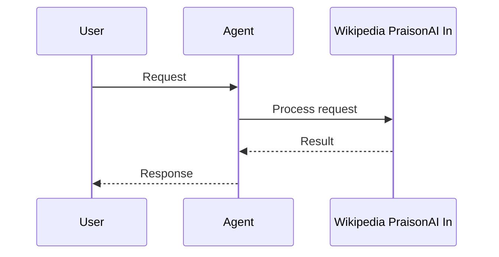

```python
from praisonaiagents import Agent

agent = Agent(
    name="WikiAgent",
    instructions="Search Wikipedia for factual information.",
)
agent.start("Explain the history of the internet")
```

The user asks for encyclopaedic facts; the agent searches Wikipedia and returns a grounded summary.





# Wikipedia PraisonAI Integration

```bash
pip install wikipedia langchain_community
```

```python
# tools.py
from langchain_community.utilities import WikipediaAPIWrapper
class WikipediaSearchTool(BaseTool):
    name: str = "WikipediaSearchTool"
    description: str = "Search Wikipedia for relevant information based on a query."

    def _run(self, query: str):
        api_wrapper = WikipediaAPIWrapper(top_k_results=4, doc_content_chars_max=100)
        results = api_wrapper.load(query=query)
        return results
```

```yaml
# agents.yaml
framework: crewai
topic: research about nvidia growth
agents:  # Canonical: use 'agents' instead of 'roles'
  data_collector:
    instructions:  # Canonical: use 'instructions' instead of 'backstory' An experienced researcher with the ability to efficiently collect and
      organize vast amounts of data.
    goal: Gather information on Nvidia's growth by providing the Ticket Symbol to YahooFinanceNewsTool
    role: Data Collector
    tasks:
      data_collection_task:
        description: Collect data on Nvidia's growth from various sources such as
          financial reports, news articles, and company announcements.
        expected_output: A comprehensive document detailing data points on Nvidia's
          growth over the years.
    tools:
    - 'WikipediaSearchTool'
```


## Quick Start

<Steps>
<Step title="Install">
```bash
pip install praisonaiagents wikipedia-api
```
</Step>
<Step title="Search Wikipedia with agent">
```python
from praisonaiagents import Agent

agent = Agent(
    name="WikiAgent",
    instructions="Search Wikipedia for factual information.",
)

agent.start("Explain the history of the internet")
```
</Step>
</Steps>


## Best Practices

<AccordionGroup>
  <Accordion title="Use Wikipedia for factual background">
    Wikipedia tools are best for general knowledge and background context, not breaking news.
  </Accordion>
  <Accordion title="Extract specific sections">
    Extract specific sections rather than full articles to reduce token usage.
  </Accordion>
  <Accordion title="Follow links for depth">
    Use Wikipedia link extraction to discover and follow related concepts.
  </Accordion>
  <Accordion title="Pair with web search for recency">
    Combine Wikipedia (background facts) with web search (recent information) for comprehensive research.
  </Accordion>
</AccordionGroup>


## Related

<CardGroup cols={2}>
  <Card title="Custom Tools" icon="wrench" href="/docs/tools/custom">
    Build your own agent tools
  </Card>
  <Card title="Tools Overview" icon="toolbox" href="/docs/tools/tools">
    Browse PraisonAI tool documentation
  </Card>
</CardGroup>
