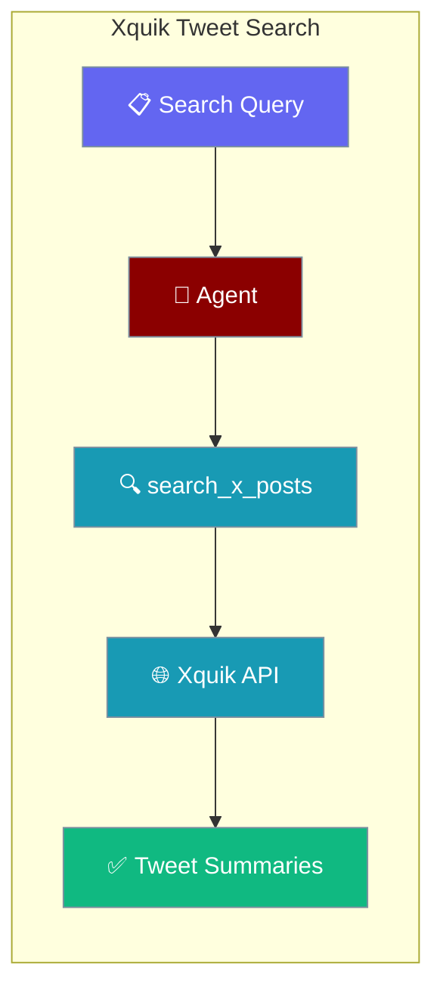
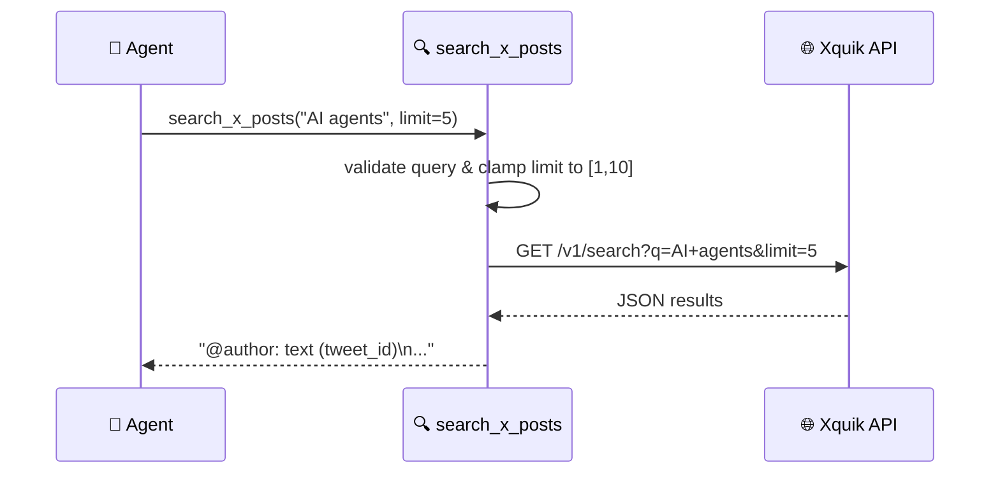

Search recent public posts on X (Twitter) in agent workflows with a single function call.

```python
from praisonaiagents import Agent
from praisonaiagents.tools import search_x_posts

agent = Agent(name="SocialResearcher", tools=[search_x_posts])
agent.start("Find recent posts about PraisonAI on X")
```

The user describes a topic; the agent searches recent public X posts via Xquik and summarises highlights.



## Quick Start

<Steps>
<Step title="Set your API key">
```bash
export XQUIK_API_KEY=your_xquik_api_key
export OPENAI_API_KEY=your_openai_api_key
```
</Step>

<Step title="Install and run">
```python
import os
import httpx
from praisonaiagents import Agent
from praisonaiagents.tools import tool

XQUIK_API_KEY = os.getenv("XQUIK_API_KEY", "")

def _xquik_api_key_available() -> bool:
    return bool(XQUIK_API_KEY)

@tool(availability=_xquik_api_key_available)
def search_x_posts(query: str, limit: int = 5) -> str:
    """Search recent public posts on X (Twitter) using the Xquik API.

    Args:
        query: Search query string.
        limit: Number of results to return (1–10, default 5).

    Returns:
        Formatted tweet summaries or an error message.
    """
    if not query or not query.strip():
        return "Error: query cannot be empty."

    limit = max(1, min(10, limit))

    try:
        response = httpx.get(
            "https://api.xquik.com/v1/search",
            params={"q": query, "limit": limit},
            headers={"Authorization": f"Bearer {XQUIK_API_KEY}"},
            timeout=10,
        )
        response.raise_for_status()
        data = response.json()
    except httpx.TimeoutException:
        return "Error: request timed out — try again shortly."
    except httpx.HTTPStatusError as e:
        return f"Error: HTTP {e.response.status_code} from Xquik API."
    except Exception as e:
        return f"Error: {e}"

    posts = data.get("results") or data.get("posts") or []
    if not posts:
        return f"No results found for '{query}'."

    lines = []
    for post in posts[:limit]:
        author = post.get("author", "unknown")
        text = post.get("text", "")
        tweet_id = post.get("id", "")
        lines.append(f"@{author}: {text} ({tweet_id})")

    return "\n".join(lines)


agent = Agent(
    name="SocialResearcher",
    instructions="Search X for recent posts and summarise key themes.",
    tools=[search_x_posts],
)

agent.start("Find recent posts about AI agents")
```
</Step>
</Steps>

---

## How It Works



Each result line uses the format `@author: text (tweet_id)` so agents can reference specific posts downstream.

---

## Configuration

### Prerequisites

| Requirement | Detail |
|------------|--------|
| `XQUIK_API_KEY` | Obtain from [xquik.com](https://xquik.com) |
| `OPENAI_API_KEY` (or other LLM) | For the agent's reasoning |
| `httpx` | `pip install httpx` |

### Function Signature

| Parameter | Type | Default | Description |
|-----------|------|---------|-------------|
| `query` | `str` | _(required)_ | Search query for X posts |
| `limit` | `int` | `5` | Results to return; clamped to `[1, 10]` |

### `availability=` decorator pattern

The `@tool(availability=_xquik_api_key_available)` decorator hides `search_x_posts` from the agent's tool list when `XQUIK_API_KEY` is not set. This pattern works for any API-key-gated tool:

```python
def _my_api_key_available() -> bool:
    return bool(os.getenv("MY_API_KEY"))

@tool(availability=_my_api_key_available)
def my_tool(...) -> str:
    ...
```

When the env var is absent the tool is silently omitted — no runtime error, no confusing model hallucination.

---

## Common Patterns

### Multiple queries in one agent run

```python
agent = Agent(
    name="TrendTracker",
    instructions="Search for each topic and identify common themes.",
    tools=[search_x_posts],
)

agent.start(
    "Search for 'AI agents' and 'LLM tools' separately, then compare results."
)
```

### Combine with a summariser

```python
from praisonaiagents import Agent, Task, PraisonAIAgents

searcher = Agent(
    name="Searcher",
    instructions="Find recent X posts about the given topic.",
    tools=[search_x_posts],
)

summariser = Agent(
    name="Summariser",
    instructions="Summarise the key themes from the posts found.",
)

search_task = Task(
    description="Search X for 'open source LLMs'",
    agent=searcher,
    expected_output="List of tweet summaries",
)

summary_task = Task(
    description="Summarise the tweets into 3 key themes",
    agent=summariser,
    expected_output="3-point summary",
    context=[search_task],
)

PraisonAIAgents(agents=[searcher, summariser], tasks=[search_task, summary_task]).start()
```

---

## Best Practices

<AccordionGroup>
<Accordion title="Always set XQUIK_API_KEY before starting the agent">
The tool returns a clear error message if the key is missing, but the agent cannot search. Export the key in your shell or `.env` before running.

```bash
export XQUIK_API_KEY=xq_...
```
</Accordion>

<Accordion title="Keep limit between 1 and 10">
The `limit` parameter is clamped server-side to `[1, 10]`. Passing `0` returns 1 result; passing `50` returns 10. Be explicit in your agent instructions.
</Accordion>

<Accordion title="Use specific queries for better results">
Vague queries like "AI" return broad results. Use specific phrases like "AI agent frameworks 2025" or include relevant hashtags.
</Accordion>

<Accordion title="Handle empty results gracefully">
When no posts match, the tool returns `"No results found for '...'"`. Instruct agents to try alternative queries in that case.
</Accordion>
</AccordionGroup>

---

## Related

<CardGroup cols={2}>
<Card title="Tavily Search" icon="magnifying-glass" href="/docs/tools/tavily">
Web search with AI-optimised results
</Card>
<Card title="Exa Search" icon="search" href="/docs/tools/exa">
Neural search for the web
</Card>
<Card title="Tool Availability" icon="toggle-on" href="/docs/features/tool-availability">
Gate tools on env vars with the `availability=` decorator
</Card>
<Card title="Custom Tools" icon="wrench" href="/docs/tools/custom">
Build your own tool functions
</Card>
</CardGroup>
