<Info>
Tools can now be referenced by name directly in YAML files without creating a local `tools.py` file.
</Info>

## How It Works

When you specify tools in your YAML configuration, PraisonAI automatically resolves them from multiple sources:

```mermaid
flowchart LR
    subgraph YAML["agents.yaml"]
        T["tools: [tavily_search]"]
    end
    
    subgraph Resolution["Tool Resolution"]
        direction TB
        L["1. Local tools.py"]
        B["2. Built-in Tools"]
        E["3. External Tools"]
    end
    
    subgraph Agent["Agent"]
        A["🤖 Agent with Tools"]
    end
    
    T --> Resolution
    Resolution --> Agent
    
    style YAML fill:#8B0000,color:#fff
    style Agent fill:#8B0000,color:#fff
    style Resolution fill:#189AB4,color:#fff
```



## Quick Start

<Steps>
  <Step title="Create YAML File">
    Reference tools by name in your `agents.yaml`:
    
    ```yaml agents.yaml
    framework: praisonai
    topic: "AI News"
    
    roles:
      researcher:
        role: AI Researcher
        goal: Search for the latest AI news
        backstory: Expert researcher
        tools:
          - tavily_search
          - internet_search
        tasks:
          search_task:
            description: Search for {topic}
            expected_output: Summary of findings
    ```
  </Step>
  
  <Step title="Run Your Agents">
    No `tools.py` needed - tools are auto-resolved:
    
    ```bash
    praisonai run agents.yaml
    ```
  </Step>
</Steps>

## Tool Sources

<CardGroup cols={3}>
  <Card title="Built-in Tools" icon="cube">
    70+ tools from `praisonaiagents.tools`
    
    - `tavily_search`
    - `internet_search`
    - `execute_command`
    - `read_file`
    - And more...
  </Card>
  
  <Card title="Local tools.py" icon="file-code">
    Custom tools you create
    
    - Takes precedence
    - Full control
    - Custom variables
  </Card>
  
  <Card title="External Tools" icon="puzzle-piece">
    120+ tools from `praisonai-tools`
    
    - `EmailTool`
    - `SlackTool`
    - `GitHubTool`
    - And more...
  </Card>
</CardGroup>

## Resolution Order

Tools are resolved in this order (first match wins):

```mermaid
flowchart TB
    subgraph Input["Tool Name: tavily_search"]
        N["'tavily_search'"]
    end
    
    subgraph Check1["1️⃣ Local tools.py"]
        L["Check local file"]
    end
    
    subgraph Check2["2️⃣ Built-in Tools"]
        B["Check praisonaiagents.tools"]
    end
    
    subgraph Check3["3️⃣ External Tools"]
        E["Check praisonai-tools"]
    end
    
    subgraph Result["Result"]
        R["✅ Callable Function"]
    end
    
    N --> L
    L -->|Not Found| B
    L -->|Found| R
    B -->|Not Found| E
    B -->|Found| R
    E -->|Found| R
    
    style Input fill:#8B0000,color:#fff
    style Result fill:#8B0000,color:#fff
    style Check1 fill:#189AB4,color:#fff
    style Check2 fill:#189AB4,color:#fff
    style Check3 fill:#189AB4,color:#fff
```



<Tip>
Local `tools.py` always takes precedence. This lets you override built-in tools with custom implementations.
</Tip>

## Available Built-in Tools

<AccordionGroup>
  <Accordion title="Search Tools">
    | Tool | Description |
    |------|-------------|
    | `tavily_search` | AI-powered web search |
    | `tavily_extract` | Extract content from URLs |
    | `internet_search` | DuckDuckGo search |
    | `exa_search` | Exa semantic search |
    | `search_web` | Unified search (auto-fallback) |
  </Accordion>
  
  <Accordion title="File Tools">
    | Tool | Description |
    |------|-------------|
    | `read_file` | Read file contents |
    | `write_file` | Write to files |
    | `list_files` | List directory contents |
    | `copy_file` | Copy files |
    | `delete_file` | Delete files |
  </Accordion>
  
  <Accordion title="Shell Tools">
    | Tool | Description |
    |------|-------------|
    | `execute_command` | Run shell commands |
    | `list_processes` | List running processes |
    | `kill_process` | Terminate processes |
    | `get_system_info` | System information |
  </Accordion>
  
  <Accordion title="Web Crawling">
    | Tool | Description |
    |------|-------------|
    | `crawl4ai` | Async web crawling |
    | `crawl4ai_extract` | Extract with CSS selectors |
    | `scrape_page` | Spider page scraping |
    | `extract_links` | Extract page links |
  </Accordion>
</AccordionGroup>

## CLI Commands

### List Available Tools

```bash
praisonai tools list
```

<Frame>
```
┌─────────────────────────────────────────────────┐
│               Available Tools                    │
├──────────────────┬──────────┬───────────────────┤
│ Tool Name        │ Source   │ Description       │
├──────────────────┼──────────┼───────────────────┤
│ crawl4ai         │ builtin  │ Built-in tool...  │
│ execute_command  │ builtin  │ Built-in tool...  │
│ internet_search  │ builtin  │ Built-in tool...  │
│ tavily_search    │ builtin  │ Built-in tool...  │
│ my_custom_tool   │ local    │ My custom tool... │
└──────────────────┴──────────┴───────────────────┘
```
</Frame>

### Validate YAML Tools

```bash
praisonai tools validate agents.yaml
```

<Tabs>
  <Tab title="Valid">
    ```
    ✓ All tools in agents.yaml are valid!
    Tools found: internet_search, tavily_search
    ```
  </Tab>
  <Tab title="Invalid">
    ```
    ✗ Missing tools in agents.yaml:
      • nonexistent_tool
    
    Hint: Run 'praisonai tools list' to see available tools.
    ```
  </Tab>
</Tabs>

### Get Tool Info

```bash
praisonai tools info tavily_search
```

## Custom Tools (tools.py)

For custom logic or variables, create a `tools.py` file:

```python tools.py
# Custom tool with your own logic
def my_custom_tool(query: str) -> str:
    """Search using my custom API."""
    # Your implementation
    return f"Results for: {query}"

# Custom variables
API_KEY = "your-key"
BASE_URL = "https://api.example.com"

def api_search(query: str) -> dict:
    """Search with custom API."""
    import requests
    response = requests.get(f"{BASE_URL}/search?q={query}&key={API_KEY}")
    return response.json()
```

Then reference in YAML:

```yaml agents.yaml
roles:
  researcher:
    tools:
      - my_custom_tool    # From local tools.py
      - api_search        # From local tools.py
      - tavily_search     # Built-in (still works!)
```

<Warning>
Local tools with the same name as built-in tools will override them.
</Warning>

## Examples

<CodeGroup>
```yaml Simple Search Agent
framework: praisonai
topic: "Latest AI developments"

roles:
  researcher:
    role: AI Researcher
    goal: Find and summarize AI news
    backstory: Expert in AI research
    tools:
      - tavily_search
    tasks:
      research:
        description: Search for {topic}
        expected_output: Detailed summary
```

```yaml Multi-Tool Agent
framework: praisonai
topic: "Python web scraping"

roles:
  developer:
    role: Developer
    goal: Research and implement solutions
    backstory: Senior Python developer
    tools:
      - tavily_search
      - internet_search
      - execute_command
      - read_file
      - write_file
    tasks:
      research:
        description: Research {topic}
        expected_output: Implementation guide
```

```yaml With Custom Tools
framework: praisonai
topic: "Company data"

roles:
  analyst:
    role: Data Analyst
    goal: Analyze company data
    backstory: Expert analyst
    tools:
      - my_database_query  # From tools.py
      - tavily_search      # Built-in
    tasks:
      analyze:
        description: Analyze {topic}
        expected_output: Analysis report
```
</CodeGroup>

## Troubleshooting

<AccordionGroup>
  <Accordion title="Tool not found">
    1. Check the tool name spelling
    2. Run `praisonai tools list` to see available tools
    3. If using external tools, ensure `praisonai-tools` is installed:
       ```bash
       pip install praisonai-tools
       ```
  </Accordion>
  
  <Accordion title="Tool not working as expected">
    1. Check if the tool requires an API key (e.g., `TAVILY_API_KEY`)
    2. Run `praisonai tools info <tool_name>` for details
    3. Test the tool: `praisonai tools test <tool_name>`
  </Accordion>
  
  <Accordion title="Want to override a built-in tool">
    Create a `tools.py` file with a function of the same name:
    ```python
    def tavily_search(query: str) -> str:
        """My custom tavily_search implementation."""
        # Your code here
        return "custom result"
    ```
  </Accordion>
</AccordionGroup>

## API Reference

<ResponseField name="ToolResolver" type="class">
  Resolves tool names to callables from multiple sources.
  
  <Expandable title="Methods">
    <ResponseField name="resolve(name)" type="method">
      Resolve a single tool name to a callable.
      
      **Returns:** `Callable` or `None`
    </ResponseField>
    
    <ResponseField name="resolve_many(names)" type="method">
      Resolve multiple tool names.
      
      **Returns:** `List[Callable]`
    </ResponseField>
    
    <ResponseField name="list_available()" type="method">
      List all available tools with descriptions.
      
      **Returns:** `Dict[str, str]`
    </ResponseField>
    
    <ResponseField name="has_tool(name)" type="method">
      Check if a tool exists.
      
      **Returns:** `bool`
    </ResponseField>
    
    <ResponseField name="validate_yaml_tools(config)" type="method">
      Validate tools in a YAML config.
      
      **Returns:** `List[str]` (missing tool names)
    </ResponseField>
  </Expandable>
</ResponseField>

## Python Usage

```python
from praisonai.tool_resolver import ToolResolver, resolve_tool

# Using the class
resolver = ToolResolver()
tool = resolver.resolve("tavily_search")
tools = resolver.resolve_many(["tavily_search", "internet_search"])

# Using convenience functions
from praisonai.tool_resolver import resolve_tool, list_available_tools

tool = resolve_tool("tavily_search")
available = list_available_tools()
```
