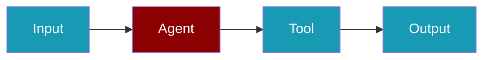

# YouTube Search PraisonAI Integration

```bash
pip install youtube_search praisonai langchain_community langchain
```

```python
# tools.py
from langchain_community.tools import YouTubeSearchTool
```

```yaml
# agents.yaml
framework: crewai
topic: research about the causes of lung disease
agents:  # Canonical: use 'agents' instead of 'roles'
  research_analyst:
    instructions:  # Canonical: use 'instructions' instead of 'backstory' Experienced in analyzing scientific data related to respiratory health.
    goal: Analyze data on lung diseases
    role: Research Analyst
    tasks:
      data_analysis:
        description: Gather and analyze data on the causes and risk factors of lung
          diseases.
        expected_output: Report detailing key findings on lung disease causes.
    tools:
    - 'YouTubeSearchTool'
```

## Related

<CardGroup cols={2}>
  <Card title="Custom Tools" icon="wrench" href="/docs/tools/custom">
    Build your own agent tools
  </Card>
  <Card title="Tools Overview" icon="toolbox" href="/docs/tools/tools">
    Browse PraisonAI tool documentation
  </Card>
</CardGroup>
