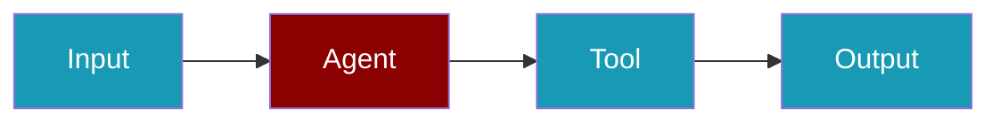
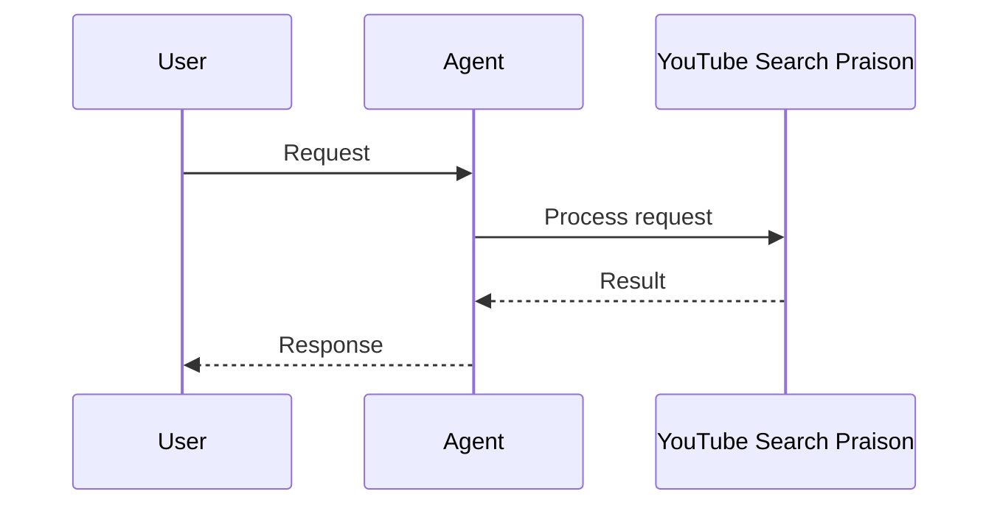

```python
from praisonaiagents import Agent

agent = Agent(
    name="YouTubeAgent",
    instructions="Extract and analyse YouTube video content.",
)
agent.start("Summarise the key points from this video: https://www.youtube.com/watch?v=example")
```

The user shares a video link or search topic; the agent finds content and summarises transcripts or metadata.






# YouTube Search PraisonAI Integration

```bash
pip install youtube_search praisonai langchain_community langchain
```

```python
# tools.py
from langchain_community.tools import YouTubeSearchTool
```

```yaml
# agents.yaml
framework: crewai
topic: research about the causes of lung disease
agents:  # Canonical: use 'agents' instead of 'roles'
  research_analyst:
    instructions:  # Canonical: use 'instructions' instead of 'backstory' Experienced in analyzing scientific data related to respiratory health.
    goal: Analyze data on lung diseases
    role: Research Analyst
    tasks:
      data_analysis:
        description: Gather and analyze data on the causes and risk factors of lung
          diseases.
        expected_output: Report detailing key findings on lung disease causes.
    tools:
    - 'YouTubeSearchTool'
```


## Quick Start

<Steps>
<Step title="Install">
```bash
pip install praisonaiagents youtube-transcript-api
```
</Step>
<Step title="Extract video content with agent">
```python
from praisonaiagents import Agent

agent = Agent(
    name="YouTubeAgent",
    instructions="Extract and analyze YouTube video content.",
)

agent.start("Summarize the key points from this video: https://www.youtube.com/watch?v=example")
```
</Step>
</Steps>


## Best Practices

<AccordionGroup>
  <Accordion title="Use transcript extraction for content analysis">
    YouTube transcripts provide the full spoken content - much richer than titles or descriptions.
  </Accordion>
  <Accordion title="Search before extracting">
    Search for videos first, then extract transcripts from the most relevant ones.
  </Accordion>
  <Accordion title="Handle missing transcripts">
    Not all videos have transcripts - always check for `None` before processing.
  </Accordion>
  <Accordion title="Chunk long transcripts">
    Long video transcripts may exceed context limits - chunk them into segments for analysis.
  </Accordion>
</AccordionGroup>


## Related

<CardGroup cols={2}>
  <Card title="Custom Tools" icon="wrench" href="/docs/tools/custom">
    Build your own agent tools
  </Card>
  <Card title="Tools Overview" icon="toolbox" href="/docs/tools/tools">
    Browse PraisonAI tool documentation
  </Card>
</CardGroup>
