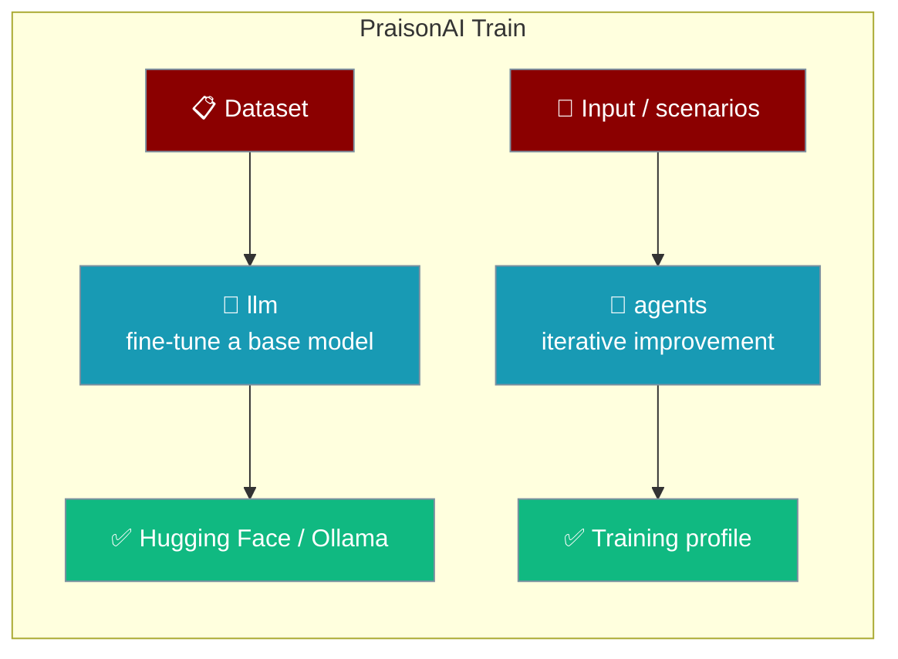
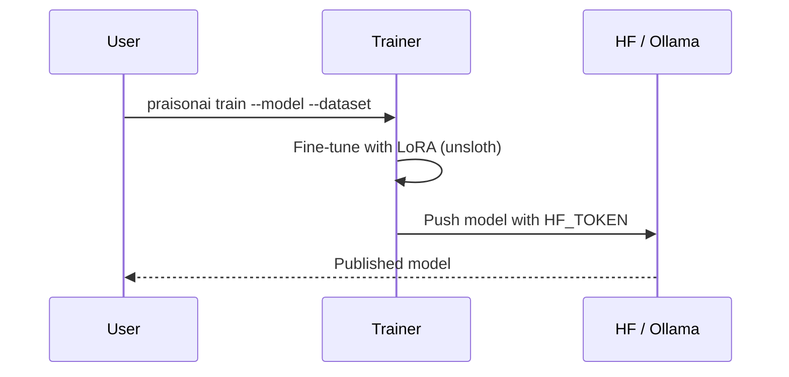

Fine-tune a base model on your dataset and push the result to Hugging Face and Ollama with one command.

```bash
export HF_TOKEN="${HF_TOKEN:?Set HF_TOKEN in your shell}"
praisonai train \
    --model unsloth/Meta-Llama-3.1-8B-Instruct-bnb-4bit \
    --dataset yahma/alpaca-cleaned \
    --hf mervinpraison/llama3.1-instruct \
    --ollama mervinpraison/llama3.1-instruct
```



<Info>
Two training flows: **`llm`** fine-tunes a base model on your dataset (needs the heavy ML stack), and **`agents`** improves an agent through iterative feedback loops (lightweight, no CUDA/Unsloth).
</Info>

## Standalone Install

Training now ships as its own package (`praisonai-train`, import `praisonai_train`). Install just what you need:

```bash
pip install praisonai-train              # agent training, lightweight (no CUDA/Unsloth)
pip install "praisonai-train[llm]"       # + Unsloth / torch fine-tuning stack
```

The standalone CLI exposes the training commands directly:

```bash
praisonai-train agents --input "What is Python?" --iterations 3
praisonai-train llm dataset.json --model llama-3.1
praisonai-train list
praisonai-train show <session>
praisonai-train apply <session>
```

<Note>
The wrapper CLI `praisonai train ...` still works — it now bridges into `praisonai-train` when the standalone package is installed (and is hidden on code-only installs). `pip install "praisonai[train]"` (previously an empty extra) now pulls `praisonai-train[llm]`.
</Note>

<div className="relative w-full aspect-video">
  <iframe
    className="absolute top-0 left-0 w-full h-full"
    src="https://www.youtube.com/embed/aLawE8kwCrI"
    title="YouTube video player"
    allow="accelerometer; autoplay; clipboard-write; encrypted-media; gyroscope; picture-in-picture"
    allowFullScreen
  ></iframe>
</div>

## To upload to Huggingface

```bash
export HF_TOKEN="${HF_TOKEN:?Set HF_TOKEN in your shell}"
```

## Initilise praisonai train

```bash
praisonai train init
```

## Requirements

<Note>
Training dependencies are checked at startup via `unsloth` package availability but only fully loaded when training commands run.
</Note>

**Install training dependencies:**
```bash
pip install "praisonai-train[llm]"       # LLM fine-tuning (Unsloth / torch / CUDA)
pip install praisonai-train              # agent training only — no CUDA/Unsloth
pip install "praisonai[train]"           # via the wrapper — pulls praisonai-train[llm]
```

Pick the flavour that matches your flow: **agent training** (`praisonai-train`) needs no CUDA/Unsloth, while **LLM fine-tuning** (`praisonai-train[llm]`) pulls the full torch/Unsloth stack.

**Required for training:**
1. Huggingface token
2. Base model to train on (e.g. unsloth/Meta-Llama-3.1-8B-Instruct-bnb-4bit)
3. Dataset to train on (e.g. yahma/alpaca-cleaned)
4. Huggingface model name to upload to (e.g. mervinpraison/llama3.1-instruct) (Optional)
5. Ollama model name to upload to (e.g. mervinpraison/llama3.1-instruct) (Optional)

If training dependencies are missing, you'll see:
```
ERROR: Training dependencies not installed. Install with:

pip install "praisonai[train]"
Or run: praisonai train init
```

## To upload to ollama.com (Linux)

```bash
sudo cat /usr/share/ollama/.ollama/id_ed25519.pub
```

Save the output from above to ollama.com --> Ollama keys

<Note>
You no longer need to run `ollama serve` manually before `praisonai train`. The training command starts the Ollama daemon automatically if it isn't already running, then creates and pushes the model. Requires the `ollama` CLI on PATH — install from [ollama.com](https://ollama.com).
</Note>

## RUN PraisonAI Train

```bash
praisonai train \
    --model unsloth/Meta-Llama-3.1-8B-Instruct-bnb-4bit \
    --dataset yahma/alpaca-cleaned \
    --hf mervinpraison/llama3.1-instruct \
    --ollama mervinpraison/llama3.1-instruct
```

Note: PraisonAI Train currently tested on Linux with 1 GPU. With pytorch-cuda=12.1

## Config.yaml example

```yaml
ollama_save: "true"
huggingface_save: "true"
train: "true"

model_name: "unsloth/Meta-Llama-3.1-8B-Instruct-bnb-4bit"
hf_model_name: "mervinpraison/llama-3.1-instruct"
ollama_model: "mervinpraison/llama3.1-instruct"
model_parameters: "8b"

dataset:
  - name: "yahma/alpaca-cleaned"
    split_type: "train"
    processing_func: "format_prompts"
    rename:
      input: "input"
      output: "output"
      instruction: "instruction"
    filter_data: false
    filter_column_value: "id"
    filter_value: "alpaca"
    num_samples: 20000

dataset_text_field: "text"
dataset_num_proc: 2
packing: false

max_seq_length: 2048
load_in_4bit: true
lora_r: 16
lora_target_modules: 
  - "q_proj"
  - "k_proj"
  - "v_proj"
  - "o_proj"
  - "gate_proj"
  - "up_proj"
  - "down_proj"
lora_alpha: 16
lora_dropout: 0
lora_bias: "none"
use_gradient_checkpointing: "unsloth"
random_state: 3407
use_rslora: false
loftq_config: null

per_device_train_batch_size: 2
gradient_accumulation_steps: 2
warmup_steps: 5
num_train_epochs: 1
max_steps: 10
learning_rate: 2.0e-4
logging_steps: 1
optim: "adamw_8bit"
weight_decay: 0.01
lr_scheduler_type: "linear"
seed: 3407
output_dir: "outputs"

quantization_method: 
  - "q4_k_m"

```

```bash
praisonai train
```

## wandb

```bash
wandb login
```

<Note>
Get the key from [here](https://wandb.ai/site/login)
</Note>

```bash
export PRAISON_WANDB=True
export WANDB_LOG_MODEL=checkpoint
export WANDB_PROJECT=praisonai-test
export PRAISON_WANDB_RUN_NAME=praisonai-train  
```

## How It Works

You point the trainer at a base model and dataset; it fine-tunes with LoRA and pushes the result to the hubs you configured.



## Best Practices

<AccordionGroup>
<Accordion title="Set HF_TOKEN in the environment">
Export `HF_TOKEN` in your shell before training so the trainer can push to Hugging Face. Never commit the raw token.
</Accordion>

<Accordion title="Start small, then scale">
Use a low `max_steps` and a small `num_samples` for a first run to confirm the pipeline before a full training job.
</Accordion>

<Accordion title="Install the train extra">
Run `pip install "praisonai[train]"` (or `praisonai train init`) so `unsloth` and CUDA deps are available.
</Accordion>

<Accordion title="Track runs with Weights & Biases">
Set `PRAISON_WANDB=True` and the `WANDB_*` variables to log loss curves and checkpoints for each run.
</Accordion>
</AccordionGroup>

## Related

<CardGroup cols={2}>
  <Card title="Models" icon="brain" href="/docs/models">
    Use your fine-tuned model with an Agent.
  </Card>
  <Card title="Installation" icon="download" href="/docs/installation">
    Install the training extras.
  </Card>
</CardGroup>