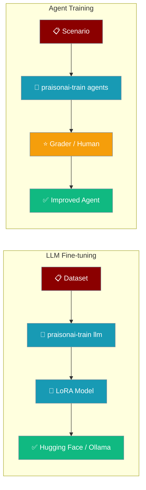
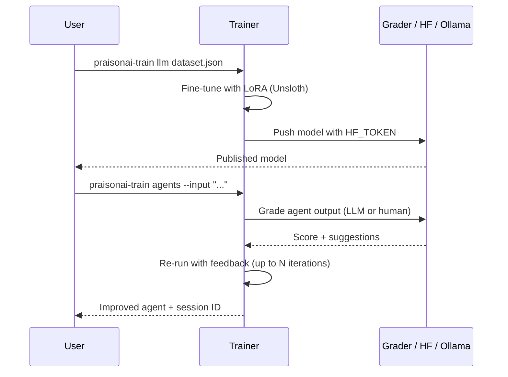
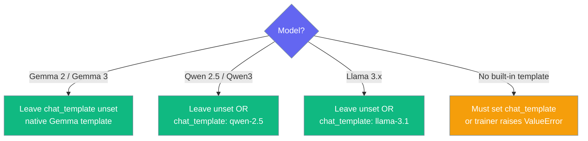

Fine-tune a base model with Unsloth or improve an agent iteratively with LLM/human feedback — one command each.



<Info>
Two training flows: **`llm`** fine-tunes a base model on your dataset (needs the heavy ML stack), and **`agents`** improves an agent through iterative feedback loops (lightweight, no CUDA/Unsloth).
</Info>

## Standalone Install

Training now ships as its own package (`praisonai-train`, import `praisonai_train`). Install just what you need:

```bash
pip install praisonai-train              # agent training (LLM-as-Judge + human feedback), no CUDA/Unsloth
pip install "praisonai-train[llm]"       # + Unsloth / torch fine-tuning stack
```

The standalone CLI exposes the training commands directly:

```bash
praisonai-train agents --input "What is Python?" --iterations 3
praisonai-train llm dataset.json --model llama-3.1
praisonai-train list
praisonai-train show <session>
praisonai-train apply <session>
```

<Note>
The wrapper CLI `praisonai train ...` still works — it now bridges into `praisonai-train` when the standalone package is installed (and is hidden on code-only installs). `pip install "praisonai[train]"` (previously an empty extra) now pulls `praisonai-train[llm]`.
</Note>

<div className="relative w-full aspect-video">
  <iframe
    className="absolute top-0 left-0 w-full h-full"
    src="https://www.youtube.com/embed/aLawE8kwCrI"
    title="YouTube video player"
    allow="accelerometer; autoplay; clipboard-write; encrypted-media; gyroscope; picture-in-picture"
    allowFullScreen
  ></iframe>
</div>

## Quick Start

<Steps>
<Step title="LLM Fine-tuning">

Fine-tune a base model on your dataset with Unsloth.

```bash
pip install "praisonai-train[llm]"

praisonai-train llm dataset.json \
    --model unsloth/Meta-Llama-3.1-8B-Instruct-bnb-4bit
```

</Step>

<Step title="Agent Training">

Improve an agent iteratively with LLM-as-Judge or human feedback.

```python
from praisonaiagents import Agent

agent = Agent(instructions="You are a helpful assistant.")
```

```bash
pip install praisonai-train

praisonai-train agents --input "What is Python?"
```

One `pip install praisonai-train` gives you the agent, the trainer, and the grader — `litellm` ships as a core dependency, so live LLM-as-Judge grading works with no extra install.

Runs cleanly on Windows and other non-UTF-8 consoles — the summary automatically falls back to ASCII (`PASSED` / `NEEDS WORK`) with no configuration needed. Exit codes: `0` = training persisted, `1` = training failed, `130` = interrupted. See [Train CLI → Exit Codes](/docs/cli/train#exit-codes).

<Note>
`--iterations` sets the **maximum** number of training loops. In LLM-as-Judge mode, training **stops early** when any iteration scores **≥ 9.5** (excellent), so easy prompts may finish in a single iteration. Pass `--no-early-stop` to force all iterations, or `--verbose` to see when it stops. See [Train CLI → Early Stop](/docs/cli/train#early-stop-llm-mode) for the full flow.
</Note>

</Step>
</Steps>

---

## How It Works

Point the trainer at a base model and dataset to fine-tune, or at a scenario to iteratively improve an agent.



**Real interaction — agent-training path:** an agent gives so-so answers → run `praisonai-train agents --input "Explain AI" --human` → review N iterations → `praisonai-train apply <session_id> --run "Explain AI"` bakes the improvements into the agent via hooks → the same agent answers better.

---

## CLI Reference

Five subcommands cover both fine-tuning and agent training.

| Subcommand | Purpose |
|------------|---------|
| `praisonai-train llm DATASET` | Fine-tune an LLM via Unsloth |
| `praisonai-train agents [AGENT_FILE]` | Iteratively train an agent |
| `praisonai-train list` | List training sessions (add `--storage-backend`/`--storage-path` for SQLite/Redis/custom dirs) |
| `praisonai-train show SESSION_ID` | Show a session's iterations and best score (backend-aware) |
| `praisonai-train apply SESSION_ID` | Apply learned suggestions to an agent (backend-aware) |

See [Train CLI](/docs/cli/train) for full flags.

---

## Fine-tuning Setup

Push a fine-tuned model to Hugging Face and Ollama.

### Hugging Face token

```bash
export HF_TOKEN="${HF_TOKEN:?Set HF_TOKEN in your shell}"
```

### Chat Template

Leave `chat_template` unset for tokenizers that ship their own — the trainer uses the model's native template and only overrides it when you set the key.



If a model has no built-in template and you leave `chat_template` unset, the trainer fails fast with a clear error you can grep for:

```text
Tokenizer for model '<name>' has no chat template and none was provided via config 'chat_template'. Set 'chat_template' (e.g. 'gemma', 'qwen-2.5', 'llama-3.1') so conversations format correctly.
```

### Multi-Model Fine-tuning

Gemma and Qwen now fine-tune out of the box with their native templates — no config needed.

```bash
praisonai-train llm dataset.json --model unsloth/gemma-2-2b-it-bnb-4bit
praisonai-train llm dataset.json --model unsloth/Qwen2.5-0.5B-Instruct-bnb-4bit
```

Both commands are the two models the SDK actually tests (2× RTX A6000). Forcing `llama-3.1` on every model was the old default and silently corrupted Gemma/Qwen training.

### Assistant-only Loss

Compute loss only on assistant turns — off by default, enable it in the YAML.

```yaml
assistant_only_loss: true
```

This replaces the old Llama-only `train_on_responses_only` markers with TRL's model-agnostic `SFTConfig(assistant_only_loss=True)`.

<Warning>
`assistant_only_loss` needs a chat template that exposes assistant-turn masks (`` blocks). If the template lacks them, TRL can't produce the mask.
</Warning>

## Initilise praisonai train

```bash
praisonai train init
```

## Requirements

<Note>
Training dependencies are checked at startup via `unsloth` package availability but only fully loaded when training commands run.
</Note>

**Install training dependencies:**
```bash
pip install "praisonai-train[llm]"       # LLM fine-tuning (Unsloth / torch / CUDA)
pip install praisonai-train              # agent training (LLM-as-Judge + human feedback) — no CUDA/Unsloth
pip install "praisonai[train]"           # via the wrapper — pulls praisonai-train[llm]
```

Pick the flavour that matches your flow: **agent training** (`praisonai-train`) needs no CUDA/Unsloth — its base install already pulls `litellm` for live LLM-as-Judge grading — while **LLM fine-tuning** (`praisonai-train[llm]`) pulls the full torch/Unsloth stack.

`pip install "praisonai-train[llm]"` installs the whole ML stack for you — you only run the base install:

| Package | Minimum floor |
|---------|---------------|
| `transformers` | `>= 4.51.3` |
| `unsloth` | `>= 2025.9.1` |
| `trl` | `>= 0.18.2` |
| `peft` | `>= 0.13.0` |
| `accelerate` | `>= 0.34.0` |
| `bitsandbytes` | `>= 0.45.0` |
| `torch` | `>= 2.6.0` (CUDA 12.4) |

Verified end-to-end on unsloth 2026.7.4 / trl 0.24.0 / torch 2.10 / peft 0.19.1, across Qwen2.5-0.5B and Gemma-2-2B.

**Required for training:**
1. Huggingface token
2. Base model to train on (e.g. unsloth/Meta-Llama-3.1-8B-Instruct-bnb-4bit)
3. Dataset to train on (e.g. yahma/alpaca-cleaned)
4. Huggingface model name to upload to (e.g. mervinpraison/llama3.1-instruct) (Optional)
5. Ollama model name to upload to (e.g. mervinpraison/llama3.1-instruct) (Optional)

If training dependencies are missing when you run `praisonai-train llm`, you'll see one of two messages depending on what's installed.

**When `praisonai-code` is not installed (bare `pip install praisonai-train`):**

```
LLM fine-tuning dependencies not installed
Install with: pip install "praisonai-train[llm]"
```

**When `praisonai-code` is installed but a downstream import failed (e.g. torch/unsloth missing):**

```
Failed to load LLM fine-tuning runner: <underlying ImportError>
```

The wrapper's older `pip install "praisonai[train]"` hint is no longer printed from the `praisonai-train llm` entrypoint (PraisonAI PR #3053).

```mermaid
sequenceDiagram
    participant User
    participant CLI as praisonai-train llm
    participant Bridge as _code_bridge

    User->>CLI: praisonai-train llm dataset.json
    CLI->>Bridge: import praisonai_code.cli.main
    alt praisonai_code absent
        Bridge-->>CLI: ImportError + code_available()=False
        CLI-->>User: "LLM fine-tuning dependencies not installed"<br/>Install with: pip install "praisonai-train[llm]"
    else praisonai_code present but downstream import fails
        Bridge-->>CLI: ImportError + code_available()=True
        CLI-->>User: "Failed to load LLM fine-tuning runner: &lt;real error&gt;"
    else all deps present
        Bridge-->>CLI: PraisonAI runner
        CLI-->>User: Fine-tune runs
    end
```

## Supported model families

The trainer uses each base model's own chat template by default — no more force-applied Llama template — so Gemma, Qwen, and Llama all format correctly out of the box.

| Model family | Example base model | `chat_template` value |
|--------------|--------------------|-----------------------|
| Llama 3.x | `unsloth/Meta-Llama-3.1-8B-Instruct-bnb-4bit` | `"llama-3.1"` (or leave unset — model has its own) |
| Gemma 2 / Gemma 3 | `unsloth/gemma-2-2b-it-bnb-4bit` | `"gemma"` (or leave unset) |
| Qwen 2.5 / Qwen 3 | `unsloth/Qwen2.5-0.5B-Instruct-bnb-4bit` | `"qwen-2.5"` (or leave unset) |
| Mistral / Phi | via native template | leave unset |

<Warning>
If your base model has no built-in chat template, set `chat_template` in `config.yaml` — otherwise the trainer raises a `ValueError` at model-prep time:

```
ValueError: Tokenizer for model '<name>' has no chat template and none was
provided via config 'chat_template'. Set 'chat_template' (e.g. 'gemma',
'qwen-2.5', 'llama-3.1') so conversations format correctly.
```
</Warning>

## To upload to ollama.com (Linux)

```bash
sudo cat /usr/share/ollama/.ollama/id_ed25519.pub
```

Save the output to ollama.com → Ollama keys.

<Note>
You no longer need to run `ollama serve` manually. The trainer starts the Ollama daemon automatically if it isn't already running, then creates and pushes the model. Requires the `ollama` CLI on PATH — install from [ollama.com](https://ollama.com).
</Note>

<Note>
Pushing a **Gemma** model to Ollama now uses the correct `<start_of_turn>` / `<end_of_turn>` template and stop tokens (was Llama-only before, which exported the wrong template). Existing Llama, Qwen, Mistral, Phi, DeepSeek, and LLaVA Modelfile behaviour is unchanged.
</Note>

<Note>
PraisonAI Train is tested on Linux with pytorch-cuda 12.4 and Python 3.11 (2× RTX A6000). The `[llm]` extra pulls the modern Unsloth stack — minimum floors: `torch>=2.6.0`, `transformers>=4.51.3`, `unsloth>=2025.9.1`, `trl>=0.18.2`, `peft>=0.13.0`, `accelerate>=0.34.0`, `bitsandbytes>=0.45.0`. Newer combinations (unsloth 2026.7.4 / trl 0.24.0 / torch 2.10 / peft 0.19.1) are also verified.
</Note>

---

## Config.yaml example

Drive an LLM fine-tuning run from a config file instead of flags.

<Note>
All `lora_*` keys and the runtime keys (`dataset_num_proc`, `packing`, `dataset_text_field`) below are honored as of PraisonAI [#3274](https://github.com/MervinPraison/PraisonAI/pull/3274) — previously several were silently overridden. Every new key is optional with its prior default, so existing configs keep working unchanged.
</Note>

```yaml
ollama_save: "true"
huggingface_save: "true"
train: "true"

model_name: "unsloth/Meta-Llama-3.1-8B-Instruct-bnb-4bit"
hf_model_name: "mervinpraison/llama-3.1-instruct"
ollama_model: "mervinpraison/llama3.1-instruct"
model_parameters: "8b"

# Optional: force a specific Unsloth chat template (default: model's own).
# Required when the base model's tokenizer has no built-in chat template.
chat_template: "llama-3.1"   # or "gemma", "qwen-2.5"

# Optional: compute loss only on assistant turns (model-agnostic).
# Requires a chat template that emits  blocks.
assistant_only_loss: false

dataset:
  - name: "yahma/alpaca-cleaned"
    split_type: "train"
    processing_func: "format_prompts"
    rename:
      input: "input"
      output: "output"
      instruction: "instruction"
    filter_data: false
    filter_column_value: "id"
    filter_value: "alpaca"
    num_samples: 20000

dataset_text_field: "text"
dataset_num_proc: 2
packing: false

chat_template: "gemma"  # or "qwen-2.5", "llama-3.1"; omit to use the model's own
assistant_only_loss: false  # opt-in; requires template with  blocks

max_seq_length: 2048
load_in_4bit: true
lora_r: 16
lora_target_modules:
  - "q_proj"
  - "k_proj"
  - "v_proj"
  - "o_proj"
  - "gate_proj"
  - "up_proj"
  - "down_proj"
lora_alpha: 16
lora_dropout: 0
lora_bias: "none"
use_gradient_checkpointing: "unsloth"
random_state: 3407
use_rslora: false
loftq_config: null

per_device_train_batch_size: 2
gradient_accumulation_steps: 2
warmup_steps: 5
num_train_epochs: 1
max_steps: 10
learning_rate: 2.0e-4
logging_steps: 1
optim: "adamw_8bit"
weight_decay: 0.01
lr_scheduler_type: "linear"
seed: 3407
output_dir: "outputs"

quantization_method:
  - "q4_k_m"
```

```bash
praisonai-train llm dataset.json
```

### New / newly-honored fine-tuning config keys

These keys map straight to the trainer in `praisonai_train/train/llm/trainer.py` — all optional, all backward-compatible.

| Key | Type | Default | Description |
|---|---|---|---|
| `chat_template` | `str \| null` | `null` (use model's own) | Override the tokenizer's built-in chat template. Common values: `"gemma"`, `"qwen-2.5"`, `"llama-3.1"`. Trainer raises `ValueError` if the model has no template **and** this is unset. |
| `assistant_only_loss` | `bool` | `false` | Compute loss only on assistant turns. Requires a chat template that emits `` blocks so TRL can derive the mask. |
| `lora_r` | `int` | `16` | LoRA rank. **Now honored from config** (was hardcoded pre-#3274). |
| `lora_alpha` | `int` | `16` | LoRA alpha. **Now honored from config**. |
| `lora_target_modules` | `list[str]` | `["q_proj","k_proj","v_proj","o_proj","gate_proj","up_proj","down_proj"]` | LoRA target modules. **Now honored from config**. |
| `lora_dropout` | `float` | `0` | LoRA dropout. **Now honored from config**. |
| `lora_bias` | `str` | `"none"` | LoRA bias mode. **Now honored from config**. |
| `use_gradient_checkpointing` | `str \| bool` | `"unsloth"` | Gradient checkpointing mode. **Now honored from config**. |
| `random_state` | `int` | `3407` | PEFT seed. **Now honored from config**. |
| `use_rslora` | `bool` | `false` | Enable RS-LoRA. **Now honored from config**. |
| `loftq_config` | `dict \| null` | `null` | LoftQ config. **Now honored from config**. |
| `dataset_num_proc` | `int` | `1` | Dataset tokenization workers (goes on `SFTConfig`). |
| `packing` | `bool` | `false` | Enable sequence packing (goes on `SFTConfig`). |
| `num_train_epochs` | `int \| null` | `null` | If set **and** `max_steps` unset, train by epochs instead of steps. |

<Note>
`max_seq_length` stays a user-facing key but maps internally to `max_length` on `SFTConfig` (TRL's rename). `max_steps` still defaults to `2800` when neither `num_train_epochs` nor `max_steps` is set.
</Note>

---

## Advanced

Fine-tune loss to assistant turns only, in a model-agnostic way.

### Model-agnostic response-only training

Set `assistant_only_loss: true` to mask the loss to assistant turns instead of the whole prompt.

```yaml
model_name: "unsloth/Meta-Llama-3.1-8B-Instruct-bnb-4bit"
chat_template: "llama-3.1"
assistant_only_loss: true
```

<Warning>
`assistant_only_loss` requires a chat template that emits `` blocks — TRL derives the response mask from those markers. Templates without them cannot produce the mask.
</Warning>

---

## Weights & Biases

Track loss curves and checkpoints for each run.

```bash
wandb login
```

<Note>
Get the key from [here](https://wandb.ai/site/login)
</Note>

```bash
export PRAISON_WANDB=True
export WANDB_LOG_MODEL=checkpoint
export WANDB_PROJECT=praisonai-test
export PRAISON_WANDB_RUN_NAME=praisonai-train
```

<div className="relative w-full aspect-video">
  <iframe
    className="absolute top-0 left-0 w-full h-full"
    src="https://www.youtube.com/embed/aLawE8kwCrI"
    title="YouTube video player"
    allow="accelerometer; autoplay; clipboard-write; encrypted-media; gyroscope; picture-in-picture"
    allowFullScreen
  ></iframe>
</div>

---

## Best Practices

<AccordionGroup>
<Accordion title="Start with praisonai-train alone if you only want agent training">
`pip install praisonai-train` pulls `praisonaiagents` plus `litellm` (for LLM-as-Judge grading) — enough for `agents`, `list`, `show`, and `apply`. Add `[llm]` only when you need Unsloth fine-tuning.
</Accordion>

<Accordion title="Set HF_TOKEN in the environment">
Export `HF_TOKEN` in your shell before fine-tuning so the trainer can push to Hugging Face. Never commit the raw token.
</Accordion>

<Accordion title="Start small, then scale">
Use a low `max_steps` and a small `num_samples` for a first run to confirm the pipeline before a full training job.
</Accordion>

<Accordion title="Track runs with Weights & Biases">
Set `PRAISON_WANDB=True` and the `WANDB_*` variables to log loss curves and checkpoints for each run.
</Accordion>

<Accordion title="Let the tokenizer's native template win">
Only set `chat_template` for models without one, or to force a specific one. Forcing `llama-3.1` on Gemma/Qwen was the old default and silently corrupted training — now the trainer uses each model's own template by default.
</Accordion>
</AccordionGroup>

---

## Related

<CardGroup cols={2}>
  <Card title="Train CLI" icon="terminal" href="/docs/cli/train">
    Full flag reference for the five subcommands.
  </Card>
  <Card title="praisonai-train Package" icon="graduation-cap" href="/docs/features/praisonai-train-package">
    Install and use training without the full wrapper.
  </Card>
  <Card title="Installation Extras" icon="puzzle-piece" href="/docs/features/installation-extras">
    Optional dependency groups and the train install matrix.
  </Card>
  <Card title="Models" icon="brain" href="/docs/models">
    Use your fine-tuned model with an Agent.
  </Card>
</CardGroup>
