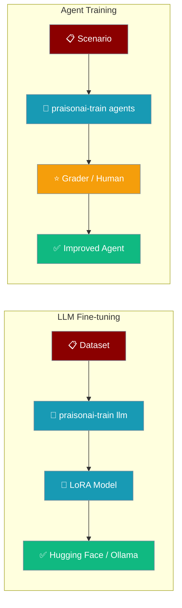
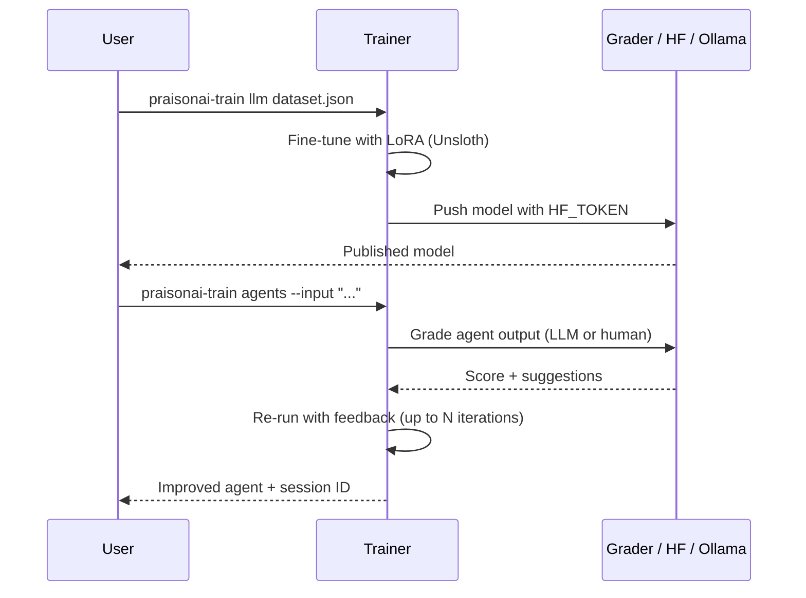

Fine-tune a base model with Unsloth or improve an agent iteratively with LLM/human feedback — one command each.



<Info>
Two training flows: **`llm`** fine-tunes a base model on your dataset (needs the heavy ML stack), and **`agents`** improves an agent through iterative feedback loops (lightweight, no CUDA/Unsloth).
</Info>

## Standalone Install

Training now ships as its own package (`praisonai-train`, import `praisonai_train`). Install just what you need:

```bash
pip install praisonai-train              # agent training (LLM-as-Judge + human feedback), no CUDA/Unsloth
pip install "praisonai-train[llm]"       # + Unsloth / torch fine-tuning stack
```

The standalone CLI exposes the training commands directly:

```bash
praisonai-train agents --input "What is Python?" --iterations 3
praisonai-train llm dataset.json --model llama-3.1
praisonai-train list
praisonai-train show <session>
praisonai-train apply <session>
```

<Note>
The wrapper CLI `praisonai train ...` still works — it now bridges into `praisonai-train` when the standalone package is installed (and is hidden on code-only installs). `pip install "praisonai[train]"` (previously an empty extra) now pulls `praisonai-train[llm]`.
</Note>

<div className="relative w-full aspect-video">
  <iframe
    className="absolute top-0 left-0 w-full h-full"
    src="https://www.youtube.com/embed/aLawE8kwCrI"
    title="YouTube video player"
    allow="accelerometer; autoplay; clipboard-write; encrypted-media; gyroscope; picture-in-picture"
    allowFullScreen
  ></iframe>
</div>

## Quick Start

<Steps>
<Step title="LLM Fine-tuning">

Fine-tune a base model on your dataset with Unsloth.

```bash
pip install "praisonai-train[llm]"

praisonai-train llm dataset.json \
    --model unsloth/Meta-Llama-3.1-8B-Instruct-bnb-4bit
```

</Step>

<Step title="Agent Training">

Improve an agent iteratively with LLM-as-Judge or human feedback.

```python
from praisonaiagents import Agent

agent = Agent(instructions="You are a helpful assistant.")
```

```bash
pip install praisonai-train

praisonai-train agents --input "What is Python?"
```

One `pip install praisonai-train` gives you the agent, the trainer, and the grader — `litellm` ships as a core dependency, so live LLM-as-Judge grading works with no extra install.

Runs cleanly on Windows and other non-UTF-8 consoles — the summary automatically falls back to ASCII (`PASSED` / `NEEDS WORK`) with no configuration needed. Exit codes: `0` = training persisted, `1` = training failed, `130` = interrupted. See [Train CLI → Exit Codes](/docs/cli/train#exit-codes).

<Note>
`--iterations` sets the **maximum** number of training loops. In LLM-as-Judge mode, training **stops early** when any iteration scores **≥ 9.5** (excellent), so easy prompts may finish in a single iteration. Pass `--no-early-stop` to force all iterations, or `--verbose` to see when it stops. See [Train CLI → Early Stop](/docs/cli/train#early-stop-llm-mode) for the full flow.
</Note>

</Step>
</Steps>

---

## How It Works

Point the trainer at a base model and dataset to fine-tune, or at a scenario to iteratively improve an agent.



**Real interaction — agent-training path:** an agent gives so-so answers → run `praisonai-train agents --input "Explain AI" --human` → review N iterations → `praisonai-train apply <session_id> --run "Explain AI"` bakes the improvements into the agent via hooks → the same agent answers better.

---

## CLI Reference

Five subcommands cover both fine-tuning and agent training.

| Subcommand | Purpose |
|------------|---------|
| `praisonai-train llm DATASET` | Fine-tune an LLM via Unsloth |
| `praisonai-train agents [AGENT_FILE]` | Iteratively train an agent |
| `praisonai-train list` | List training sessions |
| `praisonai-train show SESSION_ID` | Show a session's iterations and best score |
| `praisonai-train apply SESSION_ID` | Apply learned suggestions to an agent |

See [Train CLI](/docs/cli/train) for full flags.

---

## Fine-tuning Setup

Push a fine-tuned model to Hugging Face and Ollama.

### Hugging Face token

```bash
export HF_TOKEN="${HF_TOKEN:?Set HF_TOKEN in your shell}"
```

## Initilise praisonai train

```bash
praisonai train init
```

## Requirements

<Note>
Training dependencies are checked at startup via `unsloth` package availability but only fully loaded when training commands run.
</Note>

**Install training dependencies:**
```bash
pip install "praisonai-train[llm]"       # LLM fine-tuning (Unsloth / torch / CUDA)
pip install praisonai-train              # agent training (LLM-as-Judge + human feedback) — no CUDA/Unsloth
pip install "praisonai[train]"           # via the wrapper — pulls praisonai-train[llm]
```

Pick the flavour that matches your flow: **agent training** (`praisonai-train`) needs no CUDA/Unsloth — its base install already pulls `litellm` for live LLM-as-Judge grading — while **LLM fine-tuning** (`praisonai-train[llm]`) pulls the full torch/Unsloth stack.

**Required for training:**
1. Huggingface token
2. Base model to train on (e.g. unsloth/Meta-Llama-3.1-8B-Instruct-bnb-4bit)
3. Dataset to train on (e.g. yahma/alpaca-cleaned)
4. Huggingface model name to upload to (e.g. mervinpraison/llama3.1-instruct) (Optional)
5. Ollama model name to upload to (e.g. mervinpraison/llama3.1-instruct) (Optional)

If training dependencies are missing when you run `praisonai-train llm`, you'll see one of two messages depending on what's installed.

**When `praisonai-code` is not installed (bare `pip install praisonai-train`):**

```
LLM fine-tuning dependencies not installed
Install with: pip install "praisonai-train[llm]"
```

**When `praisonai-code` is installed but a downstream import failed (e.g. torch/unsloth missing):**

```
Failed to load LLM fine-tuning runner: <underlying ImportError>
```

The wrapper's older `pip install "praisonai[train]"` hint is no longer printed from the `praisonai-train llm` entrypoint (PraisonAI PR #3053).

```mermaid
sequenceDiagram
    participant User
    participant CLI as praisonai-train llm
    participant Bridge as _code_bridge

    User->>CLI: praisonai-train llm dataset.json
    CLI->>Bridge: import praisonai_code.cli.main
    alt praisonai_code absent
        Bridge-->>CLI: ImportError + code_available()=False
        CLI-->>User: "LLM fine-tuning dependencies not installed"<br/>Install with: pip install "praisonai-train[llm]"
    else praisonai_code present but downstream import fails
        Bridge-->>CLI: ImportError + code_available()=True
        CLI-->>User: "Failed to load LLM fine-tuning runner: &lt;real error&gt;"
    else all deps present
        Bridge-->>CLI: PraisonAI runner
        CLI-->>User: Fine-tune runs
    end
```

## To upload to ollama.com (Linux)

```bash
sudo cat /usr/share/ollama/.ollama/id_ed25519.pub
```

Save the output to ollama.com → Ollama keys.

<Note>
You no longer need to run `ollama serve` manually. The trainer starts the Ollama daemon automatically if it isn't already running, then creates and pushes the model. Requires the `ollama` CLI on PATH — install from [ollama.com](https://ollama.com).
</Note>

<Note>
PraisonAI Train is currently tested on Linux with 1 GPU and pytorch-cuda=12.1.
</Note>

---

## Config.yaml example

Drive an LLM fine-tuning run from a config file instead of flags.

```yaml
ollama_save: "true"
huggingface_save: "true"
train: "true"

model_name: "unsloth/Meta-Llama-3.1-8B-Instruct-bnb-4bit"
hf_model_name: "mervinpraison/llama-3.1-instruct"
ollama_model: "mervinpraison/llama3.1-instruct"
model_parameters: "8b"

dataset:
  - name: "yahma/alpaca-cleaned"
    split_type: "train"
    processing_func: "format_prompts"
    rename:
      input: "input"
      output: "output"
      instruction: "instruction"
    filter_data: false
    filter_column_value: "id"
    filter_value: "alpaca"
    num_samples: 20000

dataset_text_field: "text"
dataset_num_proc: 2
packing: false

max_seq_length: 2048
load_in_4bit: true
lora_r: 16
lora_target_modules:
  - "q_proj"
  - "k_proj"
  - "v_proj"
  - "o_proj"
  - "gate_proj"
  - "up_proj"
  - "down_proj"
lora_alpha: 16
lora_dropout: 0
lora_bias: "none"
use_gradient_checkpointing: "unsloth"
random_state: 3407
use_rslora: false
loftq_config: null

per_device_train_batch_size: 2
gradient_accumulation_steps: 2
warmup_steps: 5
num_train_epochs: 1
max_steps: 10
learning_rate: 2.0e-4
logging_steps: 1
optim: "adamw_8bit"
weight_decay: 0.01
lr_scheduler_type: "linear"
seed: 3407
output_dir: "outputs"

quantization_method:
  - "q4_k_m"
```

```bash
praisonai-train llm dataset.json
```

---

## Weights & Biases

Track loss curves and checkpoints for each run.

```bash
wandb login
```

<Note>
Get the key from [here](https://wandb.ai/site/login)
</Note>

```bash
export PRAISON_WANDB=True
export WANDB_LOG_MODEL=checkpoint
export WANDB_PROJECT=praisonai-test
export PRAISON_WANDB_RUN_NAME=praisonai-train
```

<div className="relative w-full aspect-video">
  <iframe
    className="absolute top-0 left-0 w-full h-full"
    src="https://www.youtube.com/embed/aLawE8kwCrI"
    title="YouTube video player"
    allow="accelerometer; autoplay; clipboard-write; encrypted-media; gyroscope; picture-in-picture"
    allowFullScreen
  ></iframe>
</div>

---

## Best Practices

<AccordionGroup>
<Accordion title="Start with praisonai-train alone if you only want agent training">
`pip install praisonai-train` pulls `praisonaiagents` plus `litellm` (for LLM-as-Judge grading) — enough for `agents`, `list`, `show`, and `apply`. Add `[llm]` only when you need Unsloth fine-tuning.
</Accordion>

<Accordion title="Set HF_TOKEN in the environment">
Export `HF_TOKEN` in your shell before fine-tuning so the trainer can push to Hugging Face. Never commit the raw token.
</Accordion>

<Accordion title="Start small, then scale">
Use a low `max_steps` and a small `num_samples` for a first run to confirm the pipeline before a full training job.
</Accordion>

<Accordion title="Track runs with Weights & Biases">
Set `PRAISON_WANDB=True` and the `WANDB_*` variables to log loss curves and checkpoints for each run.
</Accordion>
</AccordionGroup>

---

## Related

<CardGroup cols={2}>
  <Card title="Train CLI" icon="terminal" href="/docs/cli/train">
    Full flag reference for the five subcommands.
  </Card>
  <Card title="praisonai-train Package" icon="graduation-cap" href="/docs/features/praisonai-train-package">
    Install and use training without the full wrapper.
  </Card>
  <Card title="Installation Extras" icon="puzzle-piece" href="/docs/features/installation-extras">
    Optional dependency groups and the train install matrix.
  </Card>
  <Card title="Models" icon="brain" href="/docs/models">
    Use your fine-tuned model with an Agent.
  </Card>
</CardGroup>
