Fine-tune a base model with Unsloth or improve an agent iteratively with LLM/human feedback — one command each.

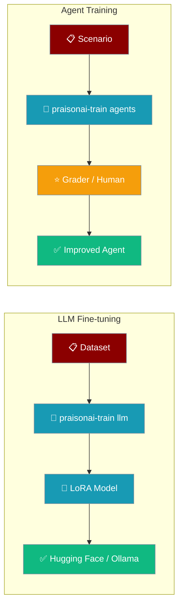
```mermaid
graph LR
    subgraph "LLM Fine-tuning"
        Data[📋 Dataset] --> LLM[🤖 praisonai-train llm]
        LLM --> Model[🧠 LoRA Model]
        Model --> Hub[✅ Hugging Face / Ollama]
    end

    subgraph "Agent Training"
        Scenario[📋 Scenario] --> Agents[🤖 praisonai-train agents]
        Agents --> Grade[⭐ Grader / Human]
        Grade --> Better[✅ Improved Agent]
    end

    classDef input fill:#8B0000,stroke:#7C90A0,color:#fff
    classDef process fill:#189AB4,stroke:#7C90A0,color:#fff
    classDef grade fill:#F59E0B,stroke:#7C90A0,color:#fff
    classDef output fill:#10B981,stroke:#7C90A0,color:#fff

    class Data,Scenario input
    class LLM,Agents,Model process
    class Grade grade
    class Hub,Better output
```

<Info>
Two training flows: **`llm`** fine-tunes a base model on your dataset (needs the heavy ML stack), and **`agents`** improves an agent through iterative feedback loops (lightweight, no CUDA/Unsloth).
</Info>

## Standalone Install

Training now ships as its own package (`praisonai-train`, import `praisonai_train`). Install just what you need:

```bash
pip install praisonai-train              # agent training (LLM-as-Judge + human feedback), no CUDA/Unsloth
pip install "praisonai-train[llm]"       # + Unsloth / torch fine-tuning stack
```

The standalone CLI exposes the training commands directly:

```bash
praisonai-train agents --input "What is Python?" --iterations 3
praisonai-train llm dataset.json --model llama-3.1
praisonai-train list
praisonai-train show <session>
praisonai-train apply <session>
```

<Note>
The wrapper CLI `praisonai train ...` still works — it now bridges into `praisonai-train` when the standalone package is installed (and is hidden on code-only installs). `pip install "praisonai[train]"` (previously an empty extra) now pulls `praisonai-train[llm]`.
</Note>

<div className="relative w-full aspect-video">
  <iframe
    className="absolute top-0 left-0 w-full h-full"
    src="https://www.youtube.com/embed/aLawE8kwCrI"
    title="YouTube video player"
    allow="accelerometer; autoplay; clipboard-write; encrypted-media; gyroscope; picture-in-picture"
    allowFullScreen
  ></iframe>
</div>

## Quick Start

<Steps>
<Step title="LLM Fine-tuning">

Fine-tune a base model on your dataset with Unsloth. Pick the tab for your model family — the trainer uses each model's own chat template, so `chat_template` is optional.

```bash
pip install "praisonai-train[llm]"
```

<Tabs>
<Tab title="Llama">

```bash
praisonai-train llm dataset.json \
    --model unsloth/Meta-Llama-3.1-8B-Instruct-bnb-4bit
```

Optional YAML override: `chat_template: "llama-3.1"`.

</Tab>
<Tab title="Gemma">

```bash
praisonai-train llm dataset.json \
    --model unsloth/gemma-2-2b-it-bnb-4bit
```

Optional YAML override: `chat_template: "gemma"` (or `"gemma-2"`).

</Tab>
<Tab title="Qwen">

```bash
praisonai-train llm dataset.json \
    --model unsloth/Qwen2.5-0.5B-Instruct-bnb-4bit
```

Optional YAML override: `chat_template: "qwen-2.5"`.

</Tab>
</Tabs>

</Step>

<Step title="Agent Training">

Improve an agent iteratively with LLM-as-Judge or human feedback.

```python
from praisonaiagents import Agent

agent = Agent(instructions="You are a helpful assistant.")
```

```bash
pip install praisonai-train

praisonai-train agents --input "What is Python?"
```

One `pip install praisonai-train` gives you the agent, the trainer, and the grader — `litellm` ships as a core dependency, so live LLM-as-Judge grading works with no extra install.

Runs cleanly on Windows and other non-UTF-8 consoles — the summary automatically falls back to ASCII (`PASSED` / `NEEDS WORK`) with no configuration needed. Exit codes: `0` = training persisted, `1` = training failed, `130` = interrupted. See [Train CLI → Exit Codes](/docs/cli/train#exit-codes).

<Note>
`--iterations` sets the **maximum** number of training loops. In LLM-as-Judge mode, training **stops early** when any iteration scores **≥ 9.5** (excellent), so easy prompts may finish in a single iteration. Pass `--no-early-stop` to force all iterations, or `--verbose` to see when it stops. See [Train CLI → Early Stop](/docs/cli/train#early-stop-llm-mode) for the full flow.
</Note>

</Step>
</Steps>

---

## Beginner-safe defaults

A minimal config trains locally and never pushes to a hub unless you ask it to.

A config with just `model_name`, `max_seq_length`, and `dataset:` trains locally and saves the LoRA to `lora_model/`. Publishing to Hugging Face or Ollama is opt-in — set the flag **and** the target name. Response-only masking auto-probes the tokenizer, so `assistant_only_loss: auto` is safe on any template.

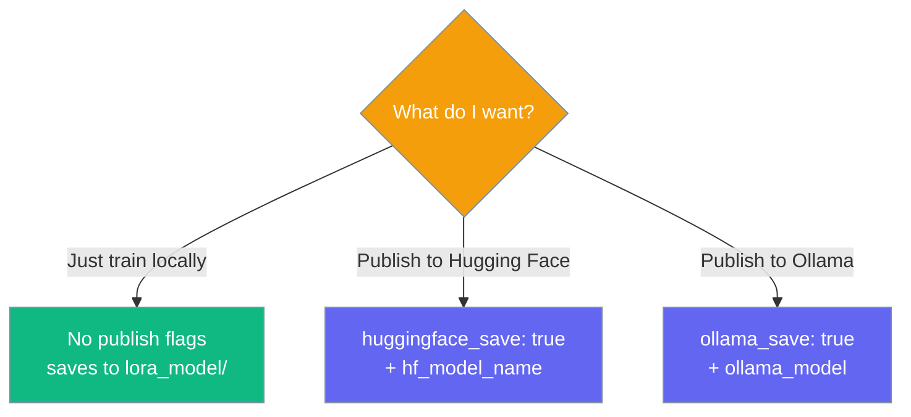
```mermaid
graph TB
    Q1{What do I want?}
    Q1 -->|Just train locally| Local[No publish flags<br/>saves to lora_model/]
    Q1 -->|Publish to Hugging Face| HF[huggingface_save: true<br/>+ hf_model_name]
    Q1 -->|Publish to Ollama| Ol[ollama_save: true<br/>+ ollama_model]

    classDef question fill:#F59E0B,stroke:#7C90A0,color:#fff
    classDef success fill:#10B981,stroke:#7C90A0,color:#fff
    classDef config fill:#6366F1,stroke:#7C90A0,color:#fff

    class Q1 question
    class Local success
    class HF,Ol config
```

Three safety guarantees:

- **Minimal config trains locally** — no push, no missing-repo crash.
- **`assistant_only_loss: auto` never crashes** on a stock Gemma / Qwen / Llama template — it falls back to full-sequence SFT.
- **Unknown / misnamed keys warn instead of crashing** — typos are [collected into one block with `did you mean` suggestions](#config-validation) and training continues.

<Info>
Expected failures now print a single `ERROR: <message>` line to stderr — no Python traceback. `Ctrl-C` prints `Interrupted.` See [Train CLI → Exit codes](/docs/cli/train#exit-codes) for the full table.
</Info>

Three runtime NOTEs surface behaviour that used to be silent — read them if the console shows something unexpected:

- **`num_samples` slices the head, before shuffle.** Setting `dataset[].num_samples: N` without `shuffle: true` trains on the **first N rows** — often sorted by topic and unrepresentative. The trainer prints `NOTE: num_samples takes the FIRST N rows before shuffle; add shuffle: true to sample randomly.` Add `shuffle: true` to the dataset entry to sample uniformly.
- **`split_type: validation`/`test`/`eval` is added to training, not held out.** These splits are **concatenated into the training set**. The trainer warns: `WARNING: dataset split_type 'validation' is ADDED to the TRAINING data (not held out). Use val_split_ratio for a held-out eval set.` Use `val_split_ratio: 0.05` for a real held-out set.
- **`max_steps: 2800` fires when neither length is set.** With neither `num_train_epochs` nor `max_steps`, the trainer defaults to `max_steps: 2800` and prints `NOTE: neither num_train_epochs nor max_steps set; defaulting to max_steps: 2800. Set num_train_epochs: 1-3 (or max_steps) to control training length.`

---

## Preflight validation

Before any model download or GPU load, the trainer fails fast with one friendly line for the four most common non-developer misconfigurations.

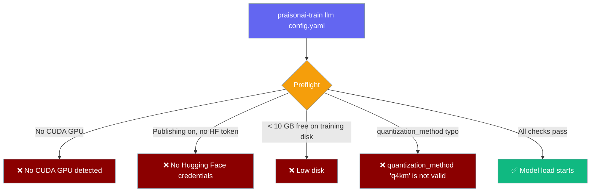
```mermaid
graph TB
    Start[praisonai-train llm config.yaml] --> P{Preflight}
    P -->|No CUDA GPU| GPU[❌ No CUDA GPU detected]
    P -->|Publishing on, no HF token| HF[❌ No Hugging Face credentials]
    P -->|< 10 GB free on training disk| Disk[❌ Low disk]
    P -->|quantization_method typo| Q[❌ quantization_method 'q4km' is not valid]
    P -->|All checks pass| Go[✅ Model load starts]

    classDef entry fill:#6366F1,stroke:#7C90A0,color:#fff
    classDef check fill:#F59E0B,stroke:#7C90A0,color:#fff
    classDef fail fill:#8B0000,stroke:#7C90A0,color:#fff
    classDef pass fill:#10B981,stroke:#7C90A0,color:#fff

    class Start entry
    class P check
    class GPU,HF,Disk,Q fail
    class Go pass
```

| Preflight check | Message when it fails | Fix |
|---|---|---|
| CUDA GPU (skipped when `train: false`) | `No CUDA GPU detected. Fine-tuning needs a GPU. On a rented box check the driver; on CPU it cannot run.` | Use a GPU box; on a rented VM re-install CUDA drivers. Set `train: false` to publish/export on CPU without training. |
| Hugging Face credentials (only when `huggingface_save` / `huggingface_save_gguf` / `push_to_hub` is on) | `Publishing to Hugging Face is enabled but no credentials were found. Run 'huggingface-cli login' or 'export HF_TOKEN=hf_...'. To train without publishing, set huggingface_save: false.` | Run `huggingface-cli login` (cached tokens count) **or** `export HF_TOKEN=hf_...`. |
| Low disk (`< 10 GB` free on `output_dir` or `.`) | `Low disk: only 3.2 GB free on the training disk (need ~10 GB minimum). Free up space or set output_dir to a larger disk.` | Free space, or set `output_dir` in `config.yaml` to a larger volume. |
| Quantization method (only when `huggingface_save_gguf` or `ollama_save` is on) | `quantization_method 'q4km' is not valid. Choose one of: bf16, f16, q2_k, q3_k_m, q4_0, q4_1, q4_k_m, q5_0, q5_1, q5_k_m, q6_k, q8_0.` | Use one of the values below. |

The **12 valid `quantization_method` values**: `q4_k_m`, `q5_k_m`, `q8_0`, `q4_0`, `q4_1`, `q5_0`, `q5_1`, `q3_k_m`, `q6_k`, `f16`, `bf16`, `q2_k`.

<Note>
The GPU check is skipped when `train: false`, so `praisonai-train export` and publish-only runs work on a CPU laptop. Hugging Face credentials are accepted from **either** an env var (`HF_TOKEN` / `HUGGING_FACE_HUB_TOKEN`) **or** a cached `huggingface-cli login` — an env var is not mandatory.
</Note>

---

## How It Works

Point the trainer at a base model and dataset to fine-tune, or at a scenario to iteratively improve an agent.

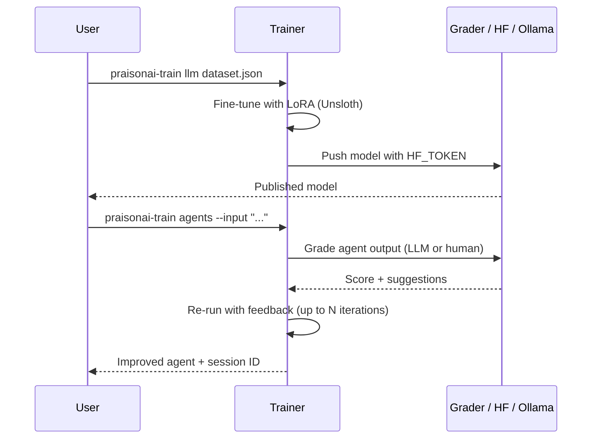
```mermaid
sequenceDiagram
    participant User
    participant Trainer
    participant Grader as Grader / HF / Ollama

    User->>Trainer: praisonai-train llm dataset.json
    Trainer->>Trainer: Fine-tune with LoRA (Unsloth)
    Trainer->>Grader: Push model with HF_TOKEN
    Grader-->>User: Published model

    User->>Trainer: praisonai-train agents --input "..."
    Trainer->>Grader: Grade agent output (LLM or human)
    Grader-->>Trainer: Score + suggestions
    Trainer->>Trainer: Re-run with feedback (up to N iterations)
    Trainer-->>User: Improved agent + session ID
```

**Real interaction — agent-training path:** an agent gives so-so answers → run `praisonai-train agents --input "Explain AI" --human` → review N iterations → `praisonai-train apply <session_id> --run "Explain AI"` bakes the improvements into the agent via hooks → the same agent answers better.

---

## CLI Reference

The `praisonai-train` CLI groups subcommands into **data** (`generate`, `validate`, `benchmark`, `dedup`), **training** (`llm`, `agents`), **serving / export** (`serve`, `export`), and **utilities** (`list`, `show`, `apply`).

| Subcommand | What it does | Deep link |
|------------|--------------|-----------|
| `generate` | Produce synthetic instruction/response rows from a recipe | [Dataset Tooling](/docs/features/praisonai-train-dataset-tooling) |
| `validate` | Score / QC an existing JSONL against the recipe's checks | [Dataset Tooling → validate](/docs/features/praisonai-train-dataset-tooling#validate) |
| `benchmark` | Compare deployments by throughput, latency, and success rate | [Speed Benchmark](/docs/features/praisonai-train-benchmark) |
| `dedup` | Exact + MinHash/LSH near-dedup across many JSONL files | [Cross-file dedup](/docs/features/praisonai-train-dataset-tooling#cross-file-dedup) |
| `llm` | Fine-tune a base LLM on a generated dataset | [Train CLI → llm](/docs/cli/train#praisonai-train-llm) |
| `export` | Publish an already-trained model (HF / GGUF / Ollama) without re-training | [Train CLI → export](/docs/cli/train#praisonai-train-export) |
| `agents` | Distil an agent workflow into a dataset for training | [Train CLI → agents](/docs/cli/train#praisonai-train-agents) |
| `serve` | Serve a trained GGUF on an OpenAI-compatible endpoint (MTP for Gemma-4) | [Serve](#serve-a-trained-model) |
| `export` | Publish / convert an already-trained model without re-training | [Export](#export-an-already-trained-model) |
| `list` | List locally available recipes / adapters | [Train CLI → list](/docs/cli/train#praisonai-train-list) |
| `show` | Show a recipe's schema and defaults | [Train CLI → show](/docs/cli/train#praisonai-train-show) |
| `apply` | Apply a trained adapter / merge with the base weights | [Train CLI → apply](/docs/cli/train#praisonai-train-apply) |

See [Train CLI](/docs/cli/train) for full flags.

---

## Serve a trained model

Run a trained GGUF on an OpenAI-compatible endpoint — MTP fast inference auto-enables for Gemma-4.

```bash
# Serve a trained Gemma-4 model on http://localhost:8080/v1 (MTP auto-enabled)
praisonai-train serve --gguf model.gguf

# Or point at a trained model directory (GGUF auto-detected)
praisonai-train serve -d lora_model

# One-shot speed test with drafter acceptance rate
praisonai-train serve --gguf model.gguf --benchmark

# Custom port, no MTP
praisonai-train serve --gguf model.gguf --no-mtp-draft --port 9000
```

Every flag, with its default:

| Flag | Type | Default | Description |
|------|------|---------|-------------|
| `--gguf` | `str` | *unset* | Path to the target GGUF to serve. |
| `--model-dir` / `-d` | `str` | *unset* | Directory of the trained model (GGUF auto-detected, drafter files skipped). |
| `--config` / `-c` | `str` | *unset* | Optional `config.yaml` for base-model / MTP knobs. |
| `--base-model` | `str` | *unset* | Base model id used to select the MTP drafter. |
| `--mtp-draft` / `--no-mtp-draft` | `bool` | `True` | Use the stock MTP drafter — on automatically when the family supports it. |
| `--spec-draft-n-max` | `int` | `2` | Max tokens the MTP drafter proposes per step. |
| `--port` | `int` | `8080` | Port for `llama-server`. |
| `--ngl` | `int` | `99` | Number of layers to offload to the GPU. |
| `--benchmark` | `bool` | `False` | Run a one-shot speed benchmark instead of serving. |

A non Gemma-4 model serves without MTP and says so — no configuration needed. The base model name (which drives drafter selection) is recovered in this order: `--base-model` > `--config` `model_name` > the model dir's `config.json` `_name_or_path`.

<Note>
`serve` needs a **llama.cpp** binary (`llama-server` / `llama-cli`) on your `PATH`. Build it from [llama.cpp](https://github.com/ggml-org/llama.cpp) (`cmake -B build && cmake --build build`) or download a release, then add it to `PATH` or set `LLAMA_CPP_BIN` to the binary or its directory. See [Serve trained models](/docs/features/train-serve) for the full walkthrough and MTP details.
</Note>

---

## Export an already-trained model

Publish or convert a locally-trained model without re-running training.

```bash
# Publish a locally-trained model to Ollama with a q4_k_m quantization
praisonai-train export ollama --model-dir lora_model --ollama yourname/mymodel --quant q4_k_m

# Publish merged weights to Hugging Face
praisonai-train export hf --model-dir lora_model --hf yourname/mymodel-hf

# Produce a LOCAL .gguf (ready to serve) and also push it to the Hub
praisonai-train export gguf --model-dir lora_model --quant q4_k_m --hf yourname/mymodel-gguf
```

The first argument is the target — `ollama`, `gguf`, or `hf`. Every flag:

| Flag | Type | Default | Description |
|------|------|---------|-------------|
| `--model-dir` / `-d` | `str` | *required* | Directory of the already-trained model. |
| `--config` / `-c` | `str` | *unset* | Optional `config.yaml` for extra export knobs. |
| `--ollama` | `str` | *unset* | Ollama model name, e.g. `yourname/mymodel`. Required for the `ollama` target. |
| `--hf` | `str` | *unset* | Hugging Face repo id, e.g. `yourname/mymodel`. Required for the `hf` target. |
| `--quant` | `str` | *unset* | Quantization method for `gguf` / `ollama`, e.g. `q4_k_m`. |
| `--base-model` | `str` | *unset* | Base model id (for chat-template selection). |
| `--mtp-draft` / `--no-mtp-draft` | `bool` | `False` | Also download the stock MTP drafter (Gemma-4 only) for fast inference. |

The `gguf` target always writes a **local** `.gguf` (so you can `serve` it) and only additionally pushes to the Hub when `--hf` is set. The model name (which drives chat-template selection) falls back to the trained model's `config.json` `_name_or_path`, then the directory name, when `--base-model` / `model_name` aren't given.

<Tip>
Export to a local GGUF, then serve it in one hop:

```bash
praisonai-train export gguf --model-dir lora_model --quant q4_k_m
praisonai-train serve -d lora_model
```
</Tip>

---

## Clean errors & preflight

Fine-tuning validates the environment up front and fails with a single actionable line — no traceback — so a non-developer knows exactly what to fix.

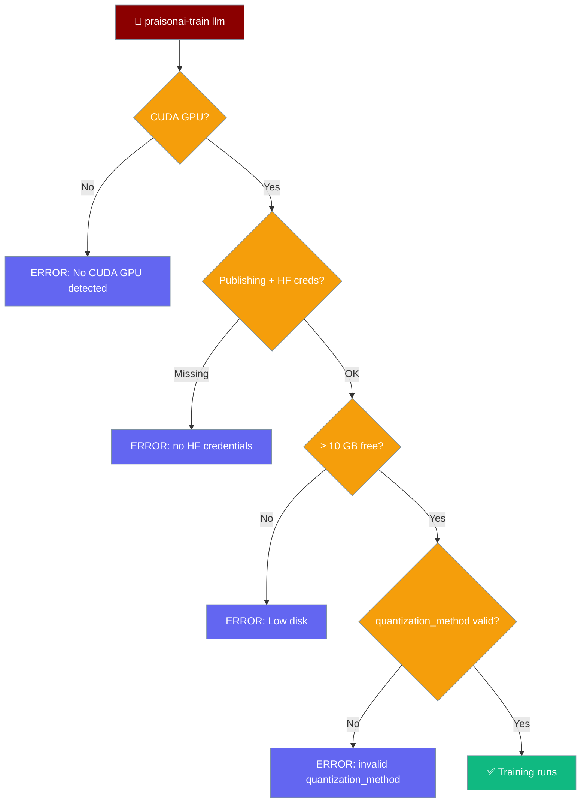
```mermaid
graph TB
    Start[🚀 praisonai-train llm] --> GPU{CUDA GPU?}
    GPU -->|No| E1[ERROR: No CUDA GPU detected]
    GPU -->|Yes| Tok{Publishing + HF creds?}
    Tok -->|Missing| E2[ERROR: no HF credentials]
    Tok -->|OK| Disk{≥ 10 GB free?}
    Disk -->|No| E3[ERROR: Low disk]
    Disk -->|Yes| Quant{quantization_method valid?}
    Quant -->|No| E4[ERROR: invalid quantization_method]
    Quant -->|Yes| Run[✅ Training runs]

    classDef input fill:#8B0000,stroke:#7C90A0,color:#fff
    classDef question fill:#F59E0B,stroke:#7C90A0,color:#fff
    classDef error fill:#6366F1,stroke:#7C90A0,color:#fff
    classDef success fill:#10B981,stroke:#7C90A0,color:#fff

    class Start input
    class GPU,Tok,Disk,Quant question
    class E1,E2,E3,E4 error
    class Run success
```

What to expect:

- **No CUDA GPU / missing HF credentials / low disk (`< 10 GB`) / bad `quantization_method`** → a single `ERROR: <reason>` line and exit `1`, checked before any download starts.
- **`Ctrl-C`** → prints `Interrupted.` and exits `130`.
- **Unknown config keys** → one grouped `WARNING:` block with a `did you mean '<key>'?` suggestion for each; training continues.

<Note>
Silent-behaviour notes worth knowing: `num_samples` applies **before** shuffle; `validation` / `test` splits are folded into training (hold out eval with `val_split_ratio` instead); `max_steps` defaults to `2800` when neither `num_train_epochs` nor `max_steps` is set.
</Note>

---

## Fine-tuning Setup

Push a fine-tuned model to Hugging Face and Ollama.

### Hugging Face token

```bash
export HF_TOKEN="${HF_TOKEN:?Set HF_TOKEN in your shell}"
```

### Chat Template

Leave `chat_template` unset for tokenizers that ship their own — the trainer uses the model's native template and only overrides it when you set the key.

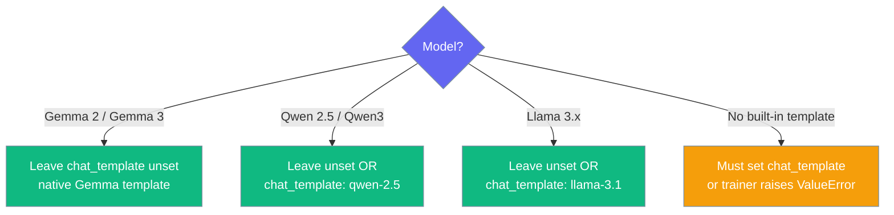
```mermaid
graph TB
    Q1{Model?}
    Q1 -->|Gemma 2 / Gemma 3| G[Leave chat_template unset<br/>native Gemma template]
    Q1 -->|Qwen 2.5 / Qwen3| Qw[Leave unset OR<br/>chat_template: qwen-2.5]
    Q1 -->|Llama 3.x| L[Leave unset OR<br/>chat_template: llama-3.1]
    Q1 -->|No built-in template| E[Must set chat_template<br/>or trainer raises ValueError]

    classDef question fill:#6366F1,stroke:#7C90A0,color:#fff
    classDef process fill:#189AB4,stroke:#7C90A0,color:#fff
    classDef success fill:#10B981,stroke:#7C90A0,color:#fff
    classDef warning fill:#F59E0B,stroke:#7C90A0,color:#fff

    class Q1 question
    class G,Qw,L success
    class E warning
```

If a model has no built-in template and you leave `chat_template` unset, the trainer fails fast with a clear error you can grep for:

```text
Tokenizer for model '<name>' has no chat template and none was provided via config 'chat_template'. Set 'chat_template' (e.g. 'gemma', 'qwen-2.5', 'llama-3.1') so conversations format correctly.
```

### Multi-Model Fine-tuning

Gemma and Qwen now fine-tune out of the box with their native templates — no config needed.

```bash
praisonai-train llm dataset.json --model unsloth/gemma-2-2b-it-bnb-4bit
praisonai-train llm dataset.json --model unsloth/Qwen2.5-0.5B-Instruct-bnb-4bit
```

Both commands are the two models the SDK actually tests (2× RTX A6000). Forcing `llama-3.1` on every model was the old default and silently corrupted Gemma/Qwen training.

### Assistant-only Loss

Response-only loss is on by default via `assistant_only_loss: auto` — the trainer probes the tokenizer and enables masking only when the template supports it.

```yaml
assistant_only_loss: auto   # default — probe the template, mask if supported
```

The trainer calls the tokenizer's chat template with `return_assistant_tokens_mask=True`; if the template exposes `` markers, masking is enabled, otherwise the trainer trains on the full sequence with no error.

| Value | Behaviour | When to use |
|-------|-----------|-------------|
| `auto` | Probe the template; mask if supported, else full-sequence SFT | **Recommended default** — safe on any template |
| `true` | Force masking; fails fast at model-prep time if unsupported | You know your template emits `` markers |
| `false` | Force off — train on the full sequence | You want full-sequence loss regardless |

`train_on_responses_only` is accepted as an alias for `assistant_only_loss` if you're migrating from an older config. Both real YAML booleans (`assistant_only_loss: true`) and the string forms (`"true"` / `"false"` / `"yes"` / `"no"` / `"on"` / `"off"`) work.

<Warning>
`assistant_only_loss: true` on a template without `` markers raises `ValueError` at model-prep time:

```
ValueError: assistant_only_loss is enabled but the chat template for
'<model_name>' has no assistant-turn markers (). Set
assistant_only_loss: auto (recommended) or false, or use a chat_template
that supports masking.
```

Use `auto` (recommended) or `false`, or set a `chat_template` that supports masking.
</Warning>

## Initilise praisonai train

```bash
praisonai train init
```

## Requirements

<Note>
Training dependencies are checked at startup via `unsloth` package availability but only fully loaded when training commands run.
</Note>

**Install training dependencies:**
```bash
pip install "praisonai-train[llm]"       # LLM fine-tuning (Unsloth / torch / CUDA)
pip install praisonai-train              # agent training (LLM-as-Judge + human feedback) — no CUDA/Unsloth
pip install "praisonai[train]"           # via the wrapper — pulls praisonai-train[llm]
```

Pick the flavour that matches your flow: **agent training** (`praisonai-train`) needs no CUDA/Unsloth — its base install already pulls `litellm` for live LLM-as-Judge grading — while **LLM fine-tuning** (`praisonai-train[llm]`) pulls the full torch/Unsloth stack.

`pip install "praisonai-train[llm]"` installs the whole ML stack for you — you only run the base install:

| Package | Minimum floor |
|---------|---------------|
| `transformers` | `>= 4.51.3` |
| `unsloth` | `>= 2025.9.1` |
| `trl` | `>= 0.18.2` |
| `peft` | `>= 0.13.0` |
| `accelerate` | `>= 0.34.0` |
| `bitsandbytes` | `>= 0.45.0` |
| `torch` | `>= 2.6.0` (CUDA 12.4) |

Verified end-to-end on unsloth 2026.7.4 / trl 0.24.0 / torch 2.10 / peft 0.19.1, across Qwen2.5-0.5B and Gemma-2-2B.

<Warning>
Older Unsloth releases (`< 2025.9.1`) and the pre-0.9 TRL API are no longer supported. If you had pinned `trl<0.9.0`, upgrade to `trl>=0.18.2`. The conda setup script now targets Python 3.11 + CUDA 12.4 + torch 2.6.0.
</Warning>

**Required for training:**
1. Huggingface token
2. Base model to train on (e.g. unsloth/Meta-Llama-3.1-8B-Instruct-bnb-4bit)
3. Dataset to train on (e.g. yahma/alpaca-cleaned)
4. Huggingface model name to upload to (e.g. mervinpraison/llama3.1-instruct) (Optional)
5. Ollama model name to upload to (e.g. mervinpraison/llama3.1-instruct) (Optional)

If training dependencies are missing when you run `praisonai-train llm`, you'll see one of two messages depending on what's installed.

**When `praisonai-code` is not installed (bare `pip install praisonai-train`):**

```
LLM fine-tuning dependencies not installed
Install with: pip install "praisonai-train[llm]"
```

**When `praisonai-code` is installed but a downstream import failed (e.g. torch/unsloth missing):**

```
Failed to load LLM fine-tuning runner: <underlying ImportError>
```

The wrapper's older `pip install "praisonai[train]"` hint is no longer printed from the `praisonai-train llm` entrypoint (PraisonAI PR #3053).

```mermaid
sequenceDiagram
    participant User
    participant CLI as praisonai-train llm
    participant Bridge as _code_bridge

    User->>CLI: praisonai-train llm dataset.json
    CLI->>Bridge: import praisonai_code.cli.main
    alt praisonai_code absent
        Bridge-->>CLI: ImportError + code_available()=False
        CLI-->>User: "LLM fine-tuning dependencies not installed"<br/>Install with: pip install "praisonai-train[llm]"
    else praisonai_code present but downstream import fails
        Bridge-->>CLI: ImportError + code_available()=True
        CLI-->>User: "Failed to load LLM fine-tuning runner: &lt;real error&gt;"
    else all deps present
        Bridge-->>CLI: PraisonAI runner
        CLI-->>User: Fine-tune runs
    end
```

## Supported model families

The trainer uses each base model's own chat template by default — no more force-applied Llama template — so Gemma, Qwen, and Llama all format correctly out of the box.

| Model family | Example base model | `chat_template` value |
|--------------|--------------------|-----------------------|
| Llama 3.x | `unsloth/Meta-Llama-3.1-8B-Instruct-bnb-4bit` | `"llama-3.1"` (or leave unset — model has its own) |
| Gemma 2 / Gemma 3 | `unsloth/gemma-2-2b-it-bnb-4bit` | `"gemma"` (or leave unset) |
| Qwen 2.5 / Qwen 3 | `unsloth/Qwen2.5-0.5B-Instruct-bnb-4bit` | `"qwen-2.5"` (or leave unset) |
| Mistral / Phi | via native template | leave unset |

<Warning>
If your base model has no built-in chat template, set `chat_template` in `config.yaml` — otherwise the trainer raises a `ValueError` at model-prep time:

```
ValueError: Tokenizer for model '<name>' has no chat template and none was
provided via config 'chat_template'. Set 'chat_template' (e.g. 'gemma',
'qwen-2.5', 'llama-3.1') so conversations format correctly.
```
</Warning>

## To upload to ollama.com (Linux)

```bash
sudo cat /usr/share/ollama/.ollama/id_ed25519.pub
```

Save the output to ollama.com → Ollama keys.

<Note>
You no longer need to run `ollama serve` manually. The trainer starts the Ollama daemon automatically if it isn't already running, then creates and pushes the model. Requires the `ollama` CLI on PATH — install from [ollama.com](https://ollama.com).
</Note>

<Note>
**Supported Ollama templates:** Llama, Qwen, Mistral, Phi, DeepSeek, LLaVA, and Gemma. Any other model falls back to a Llama-style template. Gemma folds the system prompt into the first user turn (per the Gemma chat template spec) and stops on `<end_of_turn>` / `<start_of_turn>`.
</Note>

<Note>
PraisonAI Train is tested on Linux with pytorch-cuda 12.4 and Python 3.11 (2× RTX A6000). The `[llm]` extra pulls the modern Unsloth stack — minimum floors: `torch>=2.6.0`, `transformers>=4.51.3`, `unsloth>=2025.9.1`, `trl>=0.18.2`, `peft>=0.13.0`, `accelerate>=0.34.0`, `bitsandbytes>=0.45.0`. Newer combinations (unsloth 2026.7.4 / trl 0.24.0 / torch 2.10 / peft 0.19.1) are also verified.
</Note>

### Ollama template selection

The trainer picks an Ollama `TEMPLATE` and stop-token block per model family, matched case-insensitively against `model_name`.

| Family keyword | Turn markers / templating | Stop tokens |
|---|---|---|
| `llama` | `<|start_header_id|>` / `<|eot_id|>` header blocks | `<|start_header_id|>`, `<|end_header_id|>`, `<|eot_id|>` |
| `qwen` | `<|im_start|>` / `<|im_end|>` (adds `num_ctx 32768` + Qwen system prompt) | `<|endoftext|>` |
| `mistral` | `[INST] ... [/INST]` | `[INST]`, `[/INST]` |
| `phi` | `<|im_start|>...<|im_sep|>` | `<|im_start|>`, `<|im_end|>`, `<|im_sep|>` |
| `deepseek` | bare role content | — |
| `llava` | `<|im_start|>` / `<|im_end|>` | `</s>`, `USER:`, `ASSSISTANT:` |
| `gemma` | `<start_of_turn>` / `<end_of_turn>`, system folded into first user turn | `<end_of_turn>`, `<start_of_turn>` |
| anything else | falls back to a Llama-style header template | `<|start_header_id|>`, `<|end_header_id|>`, `<|eot_id|>` |

See the full templates in the trainer source (`prepare_modelfile_content`).

<Note>
Ollama exports now use the correct template for Gemma models. Previously Gemma exports inherited the Llama template and produced garbled responses.
</Note>

<Warning>
When the base `model_name` matches no known family (`llama`, `qwen`, `gemma`, `mistral`, `phi`, `deepseek`, `llava`), the trainer prints `WARNING: no known chat template matched model '<name>'; using a generic template — stop tokens may be wrong.` and falls back to a generic Llama-style template. Set `model_name` to a recognized family to get the right stop tokens. The DeepSeek stop-token block is now the single `<｜end▁of▁sentence｜>` marker (previously four empty strings that emitted broken `PARAMETER stop` lines).
</Warning>

### Ollama environment variables

Point the trainer at a configured or remote daemon and a bigger models disk.

| Variable | Purpose | Default | When to set |
|----------|---------|---------|-------------|
| `OLLAMA_HOST` | Address the trainer probes and where `ollama create`/`push` publish to. Accepts `host`, `host:port`, or `http://host:port` (IPv6 literal `[::1]:11434` supported). | `127.0.0.1:11434` | A configured or remote Ollama daemon on a non-default host — stops the trainer ignoring a healthy remote daemon. |
| `OLLAMA_MODELS` | Directory Ollama stores models in. The trainer pre-checks free space on this volume before `ollama create`. | `~/.ollama/models` | The default volume is small — point at a large disk with `export OLLAMA_MODELS=/big/disk/ollama-models`. |

### Disk pre-check

Before `ollama create` runs, the trainer estimates the space it needs at **~1.5× the source model size** and refuses to start if the `OLLAMA_MODELS` volume has less free:

```
Not enough disk for the Ollama model: 4.2 GB free on '/home/me/.ollama/models', need ~15.0 GB. Point Ollama at a bigger disk, e.g. `export OLLAMA_MODELS=/big/disk/ollama-models`.
```

<Note>
The check is skipped when the source model size can't be measured locally (e.g. the Modelfile's `FROM` points at a Hub id rather than a file on disk) — so small Hub-backed exports on modest volumes aren't blocked with a false positive.
</Note>

### Quantization passthrough

`quantization_method` in the config flows through to `ollama create --quantize <q>`, so models aren't stored as huge `f16`. It's the same key GGUF export uses, and it's validated against the [12 valid values](#preflight-validation) up front.

### Daemon startup + surfaced errors

If the trainer starts `ollama serve` and the HTTP API on `/api/version` doesn't respond within **15 seconds**, the raised `RuntimeError` includes the `ollama serve` stderr — so `port in use` or a bad `OLLAMA_HOST` shows up in the error instead of vanishing.

### Push failures & key registration

A push whose stderr matches `unauthorized` / `401` / `403` / `forbidden` / `invalid key` translates to a key-registration hint, with your public key inlined when it's readable so you can paste it straight into ollama.com:

```
Ollama rejected the push (unauthorized). Register your public key at https://ollama.com/settings/keys and make sure the model is namespaced as `<username>/<name>`.

Your public key (~/.ollama/id_ed25519.pub):
ssh-ed25519 AAAAC3Nz...
```

A non-zero exit from `ollama create` raises a `RuntimeError` with the captured stderr (e.g. `` `ollama create me/model:latest` failed: Error: invalid Modelfile ``) instead of a raw `CalledProcessError` traceback.

---

## Config.yaml example

Drive an LLM fine-tuning run from a config file instead of flags.

<Note>
All `lora_*` keys and the runtime keys (`dataset_num_proc`, `packing`, `dataset_text_field`) below are honored as of PraisonAI [#3274](https://github.com/MervinPraison/PraisonAI/pull/3274) — previously several were silently overridden. Every new key is optional with its prior default, so existing configs keep working unchanged.
</Note>

<Tabs>
<Tab title="Minimal — train locally">

No publish flags — trains and saves the LoRA to `lora_model/`, pushing nowhere.

```yaml
model_name: "unsloth/gemma-2-2b-it-bnb-4bit"
max_seq_length: 2048
dataset:
  - name: "yahma/alpaca-cleaned"
    num_samples: 20        # subset for a fast smoke test (honored as of #3279)
```

</Tab>
<Tab title="Publish to HF + Ollama">

Publishing defaults **off** — set the flag **and** the matching target name. Real YAML booleans (not `"true"` strings).

```yaml
model_name: "unsloth/Meta-Llama-3.1-8B-Instruct-bnb-4bit"
max_seq_length: 2048
dataset:
  - name: "yahma/alpaca-cleaned"

huggingface_save: true              # real YAML bool; "true" string also works
hf_model_name: "yourname/llama-3.1-instruct-lora"

ollama_save: true
ollama_model: "yourname/llama3.1-instruct"

assistant_only_loss: auto           # tri-state — auto probes the template (default)
```

</Tab>
<Tab title="Multi-GPU + checkpoints + eval">

A realistic combined run: two GPUs, checkpoint every 50 steps, keep the 3 best, hold out 5% for eval, and stop early if it plateaus. See [Newer keys (from PraisonAI #3283)](#newer-keys-from-praisonai-3283) for every key below.

```yaml
model_name: "unsloth/gemma-2-2b-it-bnb-4bit"
max_seq_length: 2048
dataset:
  - name: "yahma/alpaca-cleaned"

# Checkpoint every 50 steps, keep only the 3 most recent
save_strategy: "steps"
save_steps: 50
save_total_limit: 3
final_model_dir: "lora_model"
resume_from_checkpoint: true   # picks up the latest if a checkpoint exists

# Hold out 5% for eval; keep the best checkpoint; stop if flat for 3 evals
val_split_ratio: 0.05
load_best_model_at_end: true
metric_for_best_model: "eval_loss"
early_stopping_patience: 3
```

```bash
# 2 GPUs on one machine
torchrun --nproc_per_node=2 -m praisonai_train.train.llm.trainer train --config config.yaml
```

</Tab>
</Tabs>

Both real YAML booleans (`train: true`) and the string forms (`train: "true"`) work — pick whichever reads better.

The full-config reference below shows every optional key with its default.

```yaml
model_name: "unsloth/Meta-Llama-3.1-8B-Instruct-bnb-4bit"
model_parameters: "8b"

# Publishing — all default OFF. Set the flag AND its target to push.
huggingface_save: true
hf_model_name: "yourname/llama-3.1-instruct"
ollama_save: true
ollama_model: "yourname/llama3.1-instruct"

# Optional: force a specific Unsloth chat template (default: model's own).
# Required when the base model's tokenizer has no built-in chat template.
chat_template: "llama-3.1"   # or "gemma", "qwen-2.5"

# Response-only loss — tri-state, default "auto" (probe the template).
assistant_only_loss: auto

dataset:
  - name: "yahma/alpaca-cleaned"
    split_type: "train"
    processing_func: "format_prompts"
    rename:
      input: "input"
      output: "output"
      instruction: "instruction"
    filter_data: false
    filter_column_value: "id"
    filter_value: "alpaca"
    num_samples: 20000   # Now honored — trains on the first 20000 rows of the split (PraisonAI #3279).

dataset_text_field: "text"
dataset_num_proc: 2
packing: false

max_seq_length: 2048
load_in_4bit: true
lora_r: 16
lora_target_modules:
  - "q_proj"
  - "k_proj"
  - "v_proj"
  - "o_proj"
  - "gate_proj"
  - "up_proj"
  - "down_proj"
lora_alpha: 16
lora_dropout: 0
lora_bias: "none"
use_gradient_checkpointing: "unsloth"
random_state: 3407
use_rslora: false
loftq_config: null

# Optional: pick the right chat template for the model family.
# Omit to use the model's own built-in template.
chat_template: "llama-3.1"      # or "gemma", "gemma-2", "qwen-2.5", "mistral", "phi-3", ...

# Optional: mask non-assistant tokens out of the loss (needs a template with  blocks).
assistant_only_loss: false

per_device_train_batch_size: 2
gradient_accumulation_steps: 2
warmup_steps: 5
num_train_epochs: 1
max_steps: 10
learning_rate: 2.0e-4
logging_steps: 1
optim: "adamw_8bit"
weight_decay: 0.01
lr_scheduler_type: "linear"
seed: 3407
output_dir: "outputs"

quantization_method:
  - "q4_k_m"
```

```bash
praisonai-train llm dataset.json
```

### Silent-behaviour notes

The trainer prints these at runtime — they change results without erroring, so know them up front.

<Note>
**`num_samples` takes the FIRST N rows *before* shuffle.** Without `shuffle: true` you always train on the head of the dataset (often sorted by source/topic and unrepresentative). Add `shuffle: true` to sample randomly.
</Note>

<Warning>
**A validation split is concatenated into training, not held out.** A `split_type` of `validation`, `valid`, `test`, or `eval` is added to the training data. Use `val_split_ratio` for a true held-out eval set.
</Warning>

<Note>
**No length set means 2800 steps.** With neither `num_train_epochs` nor `max_steps` set, the trainer silently defaults to `max_steps: 2800`. Set `num_train_epochs: 1-3` (or `max_steps`) explicitly to control training length. When both are set, `max_steps` wins.
</Note>

### New / newly-honored fine-tuning config keys

These keys map straight to the trainer in `praisonai_train/train/llm/trainer.py` — all optional, all backward-compatible.

| Key | Type | Default | Description |
|---|---|---|---|
| `model` | `str` | — | Alias for `model_name`. Accepted for parity with the `--model` CLI flag; if both are set, `model_name` wins. |
| `chat_template` | `str \| null` | `null` (use model's own) | Override the tokenizer's built-in chat template. Common values: `"gemma"`, `"qwen-2.5"`, `"llama-3.1"`. Trainer raises `ValueError` if the model has no template **and** this is unset. |
| `assistant_only_loss` | `"auto" \| bool` | `"auto"` | Compute loss only on assistant turns. `"auto"` probes the tokenizer and enables masking iff the template supports it; `true` forces on (errors if unsupported); `false` forces off. `train_on_responses_only` is accepted as an alias. |
| `train` | `bool` | `true` | Set `false` to skip training **and** publishing (validation still runs). |
| `huggingface_save` | `bool` | `false` | Push merged LoRA to Hugging Face. Requires `hf_model_name`. |
| `huggingface_save_gguf` | `bool` | `false` | Push GGUF quantizations to Hugging Face. Requires `hf_model_name`. |
| `ollama_save` | `bool` | `false` | Push to Ollama. Requires `ollama_model`. |
| `dataset[].num_samples` | `int` | — | Train on the first N rows of the split. Must be a positive integer — validated on load. **Now honored** as of #3279 (was silently ignored before). |
| `lora_r` | `int` | `16` | LoRA rank. **Now honored from config** (was hardcoded pre-#3274). |
| `lora_alpha` | `int` | `16` | LoRA alpha. **Now honored from config**. |
| `lora_target_modules` | `list[str]` | `["q_proj","k_proj","v_proj","o_proj","gate_proj","up_proj","down_proj"]` | LoRA target modules. **Now honored from config**. |
| `lora_dropout` | `float` | `0` | LoRA dropout. **Now honored from config**. |
| `lora_bias` | `str` | `"none"` | LoRA bias mode. **Now honored from config**. |
| `use_gradient_checkpointing` | `str \| bool` | `"unsloth"` | Gradient checkpointing mode. **Now honored from config**. |
| `random_state` | `int` | `3407` | PEFT seed. **Now honored from config**. |
| `use_rslora` | `bool` | `false` | Enable RS-LoRA. **Now honored from config**. |
| `loftq_config` | `dict \| null` | `null` | LoftQ config. **Now honored from config**. |
| `dataset_num_proc` | `int` | `1` | Dataset tokenization workers (goes on `SFTConfig`). |
| `packing` | `bool` | `false` | Enable sequence packing (goes on `SFTConfig`). |
| `num_train_epochs` | `int \| null` | `null` | If set **and** `max_steps` unset, train by epochs instead of steps. |

<Note>
`max_seq_length` stays a user-facing key but maps internally to `max_length` on `SFTConfig` (TRL's rename). `max_steps` still defaults to `2800` when neither `num_train_epochs` nor `max_steps` is set. All `lora_*` keys (`lora_r`, `lora_alpha`, `lora_target_modules`, `lora_dropout`, `lora_bias`, `use_gradient_checkpointing`, `random_state`, `use_rslora`, `loftq_config`) now flow through to the LoRA adapter — they were silently ignored before. Set them intentionally, or drop them to keep the defaults shown above.
</Note>

<Tip>
For a smoke test, set `dataset[].num_samples: 20` to finish in seconds. The `--model` CLI flag and the `model:` / `model_name:` YAML keys all point at the same value.
</Tip>

### Newer keys (from PraisonAI #3283)

PraisonAI [#3283](https://github.com/MervinPraison/PraisonAI/pull/3283) added multi-GPU, checkpointing, eval, early stopping, and a raw-`SFTConfig` escape hatch — all optional, all backward-compatible.

**Checkpointing & resume** — see [Checkpointing](/docs/features/praisonai-train-checkpointing):

| Key | Type | Default | Description |
|---|---|---|---|
| `save_strategy` | `"no" \| "steps" \| "epoch"` | `"steps"` if `save_steps` set, else `"no"` | When to write checkpoints. |
| `save_steps` | `int` | `100` | Step interval when `save_strategy: steps`. |
| `save_total_limit` | `int` | *unset* | Keep only the N most recent checkpoints. |
| `save_safetensors` | `bool` | `true` | Serialise in safetensors format (dropped with a warning if the installed TRL doesn't accept it). |
| `resume_from_checkpoint` | `bool \| str` | `false` | `true` = latest in `output_dir`; a path = that checkpoint. |
| `final_model_dir` | `str` | `"lora_model"` | Where the final adapter is saved (and reloaded for inference). |

**Evaluation & best-checkpoint:**

| Key | Type | Default | Description |
|---|---|---|---|
| `val_split_ratio` | `float` | *unset* | Fraction held out as eval (e.g. `0.05`). Required for `load_best_model_at_end` / `early_stopping_patience`. |
| `eval_strategy` | `"no" \| "steps" \| "epoch"` | `"steps"` if `eval_steps` set, else `"epoch"` | When to evaluate. |
| `eval_steps` | `int` | `100` | Step interval when `eval_strategy: steps`. |
| `per_device_eval_batch_size` | `int` | inherits `per_device_train_batch_size` (or `2`) | Batch size for eval. |
| `load_best_model_at_end` | `bool` | `false` | Reload the best checkpoint at end. Auto-aligns save/eval strategies. |
| `metric_for_best_model` | `str` | `"eval_loss"` | Metric to rank checkpoints on. |
| `greater_is_better` | `bool` | `false` | Direction of the ranking metric. |

**Early stopping:**

| Key | Type | Default | Description |
|---|---|---|---|
| `early_stopping_patience` | `int` | *unset* | Stop after N evals with no improvement. **Requires `val_split_ratio`**. Auto-enables `load_best_model_at_end`. |
| `early_stopping_threshold` | `float` | `0.0` | Minimum change to count as improvement. |

**Multi-GPU (DDP)** — see [Multi-GPU](/docs/features/praisonai-train-multigpu):

| Key | Type | Default | Description |
|---|---|---|---|
| `ddp_find_unused_parameters` | `bool` | `true` (under DDP) | Keep `true` for multimodal / MoE; set `false` for a small speedup on dense-text models. |

**Quantization / precision:**

| Key | Type | Default | Description |
|---|---|---|---|
| `dtype` | `"float16" \| "bfloat16" \| null` | `null` | Torch dtype for the loaded model (Unsloth decides if unset). |
| `load_in_8bit` | `bool` | *unset* | 8-bit quantisation. Mutually exclusive with `load_in_4bit`. |
| `full_finetuning` | `bool` | `false` | Train the base weights directly, skip LoRA entirely. |

**Advanced LoRA:**

| Key | Type | Default | Description |
|---|---|---|---|
| `modules_to_save` | `list[str]` | *unset* | Extra modules to fully train (e.g. `["embed_tokens", "lm_head"]`). |
| `rank_pattern` | `dict` | *unset* | Per-module LoRA ranks (PEFT). |
| `alpha_pattern` | `dict` | *unset* | Per-module LoRA alphas (PEFT). |
| `use_dora` | `bool` | `false` | DoRA — Weight-Decomposed Low-Rank Adaptation. |

**Extra optimization / logging / hub knobs:**

| Key | Type | Default | Description |
|---|---|---|---|
| `max_grad_norm` | `float` | *unset* | Gradient clipping norm. |
| `warmup_ratio` | `float` | *unset* | Alternative to `warmup_steps` (setting it pops `warmup_steps`). |
| `neftune_noise_alpha` | `float` | *unset* | NEFTune noise scale. |
| `dataloader_num_workers` | `int` | *unset* | Torch DataLoader workers. |
| `data_seed` | `int` | *unset* | Deterministic dataset shuffle. |
| `adam_beta1` / `adam_beta2` / `adam_epsilon` | `float` | *unset* | AdamW hyperparameters. |
| `group_by_length` | `bool` | *unset* | Length-aware batching. |
| `lr_scheduler_kwargs` | `dict` | *unset* | Passthrough to the LR scheduler. |
| `logging_first_step` | `bool` | `true` | Log at step 0. |
| `report_to` | `str` | `"wandb"` if `PRAISON_WANDB` else `"none"` | `none` / `tensorboard` / `wandb`. |
| `run_name` | `str` | inherits `PRAISON_WANDB_RUN_NAME` or `"praisonai-train"` | Wandb run name. |
| `push_to_hub` | `bool` | `false` | Push checkpoints to the Hub during training. |
| `hub_model_id` | `str` | inherits `hf_model_name` | Repo id for `push_to_hub`. |
| `hub_strategy` | `str` | `"every_save"` | Hub push cadence. |

**Generic `training_arguments:` passthrough** — set any raw `SFTConfig` field. The trainer merges it into the config it hands TRL, then drops any field the installed TRL's `SFTConfig` doesn't accept with a `WARNING` (so version drift warns instead of crashing).

```yaml
training_arguments:
  torch_compile: true
  gradient_checkpointing_kwargs:
    use_reentrant: false
```

<Note>
Under each `dataset:` entry, `data_files` + `format` load explicit files (default loader `"json"`), `rename` maps columns (skips renames whose source is absent), `shuffle` + `seed` reorder rows, and `filter_data` + `filter_column_value` + `filter_value` keep matching rows. Empty formatted rows are dropped with a warning; an all-empty dataset raises `ValueError`.
</Note>

---

## Multi-GPU

Launch across every GPU with one `torchrun` command — the trainer detects the distributed launch and handles DDP.

```bash
torchrun --nproc_per_node=2 -m praisonai_train.train.llm.trainer train --config config.yaml
```

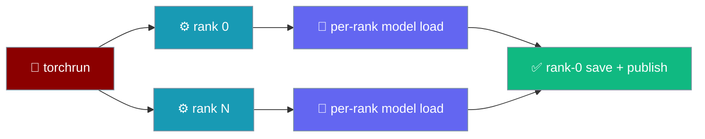
```mermaid
graph LR
    Launch[🚀 torchrun] --> R0[⚙️ rank 0]
    Launch --> RN[⚙️ rank N]
    R0 --> Load0[🧠 per-rank model load]
    RN --> LoadN[🧠 per-rank model load]
    Load0 --> Save[✅ rank-0 save + publish]
    LoadN --> Save

    classDef input fill:#8B0000,stroke:#7C90A0,color:#fff
    classDef gpu fill:#189AB4,stroke:#7C90A0,color:#fff
    classDef process fill:#6366F1,stroke:#7C90A0,color:#fff
    classDef output fill:#10B981,stroke:#7C90A0,color:#fff

    class Launch input
    class R0,RN gpu
    class Load0,LoadN process
    class Save output
```

Each rank loads the full model on its own GPU (`device_map = {"": local_rank}`), Unsloth runs through its DDP-safe checkpointing path, and only rank 0 writes the final adapter and publishes. Set `ddp_find_unused_parameters: false` for a small speedup on dense-text models (leave the default `true` for multimodal / MoE). See [Multi-GPU](/docs/features/praisonai-train-multigpu) for the full walkthrough.

---

## Checkpointing & Resume

Save mid-run so an interruption never costs the whole training — then resume from the latest.

| Key | Type | Default | Description |
|---|---|---|---|
| `save_strategy` | `"no" \| "steps" \| "epoch"` | `"steps"` if `save_steps` set, else `"no"` | When to write checkpoints. |
| `save_steps` | `int` | `100` | Step interval when `save_strategy: steps`. |
| `save_total_limit` | `int` | *unset* | Keep only the N most recent checkpoints. |
| `resume_from_checkpoint` | `bool \| str` | `false` | `true` = latest in `output_dir`; a path = that checkpoint. |
| `final_model_dir` | `str` | `"lora_model"` | Where the final adapter is saved. |

Resume after an interruption — re-launch the same command with:

```yaml
resume_from_checkpoint: true   # picks the latest checkpoint in output_dir
```

See [Checkpointing](/docs/features/praisonai-train-checkpointing) for the full reference.

---

## Eval + Early Stopping

Hold out an eval set to monitor overfitting, keep the best checkpoint, and stop when it plateaus.

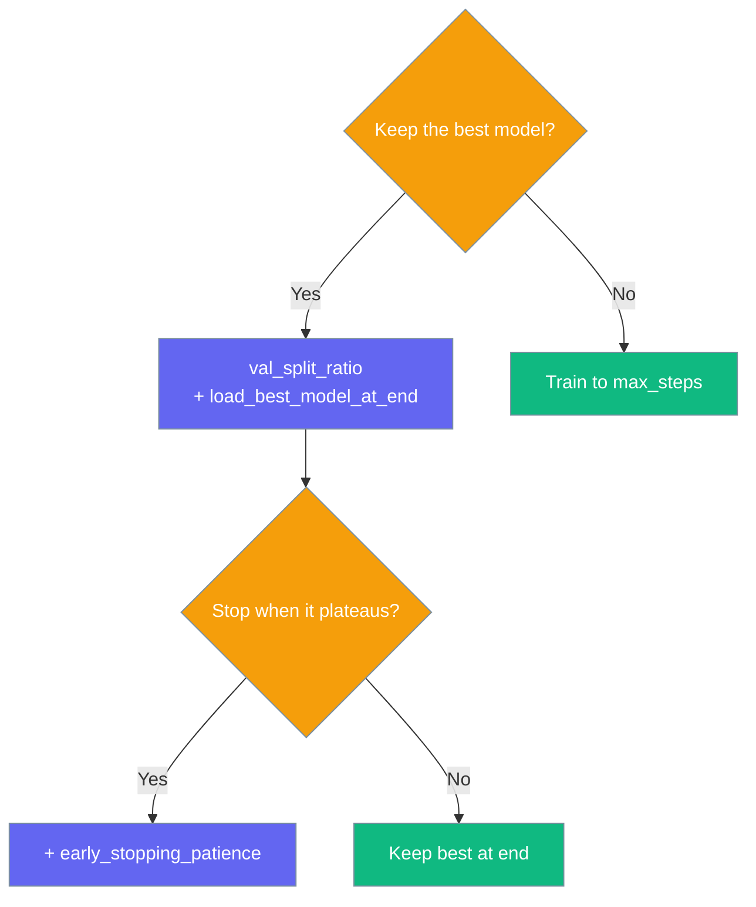
```mermaid
graph TB
    Q1{Keep the best model?}
    Q1 -->|Yes| Best[val_split_ratio<br/>+ load_best_model_at_end]
    Q1 -->|No| Plain[Train to max_steps]
    Best --> Q2{Stop when it plateaus?}
    Q2 -->|Yes| Early[+ early_stopping_patience]
    Q2 -->|No| Done[Keep best at end]

    classDef question fill:#F59E0B,stroke:#7C90A0,color:#fff
    classDef config fill:#6366F1,stroke:#7C90A0,color:#fff
    classDef success fill:#10B981,stroke:#7C90A0,color:#fff

    class Q1,Q2 question
    class Best,Early config
    class Plain,Done success
```

`val_split_ratio` carves the eval set; `load_best_model_at_end` reloads the best checkpoint; `early_stopping_patience` stops after N flat evals (and requires `val_split_ratio`). See [Checkpointing → Evaluation & Best-Checkpoint](/docs/features/praisonai-train-checkpointing#evaluation--best-checkpoint).

---

## Config validation

The trainer runs a preflight pass on load — **before** any model, dataset, GPU, or download is touched — so a non-developer gets a clean, actionable error in seconds instead of a traceback after minutes.

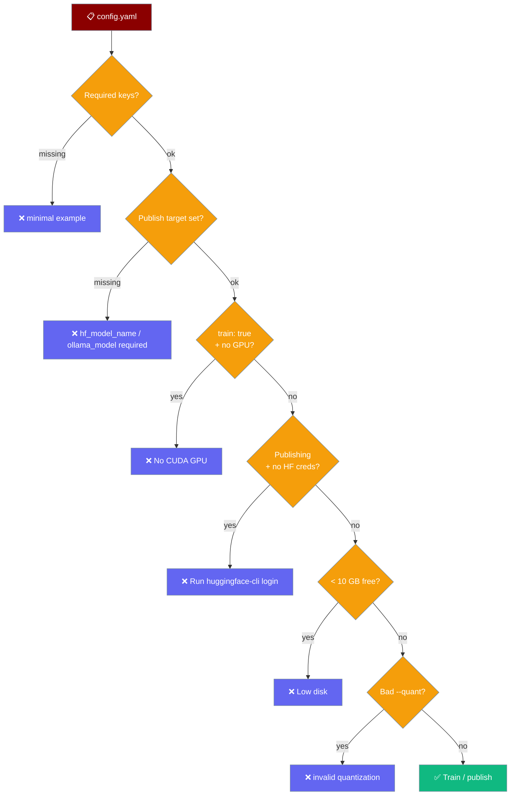
```mermaid
graph TB
    Start[📋 config.yaml] --> Req{Required keys?}
    Req -->|missing| E1[❌ minimal example]
    Req -->|ok| Tgt{Publish target set?}
    Tgt -->|missing| E2[❌ hf_model_name / ollama_model required]
    Tgt -->|ok| Gpu{train: true<br/>+ no GPU?}
    Gpu -->|yes| E3[❌ No CUDA GPU]
    Gpu -->|no| Cred{Publishing<br/>+ no HF creds?}
    Cred -->|yes| E4[❌ Run huggingface-cli login]
    Cred -->|no| Disk{< 10 GB free?}
    Disk -->|yes| E5[❌ Low disk]
    Disk -->|no| Quant{Bad --quant?}
    Quant -->|yes| E6[❌ invalid quantization]
    Quant -->|no| Ok[✅ Train / publish]

    classDef input fill:#8B0000,stroke:#7C90A0,color:#fff
    classDef decision fill:#F59E0B,stroke:#7C90A0,color:#fff
    classDef error fill:#6366F1,stroke:#7C90A0,color:#fff
    classDef success fill:#10B981,stroke:#7C90A0,color:#fff

    class Start input
    class Req,Tgt,Gpu,Cred,Disk,Quant decision
    class E1,E2,E3,E4,E5,E6 error
    class Ok success
```

### Required keys

### Preflight checks

| Check | Trigger | Failure message (paraphrased) |
|---|---|---|
| Required keys | `model_name`, `max_seq_length`, or `dataset` missing | `Config is missing required keys: [...]. Minimal example: ...` |
| Publish target set | `huggingface_save` / `huggingface_save_gguf` true but `hf_model_name` missing | `hf_model_name is required when huggingface_save or huggingface_save_gguf is enabled.` |
| Publish target set | `ollama_save: true` but `ollama_model` missing | `ollama_model is required when ollama_save is enabled.` |
| CUDA available (only when `train: true`, default) | No CUDA GPU | `No CUDA GPU detected. Fine-tuning needs a GPU. On a rented box check the driver; on CPU it cannot run.` |
| HF credentials | Any publish flag set but neither `HF_TOKEN` nor a cached `huggingface-cli login` | `Publishing to Hugging Face is enabled but no credentials were found. Run \`huggingface-cli login\` or \`export HF_TOKEN=hf_...\`. To train without publishing, set huggingface_save: false.` |
| Free disk | `output_dir` (or `.`) has < 10 GB free | `Low disk: only X.X GB free on the training disk (need ~10 GB minimum). Free up space or set output_dir to a larger disk.` |
| Quantization method | `huggingface_save_gguf` or `ollama_save` true and `quantization_method` outside the allowed set | `quantization_method '<val>' is not valid. Choose one of: bf16, f16, q2_k, q3_k_m, q4_0, q4_1, q4_k_m, q5_0, q5_1, q5_k_m, q6_k, q8_0.` |

The required-keys message shows a copy-paste minimal config:

```
ValueError: Config is missing required keys: ['model_name', 'max_seq_length', 'dataset']. Minimal example:
  model_name: unsloth/gemma-2-2b-it-bnb-4bit
  max_seq_length: 2048
  dataset:
    - name: yahma/alpaca-cleaned
```

### GPU check

Enforced only when `train: true` (the default). A publish-only or export-only run (`train: false`) is valid on CPU — cross-link [Publishing](#publishing).

```
No CUDA GPU detected. Fine-tuning needs a GPU. On a rented box check the driver; on CPU it cannot run.
```

### Hugging Face credentials

When publishing is enabled, **either** an `HF_TOKEN` / `HUGGING_FACE_HUB_TOKEN` env var **or** a cached `huggingface-cli login` (read via `huggingface_hub.get_token()`) is accepted — you don't need both.

```
Publishing to Hugging Face is enabled but no credentials were found. Run `huggingface-cli login` or `export HF_TOKEN=hf_...`. To train without publishing, set huggingface_save: false.
```

<Tip>
Already ran `huggingface-cli login`? You do **not** also need to `export HF_TOKEN` — the cached login counts.
</Tip>

### Disk headroom

The trainer needs at least **10 GB** free on the `output_dir` volume (or `.` when `output_dir` is unset).

```
Low disk: only 3.2 GB free on the training disk (need ~10 GB minimum). Free up space or set output_dir to a larger disk.
```

### Quantization method

Enforced only when a GGUF or Ollama push is enabled. Valid values: `q4_k_m`, `q5_k_m`, `q8_0`, `q4_0`, `q4_1`, `q5_0`, `q5_1`, `q3_k_m`, `q6_k`, `f16`, `bf16`, `q2_k`. An unknown value lists all valid choices.

### Unknown keys

Unrecognized keys don't crash — the trainer collects **all** of them and prints one block with the closest known key suggested via `difflib`:

```
WARNING: unrecognized config key(s) — these will be ignored:
  - num_sample  (did you mean 'num_samples'?)
  - max_step    (did you mean 'max_steps'?)
```

Training continues after the warning.

<Warning>
**Clean errors, no tracebacks.** Preflight and known runtime failures print a single `ERROR: <msg>` line and exit with code `1`. Real bugs still show the full traceback. `Ctrl-C` exits with code `130` and a single `Interrupted.` line.

`dataset[].num_samples` must be a positive integer — `0`, negatives, and booleans raise `dataset[].num_samples must be a positive integer, got <value>`.
</Warning>

See [Export a trained model](/docs/features/praisonai-train-export) to publish an already-trained model without re-running training.

---

## Publishing

Publishing to Hugging Face or Ollama is opt-in — set the flag **and** the matching target.

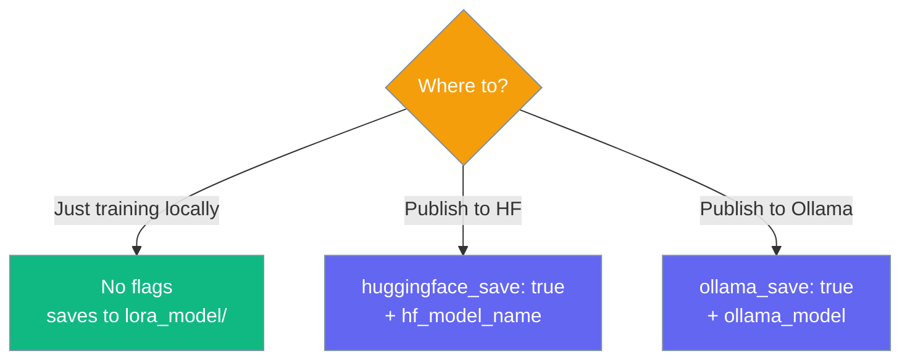
```mermaid
graph TB
    Q1{Where to?}
    Q1 -->|Just training locally| Local[No flags<br/>saves to lora_model/]
    Q1 -->|Publish to HF| HF[huggingface_save: true<br/>+ hf_model_name]
    Q1 -->|Publish to Ollama| Ol[ollama_save: true<br/>+ ollama_model]

    classDef question fill:#F59E0B,stroke:#7C90A0,color:#fff
    classDef success fill:#10B981,stroke:#7C90A0,color:#fff
    classDef config fill:#6366F1,stroke:#7C90A0,color:#fff

    class Q1 question
    class Local success
    class HF,Ol config
```

`train: false` is a valid config — the trainer skips training **and** publishing (previously it crashed with an `AttributeError` on a `None` model).

### Publish without re-training

Already trained a model? Publish it with [`praisonai train export`](/docs/cli/train#praisonai-train-export) — no dataset, no re-training.

```bash
praisonai-train export hf     --model-dir lora_model --hf     me/my-model
praisonai-train export gguf   --model-dir lora_model --hf     me/my-model --quant q4_k_m
praisonai-train export ollama --model-dir lora_model --ollama me/my-model --quant q4_k_m
```

`for_export()` skips the training-only validation — an export-only run needs no `dataset:` (or a config file at all). See [Export an already-trained model](/docs/features/praisonai-train-package#exporting-an-already-trained-model).

### Publishing failure modes

Actionable messages replace raw HTTP tracebacks.

### Ollama publish knobs

Ollama exports quantize on create and can be redirected to a bigger disk.

- **`--quantize`** — `export ollama --quant q4_k_m` passes `--quantize` to `ollama create` so the model isn't stored as a huge `f16`.
- **`OLLAMA_MODELS`** — set this env var to point Ollama at a larger disk when short on space. The trainer disk-pre-checks it before `ollama create` and fails with `export OLLAMA_MODELS=/big/disk/ollama-models` guidance instead of a cryptic "no space left on device".
- **Push `401` / `403`** → an actionable message: register your public key (`~/.ollama/id_ed25519.pub`) at [ollama.com/settings/keys](https://ollama.com/settings/keys) and namespace the model as `<username>/<name>`. The key value is printed for you to copy.

### Hugging Face push errors

A rejected Hub push turns into a one-line fix, not a stack trace.

| Situation | Message you'll see | Fix |
|---|---|---|
| HF token invalid / expired | `Hugging Face rejected the token (401). It is invalid or expired — run \`huggingface-cli login\` or \`export HF_TOKEN=hf_...\` with a valid write token.` | New write-scoped token |
| HF wrong repo owner or read-only token | `No write access to '<repo>' (403). The repo must be under your own username and the token must have write scope. Set hf_model_name to '<your-username>/<name>'.` | Namespace to your user; write token |
| Ollama key not registered | `Ollama rejected the push (unauthorized). Register your public key at https://ollama.com/settings/keys and make sure the model is namespaced as '<username>/<name>'.` **plus** your key printed inline from `~/.ollama/id_ed25519.pub` | Paste the printed key at the URL |
| Ollama disk full | `Not enough disk for the Ollama model: X GB free on '<path>', need ~Y GB. Point Ollama at a bigger disk, e.g. \`export OLLAMA_MODELS=/big/disk/ollama-models\`.` | Move `$OLLAMA_MODELS` |
| Ollama daemon didn't start | `ollama serve did not become ready in 15 seconds. ollama serve output: <stderr>` | Fix the underlying stderr (port busy, bad `OLLAMA_HOST`) |
| `ollama create` failed | Raised as a `RuntimeError` with the create-command stderr, not a raw `CalledProcessError` | Follow the printed guidance |

<Note>
**Namespaced repo IDs are never deleted as local paths.** Setting `hf_model_name: "user/model"` (a Hub repo id) is never treated as a local dir to remove. The trainer only cleans up a stale local dir when the value has no `/` **and** actually exists on disk.
</Note>

<Note>
**Chat-template fallback warns loudly.** When no known family (`llama`, `qwen`, `gemma`, `mistral`, `phi`, `deepseek`) matches your `model_name`, the trainer prints `WARNING: no known chat template matched...` and falls back to a generic Llama-style template. Verify the Ollama output, or set `model_name` to a recognized family. Empty stop tokens are skipped, so the Modelfile never emits a broken `PARAMETER stop` line.
</Note>

<Warning>
Publish-auth failures translate to one clean, actionable line:

- **HF 401** — `Hugging Face rejected the token (401). It is invalid or expired — run huggingface-cli login or export HF_TOKEN=hf_... with a valid write token.`
- **HF 403** — `No write access to '<repo>' (403). The repo must be under your own username and the token must have write scope. Set hf_model_name to '<your-username>/<name>'.`
- **Ollama 401/403** — `Ollama rejected the push (unauthorized). Register your public key at https://ollama.com/settings/keys ...` and prints your local `~/.ollama/id_ed25519.pub`. The model must be namespaced as `<username>/<name>`.
</Warning>

---

## Run summary

Just before training starts, the trainer prints a one-block summary so you can confirm the config resolved as intended.

```
──────────── PraisonAI Train ────────────
  Model:       unsloth/gemma-2-2b-it-bnb-4bit
  Examples:    950  (+50 eval)
  Loss mask:   assistant replies only
  Steps:       200  ·  batch 2 × accum 2 × 2 GPUs
  Checkpoints: steps @ 50 steps  ·  Output: lora_model/
─────────────────────────────────────────
```

The `Loss mask:` line is the resolved `auto` / `true` / `false` decision — `assistant replies only` or `full sequence`. The block now also reports the GPU count (`× N GPUs` under `torchrun`), the held-out eval count (`+N eval`), the checkpoint strategy, and the final `final_model_dir` — so you can verify the whole run resolved as intended without reading the DEBUG noise.

---

## Non-developer errors

The trainer translates the failures hit in practice into a single clean `ERROR:` line — never a traceback for these.

| What went wrong | Error you see |
|---|---|
| No GPU on a training run | `ERROR: No CUDA GPU detected. Fine-tuning needs a GPU. On a rented box check the driver; on CPU it cannot run.` |
| Publishing enabled, no HF login | `ERROR: Publishing to Hugging Face is enabled but no credentials were found. Run huggingface-cli login or export HF_TOKEN=hf_...` |
| < 10 GB free disk | `ERROR: Low disk: only X.X GB free on the training disk (need ~10 GB minimum). Free up space or set output_dir to a larger disk.` |
| Wrong `--quant` value | `ERROR: quantization_method 'q4km' is not valid. Choose one of: bf16, f16, q2_k, q3_k_m, q4_0, q4_1, q4_k_m, q5_0, q5_1, q5_k_m, q6_k, q8_0.` |
| HF token rejected | `ERROR: Hugging Face rejected the token (401). It is invalid or expired — run huggingface-cli login or export HF_TOKEN=hf_... with a valid write token.` |
| No write access to HF repo | `ERROR: No write access to '<repo>' (403). The repo must be under your own username and the token must have write scope. Set hf_model_name to '<your-username>/<name>'.` |
| Ollama daemon didn't come up | `ERROR: ollama serve did not become ready in 15.0 seconds.` + the captured `ollama serve` stderr |
| Ollama key not registered | `ERROR: Ollama rejected the push (unauthorized). Register your public key at https://ollama.com/settings/keys ...` + your local `~/.ollama/id_ed25519.pub` |
| Not enough disk on the Ollama volume | `ERROR: Not enough disk for the Ollama model: X.X GB free on '<dir>', need ~Y GB. Point Ollama at a bigger disk, e.g. export OLLAMA_MODELS=/big/disk/ollama-models` |

<Note>
`ollama serve` readiness honours `OLLAMA_HOST` — the probe hits `GET /api/version` on the resolved endpoint (forms `host`, `host:port`, `http://host:port`, `[::1]:11434`), so a healthy remote daemon is used instead of being ignored.
</Note>

Everything else — a genuine bug — still shows its full traceback so it's not silently swallowed. `Ctrl-C` exits `130`.

---

## Silent-behaviour NOTES

Three behaviours that used to surprise users now print an explicit `NOTE:` / `WARNING:` line.

- **`num_samples` takes the first N rows before shuffle** — repeated runs with the same seed use the same deterministic subset.
- **`split_type` of `validation` / `valid` / `test` / `eval` is ADDED to the training set** — no validation set is held out. Warned via `WARNING: dataset split_type '<x>' is ADDED to the training set`.
- **Default `max_steps: 2800`** fires when neither `num_train_epochs` nor `max_steps` is set: `NOTE: neither num_train_epochs nor max_steps set; defaulting to max_steps: 2800. Set num_train_epochs: 1-3 (or max_steps) to be explicit.` When **both** are set, `max_steps` silently wins (logged at DEBUG).

---

## Advanced

Fine-tune loss to assistant turns only, in a model-agnostic way.

### Model & template keys

Two optional keys control how conversations are formatted and which tokens count toward the loss.

| Option | Type | Default | Description |
|--------|------|---------|-------------|
| `chat_template` | `str` | `None` | Unsloth chat-template name (e.g. `"llama-3.1"`, `"gemma"`, `"gemma-2"`, `"qwen-2.5"`, `"qwen-3"`, `"mistral"`, `"phi-3"`, `"chatml"`). Omit to keep the model's own built-in template. See Unsloth's `get_chat_template` for the full list. |
| `assistant_only_loss` | `bool` | `false` | Compute loss only on assistant turns (model-agnostic response-only loss). Requires a chat template exposing `` blocks. |

<Note>
Omit `chat_template` unless you're intentionally overriding — the model's own template is almost always what you want.
</Note>

### Model-agnostic response-only training

Leave `assistant_only_loss: auto` to let the trainer mask the loss to assistant turns whenever the template supports it — falling back to full-sequence SFT otherwise. Force it with `true` only when you know your template emits `` blocks.

```yaml
model_name: "unsloth/Meta-Llama-3.1-8B-Instruct-bnb-4bit"
chat_template: "llama-3.1"
assistant_only_loss: true   # force on — errors fast if the template can't mask
```

This uses TRL's model-agnostic `SFTConfig(assistant_only_loss=True)` instead of the old Llama-only `train_on_responses_only` markers. If you set `assistant_only_loss: true`, also set a `chat_template` that supports assistant masks (e.g. Unsloth's `llama-3.1`, `gemma-2`, `qwen-2.5`).

<Warning>
`assistant_only_loss: true` on a template without `` markers raises `ValueError` at model-prep time. Use `auto` (recommended) or `false`, or set a `chat_template` that supports masking (e.g. an Unsloth "llama-3.1-lite" style template extended with generation blocks).
</Warning>

<Warning>
If your tokenizer has no built-in chat template and you don't set `chat_template`, `praisonai-train llm` now raises `ValueError` at model prep time:

```text
Tokenizer for model '<model_name>' has no chat template and none was
provided via config 'chat_template'. Set 'chat_template' (e.g.
'gemma', 'qwen-2.5', 'llama-3.1') so conversations format correctly.
```

This replaces the earlier silent-empty-training bug — set `chat_template` (e.g. `gemma`, `qwen-2.5`, `llama-3.1`) to fix.
</Warning>

### Which `chat_template` should I use?

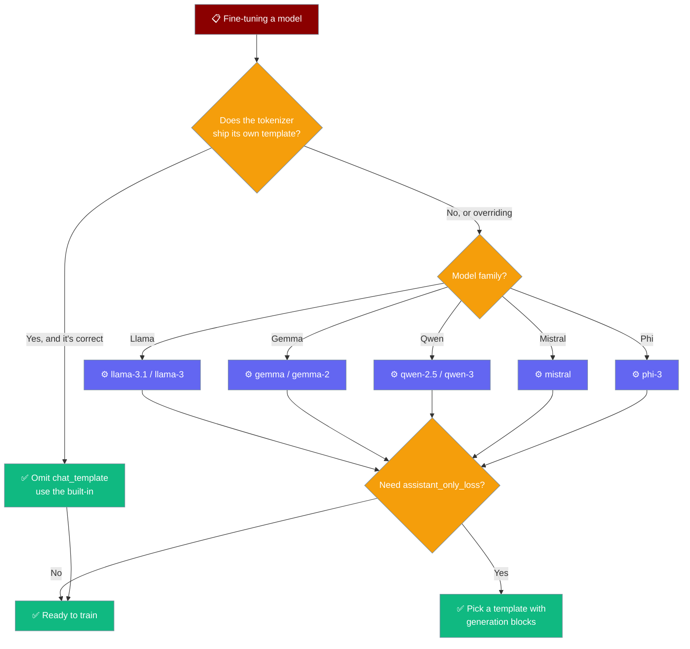
```mermaid
graph TB
    Start[📋 Fine-tuning a model] --> Q1{Does the tokenizer<br/>ship its own template?}
    Q1 -->|Yes, and it's correct| Omit[✅ Omit chat_template<br/>use the built-in]
    Q1 -->|No, or overriding| Fam{Model family?}
    Fam -->|Llama| L[⚙️ llama-3.1 / llama-3]
    Fam -->|Gemma| G[⚙️ gemma / gemma-2]
    Fam -->|Qwen| Qw[⚙️ qwen-2.5 / qwen-3]
    Fam -->|Mistral| M[⚙️ mistral]
    Fam -->|Phi| P[⚙️ phi-3]
    L --> Mask{Need assistant_only_loss?}
    G --> Mask
    Qw --> Mask
    M --> Mask
    P --> Mask
    Mask -->|Yes| Gen[✅ Pick a template with<br/>generation blocks]
    Mask -->|No| Done[✅ Ready to train]
    Omit --> Done

    classDef input fill:#8B0000,stroke:#7C90A0,color:#fff
    classDef decision fill:#F59E0B,stroke:#7C90A0,color:#fff
    classDef config fill:#6366F1,stroke:#7C90A0,color:#fff
    classDef success fill:#10B981,stroke:#7C90A0,color:#fff

    class Start input
    class Q1,Fam,Mask decision
    class L,G,Qw,M,P config
    class Omit,Gen,Done success
```

<Accordion title="Under the hood — modern TRL SFT surface">
The trainer targets the current TRL API. Anyone writing custom training code should note it now uses `SFTConfig` in place of `TrainingArguments`, passes `processing_class=` instead of the removed `tokenizer=` kwarg, moves `dataset_text_field`, `max_length` (TRL renamed `max_seq_length` → `max_length`), `packing`, and `dataset_num_proc` onto `SFTConfig`, and lets modern TRL tokenize the `text` column internally instead of pre-tokenizing with a dummy field.
</Accordion>

---

## Weights & Biases

Track loss curves and checkpoints for each run.

```bash
wandb login
```

<Note>
Get the key from [here](https://wandb.ai/site/login)
</Note>

```bash
export PRAISON_WANDB=True
export WANDB_LOG_MODEL=checkpoint
export WANDB_PROJECT=praisonai-test
export PRAISON_WANDB_RUN_NAME=praisonai-train
```

<div className="relative w-full aspect-video">
  <iframe
    className="absolute top-0 left-0 w-full h-full"
    src="https://www.youtube.com/embed/aLawE8kwCrI"
    title="YouTube video player"
    allow="accelerometer; autoplay; clipboard-write; encrypted-media; gyroscope; picture-in-picture"
    allowFullScreen
  ></iframe>
</div>

---

## Best Practices

<AccordionGroup>
<Accordion title="Start with praisonai-train alone if you only want agent training">
`pip install praisonai-train` pulls `praisonaiagents` plus `litellm` (for LLM-as-Judge grading) — enough for `agents`, `list`, `show`, and `apply`. Add `[llm]` only when you need Unsloth fine-tuning.
</Accordion>

<Accordion title="Set HF_TOKEN in the environment">
Export `HF_TOKEN` in your shell before fine-tuning so the trainer can push to Hugging Face. Never commit the raw token.
</Accordion>

<Accordion title="Start small, then scale">
Use a low `max_steps` and `num_samples: 20` for a first run — a full smoke test finishes in under a minute. Ramp up once the pipeline is green.
</Accordion>

<Accordion title="Leave assistant_only_loss: auto">
The trainer enables masking whenever the tokenizer supports it and falls back cleanly otherwise. Only set `true` / `false` if you need to force a specific behaviour.
</Accordion>

<Accordion title="Publish flags are opt-in">
For local experiments, delete the `huggingface_save` / `ollama_save` keys entirely — no target, no push, no crash. Set the flag **and** its target (`hf_model_name` / `ollama_model`) only when you want to publish.
</Accordion>

<Accordion title="Publishing needs credentials + write access — check them once">
Run `huggingface-cli login` (or `export HF_TOKEN=hf_...`) and namespace the repo under your own username. [Preflight](#preflight-validation) catches missing credentials before the run; a rejected push still [translates 401/403](#publishing-failure-messages) into an actionable fix. For Ollama, register your signing key at ollama.com — a rejected push [prints your public key to copy](#push-failures--key-registration).
</Accordion>

<Accordion title="Track runs with Weights & Biases">
Set `PRAISON_WANDB=True` and the `WANDB_*` variables to log loss curves and checkpoints for each run.
</Accordion>

<Accordion title="Let the tokenizer's native template win">
Only set `chat_template` for models without one, or to force a specific one. Forcing `llama-3.1` on Gemma/Qwen was the old default and silently corrupted training — now the trainer uses each model's own template by default.
</Accordion>

<Accordion title="Match chat_template to your model family">
Omit `chat_template` to use the model's built-in template — that's correct for most Instruct models. Set it explicitly (`gemma`, `qwen-2.5`, `llama-3.1`, ...) only when overriding or when the tokenizer ships no template, otherwise the trainer raises `ValueError` at model prep.
</Accordion>

<Accordion title="Enable assistant_only_loss for instruction datasets">
Turn on `assistant_only_loss: true` so loss is computed only on assistant turns — but confirm your chat template exposes `` blocks (e.g. Unsloth's `llama-3.1`, `gemma-2`, `qwen-2.5`). Templates without them cannot produce the mask and TRL will error.
</Accordion>
</AccordionGroup>

---

## Related

<CardGroup cols={2}>
  <Card title="Serve trained models" icon="play" href="/docs/features/train-serve">
    Serve a GGUF on an OpenAI endpoint with MTP fast inference.
  </Card>
  <Card title="Train CLI" icon="terminal" href="/docs/cli/train">
    Full flag reference for every subcommand.
  </Card>
  <Card title="Multi-GPU Training" icon="microchip" href="/docs/features/praisonai-train-multigpu">
    Fine-tune across multiple GPUs with torchrun.
  </Card>
  <Card title="Checkpointing" icon="database" href="/docs/features/praisonai-train-checkpointing">
    Save, resume, and keep the best checkpoint.
  </Card>
  <Card title="praisonai-train Package" icon="graduation-cap" href="/docs/features/praisonai-train-package">
    Install and use training without the full wrapper.
  </Card>
  <Card title="Installation Extras" icon="puzzle-piece" href="/docs/features/installation-extras">
    Optional dependency groups and the train install matrix.
  </Card>
  <Card title="Models" icon="brain" href="/docs/models">
    Use your fine-tuned model with an Agent.
  </Card>
</CardGroup>
