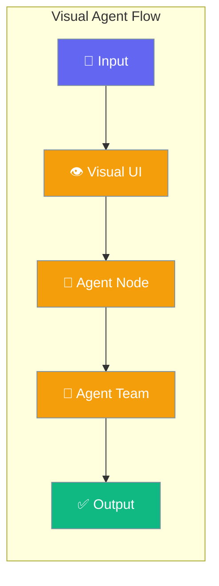
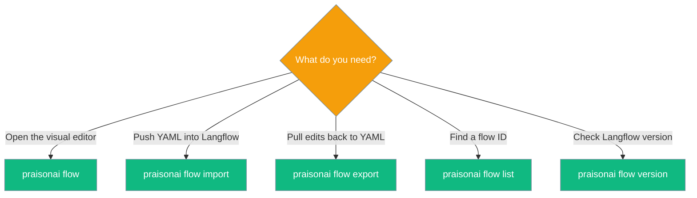
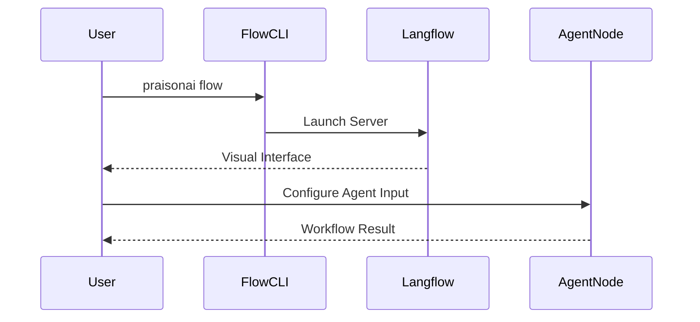

Visual workflow builder allows you to create, connect, and manage agentic processes using a drag-and-drop interface.



<Warning>
The `[flow]` extra is opt-in and heavy (~500MB) because Langflow pulls many dependencies. Install only when you need the visual builder: `pip install "praisonai[flow]"`.
</Warning>

## Quick Start

<Steps>
<Step title="Install Flow Addon">
Install the visual builder components.

```bash
pip install "praisonai[flow]"
```
</Step>

<Step title="Launch Visual Builder">
Start the local server and open the web interface.

```bash
praisonai flow
```
</Step>

<Step title="Connect Components">
Open `http://localhost:7860` to access the interface.
Drag and drop **Agent** and **Agent Team** nodes to orchestrate workflows.
</Step>
</Steps>

---

## CLI Subcommands

| Command | Purpose |
|---------|---------|
| `praisonai flow` | Launch Langflow with PraisonAI components |
| `praisonai flow import <yaml>` | Convert PraisonAI YAML → Langflow JSON and upload |
| `praisonai flow export <flow_id>` | Download a Langflow flow and convert back to YAML |
| `praisonai flow list` | List flows on a running Langflow server |
| `praisonai flow version` | Show installed Langflow version |

See [Flow CLI](/docs/cli/flow) for the full flag reference.

### Which subcommand should I use?



---

## Start Command Flags

| Flag | Type | Default | Description |
|------|------|---------|-------------|
| `--port`, `-p` | `int` | `7860` | Port to listen on |
| `--host`, `-H` | `str` | `127.0.0.1` | Host to bind to (use `0.0.0.0` to expose) |
| `--env-file` | `str` | `None` | Path to a `.env` file Langflow should load |
| `--no-open` | flag | `False` | Don't open the browser on start |
| `--log-level`, `-l` | `str` | `error` | `debug`, `info`, `warning`, `error`, `critical` |
| `--backend-only` | flag | `False` | Run backend API only (no frontend UI) |
| `--components-path` | `str` | `None` | Extra custom components directory (appended to PraisonAI's) |

### Import flags

| Flag | Type | Default | Description |
|------|------|---------|-------------|
| `yaml_path` | `str` | — | Path to YAML workflow file (positional) |
| `--url` | `str` | `http://localhost:7860` | Langflow server URL |
| `--dry-run` | flag | `False` | Preview JSON without uploading |
| `--open` | flag | `False` | Open the imported flow in the browser |
| `--output`, `-o` | `str` | `None` | Save JSON to file instead of uploading |

### Export flags

| Flag | Type | Default | Description |
|------|------|---------|-------------|
| `flow_id` | `str` | — | Flow ID to export (positional) |
| `--output`, `-o` | `str` | `<flow_name>.<ext>` | Output file path |
| `--url` | `str` | `http://localhost:7860` | Langflow server URL |
| `--format` | `str` | `yaml` | Output format: `yaml` or `json` |

### List flags

| Flag | Type | Default | Description |
|------|------|---------|-------------|
| `--url` | `str` | `http://localhost:7860` | Langflow server URL |
| `--search`, `-s` | `str` | `None` | Search flows by name or description |

---

## How It Works



| Component | Purpose | Availability |
|-----------|---------|-------------|
| **Agent Node** | Individual AI entity with tailored instructions | Sidebar > PraisonAI |
| **Agent Team Node** | Multi-agent orchestrator connecting multiple nodes | Sidebar > PraisonAI |
| **CLI Command** | Backend server runtime wrapper | `praisonai` CLI |

<Tip>
If `PRAISONAI_OBSERVE=langfuse` is set, the Agent component auto-wires a `LangfuseSink` with `praisonai_source=langflow` trace metadata.
</Tip>

---

## Agent Configuration Options

Options available on the **Agent** node visual component.

| Option | Type | Default | Description |
|--------|------|---------|-------------|
| `Agent Name` | `str` | `"Agent"` | Name for identification and logging |
| `Previous Agent` | `Handle` | `None` | Connect from previous agent to define execution order |
| `Role` | `str` | `None` | Role defining the agent's expertise |
| `Goal` | `str` | `None` | Primary objective the agent aims to achieve |
| `Backstory` | `str` (multiline) | `None` | Background context shaping personality |
| `Instructions` | `str` | `"You are a helpful assistant."` | System prompt for the agent |
| `Input` | `Handle` | `None` | User input to process |
| `Model` | `str` | `"openai/gpt-4o-mini"` | LLM model (`provider/model` format) |
| `Language Model` | `Handle` (LanguageModel) | `None` | External LLM from Langflow model components (overrides dropdown) |
| `Base URL` | `str` | `None` | Custom LLM endpoint (e.g. `http://localhost:11434` for Ollama) |
| `API Key` | `Secret` | `None` | API key for LLM provider (overrides env var) |
| `Tools` | `Handle` | `None` | Tools available to the agent |
| `Allow Delegation` | `bool` | `False` | Allow task delegation to other agents |
| `Allow Code Execution` | `bool` | `False` | Enable code execution during tasks |
| `Code Execution Mode` | `str` | `safe` | `safe` (sandboxed) or `unsafe` (full system access) |
| `Handoffs` | `Handle[Agent]` | `[]` | Other agents this agent can hand off conversations to |
| `Memory` | `bool` | `False` | Enable context retention |
| `Memory Provider` | `str` | `""` | `""`, `rag`, or `mem0` |
| `Memory Config` | `dict` | `None` | Full MemoryConfig dictionary |
| `Knowledge Files` | `File` | `None` | Files to use as knowledge sources (PDF, TXT, etc.) |
| `Knowledge URLs` | `str` (multiline) | `None` | URLs to use as knowledge sources (one per line) |
| `Guardrails` | `bool` | `False` | Enable output validation guardrails |
| `Verbose` | `bool` | `False` | Show detailed execution logs |
| `Markdown Output` | `bool` | `True` | Format output as markdown |
| `Self Reflect` | `bool` | `False` | Enable self-reflection |
| `Max Iterations` | `int` | `20` | Maximum agent loop iterations |

---

## Agent Team Configuration Options

Options available on the **Agent Team** node visual component for multi-agent workflows.

| Option | Type | Default | Description |
|--------|------|---------|-------------|
| `Name` | `str` | `"AgentTeam"` | Name for this multi-agent team |
| `Agents` | `Handle` | `[]` | List of connected PraisonAI agents to orchestrate |
| `Input` | `Handle` | `None` | Initial input to start the multi-agent workflow |
| `Process` | `str` | `"sequential"` | Collaboration mode (sequential, hierarchical, workflow) |
| `Manager Agent` | `Handle[Agent]` | `None` | Explicit manager agent for hierarchical process |
| `Manager LLM` | `str` | `"openai/gpt-4o"` | LLM used for auto-created managers |
| `Variables` | `dict` | `None` | Global variables for substitution in task descriptions |
| `Shared Memory` | `bool` | `False` | Enable shared memory across all agents |
| `Guardrails` | `bool` | `False` | Enable team-level validation guardrails |
| `Verbose` | `bool` | `False` | Show detailed execution logs |
| `Full Output` | `bool` | `False` | Return full output including all task results |
| `Planning` | `bool` | `False` | Enable planning mode for task decomposition |
| `Reflection` | `bool` | `False` | Enable self-reflection for improved results |
| `Caching` | `bool` | `False` | Enable caching of agent responses |

---

## Common Patterns

### YAML round-trip

```bash
praisonai flow                                   # 1. start the builder
praisonai flow import my_workflow.yaml --open    # 2. push YAML in
# (edit in browser, copy the flow ID from the URL)
praisonai flow export <flow_id> -o my_workflow.yaml   # 3. pull edits back to YAML
```

### Sequential Connections

Connect individual `Agent` nodes linearly (Agent 1 → Agent 2) by linking the `Agent` output handle on the first node to the `Previous Agent` input handle on the second node.

### Multi-Agent Orchestration

Connect multiple `Agent` nodes directly to the `Agents` input handle of an `Agent Team` node. The team node evaluates the topology and runs the sub-agents properly.

### Headless / LAN deploy

```bash
praisonai flow --host 0.0.0.0 --port 8080
praisonai flow --backend-only --no-open
```

---

## Best Practices

<AccordionGroup>
<Accordion title="Configure Knowledge Properly">
When using the agent node's knowledge capabilities, upload compatible document types (PDF, TXT, CSV) or provide valid URLs in the `Knowledge` inputs.
</Accordion>
<Accordion title="Use Sequential Handles">
Use the `Previous Agent` connection to establish hard execution boundaries. The orchestrator automatically parses node inputs backwards to map deterministic execution flow.
</Accordion>
<Accordion title="Enable Advanced Node Features">
Click the "Advanced" toggle on nodes inside Langflow to expose robust SDK parameters like custom Base URLs, `Code Execution Mode`, `Verbose` logging, and specific `Memory Providers`.
</Accordion>
<Accordion title="Keep YAML as source of truth">
Export flows back to YAML after visual edits so workflows stay in version control.
</Accordion>
</AccordionGroup>

---

## Related

<CardGroup cols={2}>
<Card title="Flow CLI" icon="diagram-project" href="/docs/cli/flow">
  CLI reference for all subcommands and flags
</Card>
<Card title="Langflow Integration" icon="plug" href="/docs/integrations/langflow">
  Component reference and model formats
</Card>
<Card title="Agent Workflow" icon="route" href="/docs/features/workflows">
  Core workflow concepts
</Card>
<Card title="Installation Extras" icon="puzzle-piece" href="/docs/features/installation-extras">
  `[flow]` extra reference
</Card>
</CardGroup>
