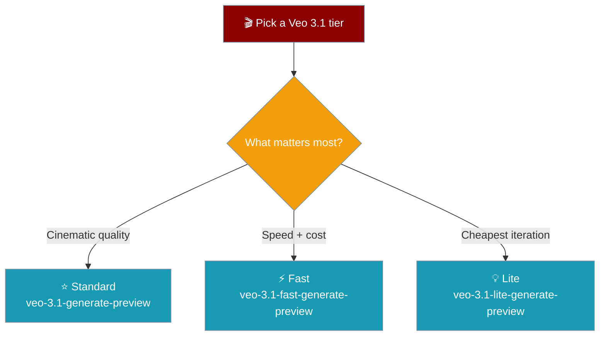

Generate videos using Google's Omni Flash and Veo 3.1 models through the Gemini API.

```python
from praisonaiagents import VideoAgent

agent = VideoAgent(llm="gemini/veo-3.1-generate-preview")
video = agent.start("A sunrise over mountains", output="sunrise.mp4")
```

## Authentication

Set your Gemini API key before running.

```bash
export GOOGLE_API_KEY=your-key
# GEMINI_API_KEY also works
```

```python
from praisonaiagents import VideoAgent

agent = VideoAgent(llm="gemini/veo-3.1-generate-preview")
video = agent.start("A city skyline at night", output="skyline.mp4")
```

## Models

Three Veo 3.1 tiers cover cinematic quality down to cheap iteration.

| Model | Description |
|-------|-------------|
| `gemini/gemini-omni-1.1-flash` | Gemini Omni Flash — Google's default video model |
| `gemini/veo-3.1-generate-preview` | Veo 3.1 Standard — cinematic quality |
| `gemini/veo-3.1-fast-generate-preview` | Veo 3.1 Fast — quicker, lower cost |
| `gemini/veo-3.1-lite-generate-preview` | Veo 3.1 Lite — cheapest iteration |

### Which Veo 3.1 tier should I pick?



### Deprecated

Migrate to the `veo-3.1` IDs above. These older models are being retired.

| Model | Note |
|-------|------|
| `gemini/veo-2.0-generate-001` | Deprecated — Gemini API shutdown 30 Jun 2026 |
| `gemini/veo-3.0-generate-preview` | Deprecated — Gemini API shutdown 30 Jun 2026 |
| `gemini/veo-3.0-fast-generate-preview` | Deprecated — Gemini API shutdown 30 Jun 2026 |

## Gemini Omni Flash

Gemini Omni Flash (`gemini-omni-1.1-flash`) is Google's recommended default video model. Use Veo 3.1 for cinematic pipelines and interpolation.

```python
from praisonaiagents import VideoAgent

agent = VideoAgent(llm="gemini/gemini-omni-1.1-flash")
video = agent.start("A marble rolling on a chain-reaction track", output="marble.mp4")
```

<Note>
Omni is served through Google's Interactions API rather than the Veo
`predictLongRunning` endpoint. VideoAgent reaches every provider through the
shared LiteLLM video interface, so Omni is usable once your installed LiteLLM
version routes `gemini/gemini-omni-1.1-flash`. Veo remains fully supported.
</Note>

## Veo 3.1 features

Veo 3.1 adds frame interpolation and reference images. Both pass straight through `generate()` — no extra setup.

<Tabs>
  <Tab title="First + last frame">
```python
from praisonaiagents import VideoAgent

agent = VideoAgent(llm="gemini/veo-3.1-generate-preview")

# First + last frame interpolation (Veo 3.1)
agent.generate(
    prompt="Sunrise timelapse",
    input_reference=start_image,  # first frame
    last_frame=end_image,         # last frame
)
```
  </Tab>
  <Tab title="Reference images">
```python
from praisonaiagents import VideoAgent

agent = VideoAgent(llm="gemini/veo-3.1-generate-preview")

# Up to 3 reference images
agent.generate(
    prompt="A cinematic dolly shot of the character",
    reference_images=[img1, img2, img3],
)
```
  </Tab>
</Tabs>

## Pricing & billing

Gemini Veo bills per generated second in USD on the paid API. You are charged only when a generation succeeds.

<Warning>
A Google Flow / AI Plus-Ultra subscription does **not** cover the Gemini API.
Flow UI credits are a different meter and cannot pay for API generations —
direct Gemini API use is billed separately on the paid tier.
</Warning>

## Parameters

```python
video = agent.generate(
    prompt="Your description"
)
```

<Warning>
Gemini Veo has limited parameter control compared to OpenAI. Duration and size are handled automatically.
</Warning>

## Features

| Feature | Supported |
|---------|-----------|
| Text-to-Video | ✅ |
| Image-to-Video | ✅ |
| First + last frame (Veo 3.1) | ✅ |
| Reference images (Veo 3.1) | ✅ |
| Video Remix | ❌ |
| Custom Duration | Handled automatically |
