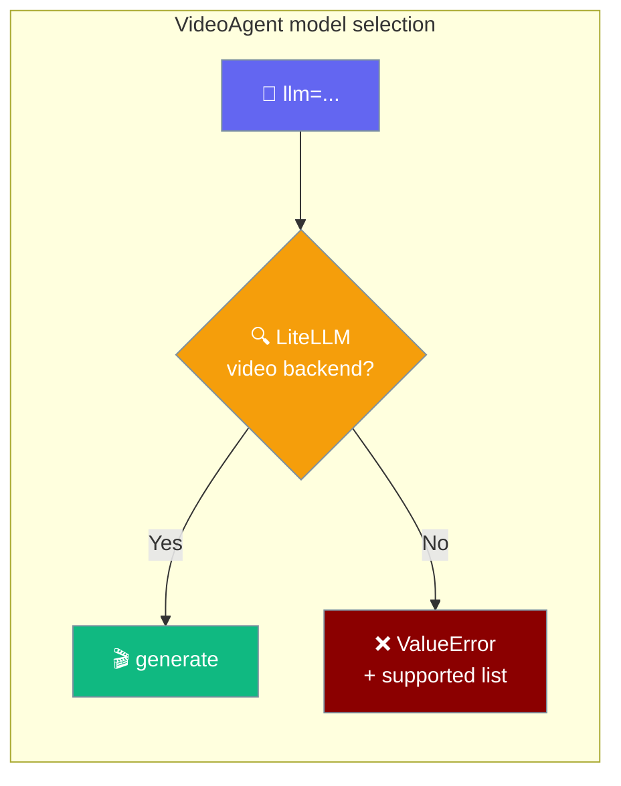

<Note>
**Default model:** When you omit `llm=`/`--model`/`model=`, every surface — SDK `VideoAgent`, capability `video_generate`, MCP `praisonai.videos.generate`, and CLI `praisonai videos` — falls back to `openai/sora-2` (the canonical default from `VideoAgent.DEFAULT_MODEL`).
</Note>

## Generate Video

<Tabs>
  <Tab title="Basic">
```python
from praisonaiagents import VideoAgent

agent = VideoAgent(llm="openai/sora-2")
video = agent.generate("A cat playing with yarn")
print(video.id)
```
  </Tab>
  <Tab title="Advanced">
```python
from praisonaiagents import VideoAgent

agent = VideoAgent(llm="openai/sora-2")

# Generate
video = agent.generate("A sunset timelapse", seconds="8", size="1920x1080")

# Wait and download
completed = agent.wait_for_completion(video.id)
if completed.status == "completed":
    agent.download(video.id, "sunset.mp4")

# List all videos
videos = agent.list()
```
  </Tab>
</Tabs>

## Providers

<CardGroup cols={3}>
  <Card title="OpenAI Sora" icon="robot" href="/video/openai">Sora-2</Card>
  <Card title="Gemini" icon="google" href="/video/gemini">Omni Flash (default), Veo 3.1</Card>
  <Card title="RunwayML" icon="film" href="/video/runwayml">Gen-4</Card>
  <Card title="Azure" icon="microsoft" href="/video/azure">Sora</Card>
  <Card title="OpenRouter" icon="router" href="/video/openrouter">Veo, Kling, Hailuo, Seedance, Wan…</Card>
</CardGroup>

## Supported models

Only models with a LiteLLM video-generation backend work in `VideoAgent`.



Pick a model that is in LiteLLM's chat/cost catalogue but has no video route (for example `xai/grok-imagine-video-*`) and `VideoAgent` raises a clear `ValueError` naming models that *do* work.

Known-good defaults:

| Model | Provider | Notes |
|-------|----------|-------|
| `openai/sora-2` | OpenAI | Default when `llm=` is omitted |
| `gemini/veo-3.1-generate-preview` | Google | Also `gemini/veo-3.1-lite-generate-preview` |
| `runwayml/gen4_turbo` | RunwayML | Image-to-video |

<Warning>
Chat/cost catalogue membership is **not** enough — the model must have a provider-specific video config in LiteLLM. If LiteLLM later adds a video backend for your provider, `VideoAgent` picks it up automatically; nothing is hardcoded to a denylist.
</Warning>

### Error you'll see on an unsupported model

```text
ValueError: 'xai/grok-imagine-video-1.5' has no LiteLLM video-generation backend
(it may be listed for chat pricing only). Use a supported video model, e.g.:
openai/sora-2, gemini/veo-3.1-generate-preview, runwayml/gen4_turbo
```

Switch `llm=` to a supported model and re-run:

```python
from praisonaiagents import VideoAgent

agent = VideoAgent(llm="openai/sora-2")  # instead of xai/grok-imagine-video-1.5
video = agent.generate("A cat playing with yarn")
```

## Desktop app

Prefer a native app? The Desktop **Video** tab generates an MP4 from a prompt with a built-in model picker (MiniMax, Sora 2, Veo 3.1) — no code required.

<CardGroup cols={1}>
  <Card title="Desktop → Video" icon="video" href="/features/desktop/video">Generate video from the Desktop app</Card>
</CardGroup>

## Troubleshooting

<AccordionGroup>
<Accordion title="ValueError: '...' has no LiteLLM video-generation backend">
The model you passed to `llm=` is in LiteLLM's model/cost catalogue but has no video-generation provider config. This is common for xAI Grok Imagine ids (`xai/grok-imagine-video-*`), which are chat-priced only.

**Fix:** switch to one of the supported models from the error message:

```python
from praisonaiagents import VideoAgent

agent = VideoAgent(llm="openai/sora-2")  # instead of xai/grok-imagine-video-1.5
```

If LiteLLM later adds a video backend for your preferred provider, `VideoAgent` picks it up automatically — nothing is hardcoded to a denylist.
</Accordion>

<Accordion title="AuthenticationError">
The model's video backend **does** exist, but your API key is missing or wrong. This error propagates unchanged — `VideoAgent` never masks it. Set the provider's env var (e.g. `OPENAI_API_KEY`, `GEMINI_API_KEY`, `RUNWAYML_API_SECRET`) and re-run.
</Accordion>

<Accordion title="video size is not supported">
The working backend rejected a specific request parameter (size, duration, prompt format). This is a bad request to a real video backend — not a missing backend — so it propagates unchanged. Fix the request, not the model: for example, drop `size=` to use the provider default.
</Accordion>
</AccordionGroup>
