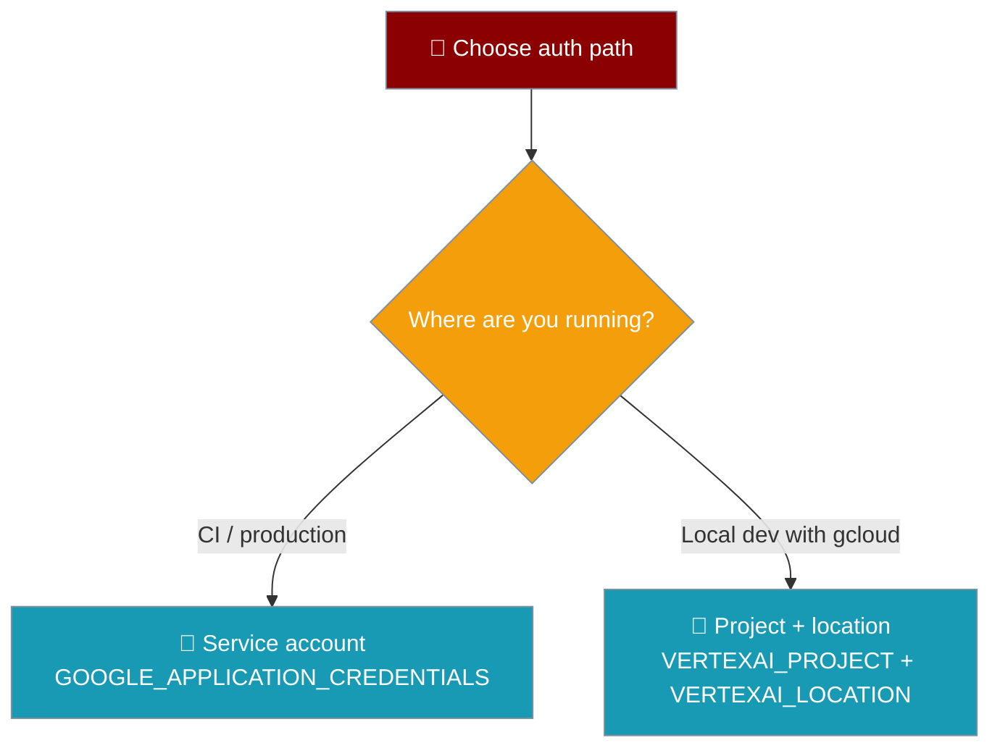

Generate videos using GA Veo 3.1 models through Google Cloud Vertex AI.

```python
from praisonaiagents import VideoAgent

agent = VideoAgent(llm="vertex_ai/veo-3.1-generate-001")
video = agent.start("Ocean waves at sunset", output="ocean.mp4")
```

## Authentication

Vertex AI supports two auth paths — pick the one that matches your setup.

```bash
# Option A: service account (CI / production)
export GOOGLE_APPLICATION_CREDENTIALS=path/to/service-account.json

# Option B: project + location (local dev with gcloud)
export VERTEXAI_PROJECT=your-project-id
export VERTEXAI_LOCATION=us-central1
```



<Note>
Use a service account for CI and production. Use project + location for local
development where you are already signed in with `gcloud`.
</Note>

## Models

Three GA Veo 3.1 tiers cover cinematic quality down to cheap iteration.

| Model | Description |
|-------|-------------|
| `vertex_ai/veo-3.1-generate-001` | Veo 3.1 GA Standard — cinematic quality |
| `vertex_ai/veo-3.1-fast-generate-001` | Veo 3.1 GA Fast — quicker, lower cost |
| `vertex_ai/veo-3.1-lite-generate-001` | Veo 3.1 Lite — cheapest iteration |

### Deprecated

Migrate to the `veo-3.1` IDs above. These older models are being retired.

| Model | Note |
|-------|------|
| `vertex_ai/veo-2.0-generate-001` | Deprecated — migrate to `veo-3.1` |
| `vertex_ai/veo-3.0-generate-preview` | Deprecated — migrate to `veo-3.1` |
| `vertex_ai/veo-3.0-fast-generate-001` | Deprecated — migrate to `veo-3.1` |

## Veo 3.1 features

Veo 3.1 adds frame interpolation and reference images. Both pass straight through `generate()` — no extra setup.

<Tabs>
  <Tab title="First + last frame">
```python
from praisonaiagents import VideoAgent

agent = VideoAgent(llm="vertex_ai/veo-3.1-generate-001")

# First + last frame interpolation (Veo 3.1)
agent.generate(
    prompt="Sunrise timelapse",
    input_reference=start_image,  # first frame
    last_frame=end_image,         # last frame
)
```
  </Tab>
  <Tab title="Reference images">
```python
from praisonaiagents import VideoAgent

agent = VideoAgent(llm="vertex_ai/veo-3.1-generate-001")

# Up to 3 reference images
agent.generate(
    prompt="A cinematic dolly shot of the character",
    reference_images=[img1, img2, img3],
)
```
  </Tab>
</Tabs>

## Pricing & billing

Vertex AI Veo bills per generated second in USD, charged through your connected GCP project.

<Warning>
Flow / AI Plus-Ultra subscription credits are a different meter and cannot pay
for API generations. Vertex AI usage is billed via your GCP project.
</Warning>

## Parameters

```python
video = agent.generate(
    prompt="Your description"
)
```

## Features

| Feature | Supported |
|---------|-----------|
| Text-to-Video | ✅ |
| Image-to-Video | ✅ |
| First + last frame (Veo 3.1) | ✅ |
| Reference images (Veo 3.1) | ✅ |
| Video Remix | ❌ |
| GCP Integration | ✅ |
