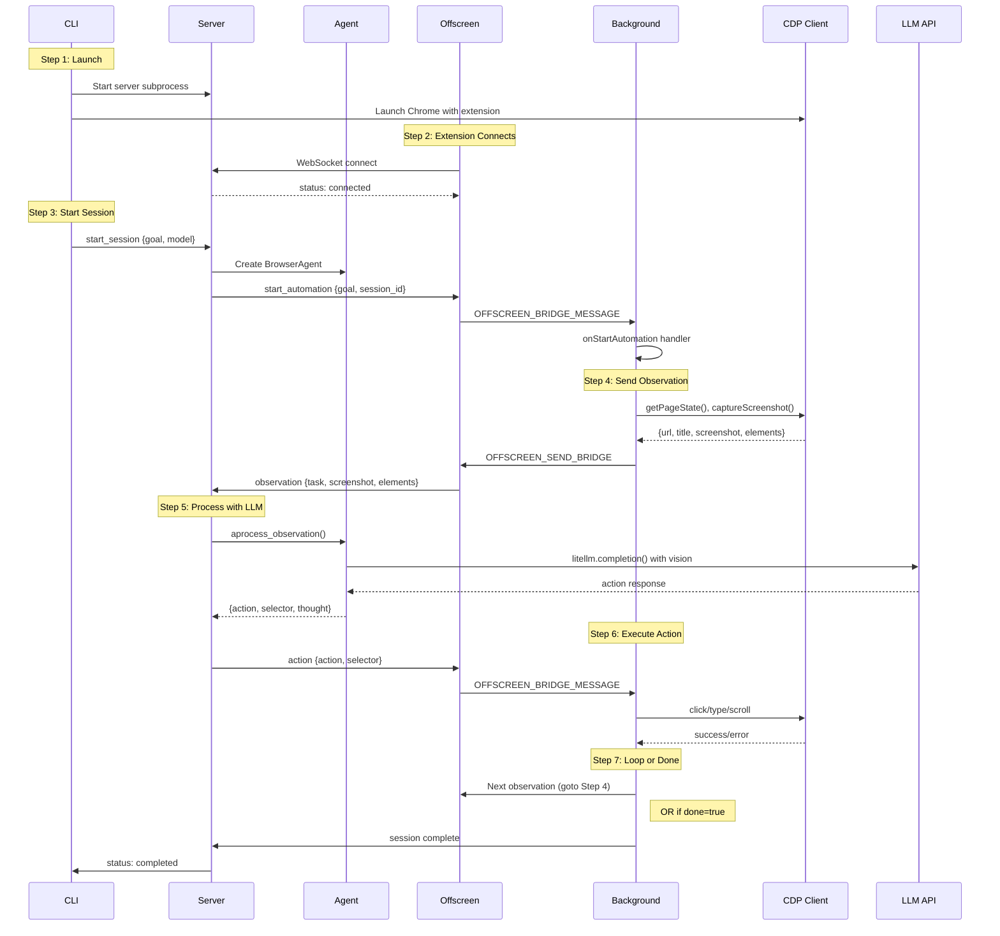

# Browser Automation Architecture

PraisonAI Browser Automation uses an 8-component architecture connecting a CLI, Python server, Chrome extension, and LLM for AI-driven browser control.

## Component Overview

| Component | Location | Purpose |
|-----------|----------|---------|
| **CLI** | `browser/cli.py` | Entry point, command routing |
| **Server** | `browser/server.py` | WebSocket server, message routing |
| **Agent** | `browser/agent.py` | LLM calls, action decisions |
| **Background** | `extension/background/index.ts` | Service worker, message routing |
| **BridgeClient** | `extension/bridge/client.ts` | WebSocket client, observation sending |
| **Offscreen** | `extension/offscreen/index.ts` | Persistent WebSocket, message forwarding |
| **CDP** | Chrome DevTools Protocol | Browser control |
| **LLM** | litellm | Model API calls |

## Automation Flow



## Message Types

### CLI → Server
- `start_session` — Begin automation with goal and model
- `stop_session` — Stop current automation

### Server → Extension  
- `start_automation` — Trigger automation flow in extension
- `action` — Tell extension which action to execute

### Extension → Server
- `observation` — Current page state with screenshot
- `heartbeat` — Keep connection alive

## Debug Logging Format

When `--debug` or `--verbose` is enabled, logs follow this format:

```
[COMPONENT][STEP] function:file message
```

**Examples:**
```
[SERVER][MSG] _process_message:server.py type=start_session
[SERVER][START] _handle_start_session:server.py → Sending start_automation to extension abcd1234
[AGENT][VISION] process_observation:agent.py model=gpt-4o vision_capable=True use_vision=True
```

## Diagnostics

### Health Check Commands

```bash
# Run all diagnostics
praisonai browser doctor

# Check specific components
praisonai browser doctor server      # Bridge server status
praisonai browser doctor chrome      # Chrome CDP status
praisonai browser doctor extension   # Extension loaded status
praisonai browser doctor bridge      # WebSocket connectivity
praisonai browser doctor api-keys    # API key configuration
praisonai browser doctor env         # Environment info
praisonai browser doctor agent       # LLM capability test
praisonai browser doctor flow        # Full automation flow test
```

### JSON Output for CI/CD

```bash
praisonai browser doctor --json
praisonai browser doctor flow --json
```

## Common Issues

### "wait" Loop Problem
**Symptom:** Agent returns `action: wait` repeatedly

**Causes:**
1. **Missing API key** — Set `GEMINI_API_KEY` or `OPENAI_API_KEY`
2. **Model not vision-capable** — Use `gpt-4o`, `gemini/gemini-2.0-flash`, etc.
3. **Extension not connected** — Check `praisonai browser doctor bridge`

**Debug:**
```bash
praisonai browser doctor api-keys --validate
praisonai browser doctor agent --model gemini/gemini-2.0-flash
```

### Extension Not Found
**Symptom:** `doctor extension` fails

**Solution:**
1. Ensure Chrome launched with extension: `--load-extension=/path/to/dist`
2. Or install extension at `chrome://extensions`

### Bridge Server Not Running
**Symptom:** `doctor bridge` fails

**Solution:**
```bash
praisonai browser start
# or use launch which auto-starts server
praisonai browser launch "search google"
```
