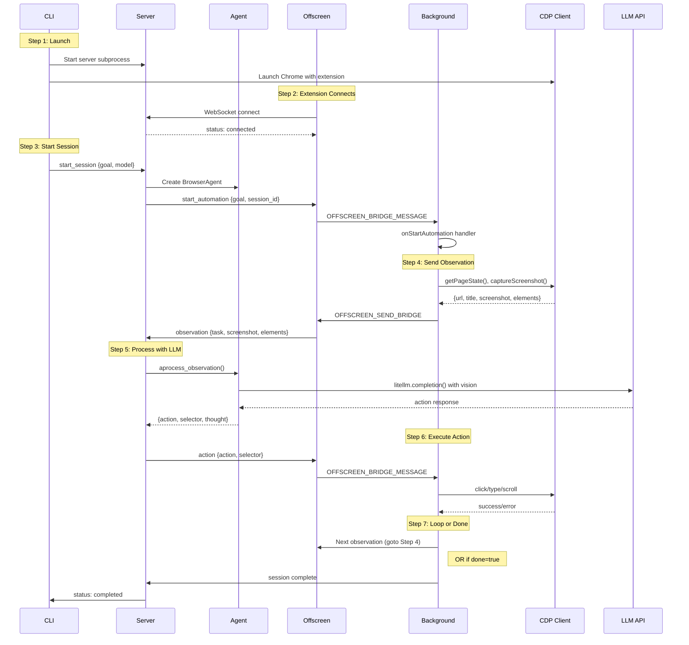

# Browser Automation Architecture

PraisonAI Browser Automation uses an 8-component architecture connecting a CLI, Python server, Chrome extension, and LLM for AI-driven browser control.

## Component Overview

| Component | Location | Purpose |
|-----------|----------|---------|
| **CLI** | `browser/cli.py` | Entry point, command routing |
| **Server** | `browser/server.py` | WebSocket server, message routing |
| **Agent** | `browser/agent.py` | LLM calls, action decisions |
| **Background** | `extension/background/index.ts` | Service worker, message routing |
| **BridgeClient** | `extension/bridge/client.ts` | WebSocket client, observation sending |
| **Offscreen** | `extension/offscreen/index.ts` | Persistent WebSocket, message forwarding |
| **CDP** | Chrome DevTools Protocol | Browser control |
| **LLM** | litellm | Model API calls |

## Automation Flow



## Message Types

### CLI → Server
- `start_session` — Begin automation with goal and model
- `stop_session` — Stop current automation

### Server → Extension  
- `start_automation` — Trigger automation flow in extension
- `action` — Tell extension which action to execute

### Extension → Server
- `observation` — Current page state with screenshot
- `heartbeat` — Keep connection alive

## Debug Logging Format

When `--debug` is enabled, logs follow this format enabling **function-by-function flow tracing**:

```
[COMPONENT][STEP] function:file → message
```

**Components:** `SERVER`, `AGENT`, `SESSION`, `CLI`  
**Steps:** `ENTRY`, `EXIT`, `CALL`, `RECV`, `SEND`, `DATA`, `ERROR`, `DECISION`

### Full Flow Example

A successful automation trace looks like this:

```log
# CLI starts session
[SERVER][ENTRY] _handle_connection:server.py client_id=abc12345, total_connections=2
[SERVER][ENTRY] _handle_start_session:server.py goal='search google...', model=gpt-4o, max_steps=20
[SERVER][CALL] BrowserAgent.__init__:server.py model=gpt-4o, max_steps=20
[AGENT][ENTRY] __init__:agent.py model=gpt-4o, max_steps=20, session_id=None
[AGENT][EXIT] __init__:agent.py → BrowserAgent created
[SESSION][ENTRY] create_session:sessions.py goal='search google...', session_id=xyz789
[SESSION][EXIT] create_session:sessions.py → session_id=xyz789
[SERVER][DATA] _handle_start_session:server.py session_id=xyz789, agent_model=gpt-4o

# Extension sends observation
[SERVER][ENTRY] _handle_observation:server.py step=1, url='https://google.com...', screenshot=True, elements=15
[SERVER][CALL] agent.aprocess_observation:server.py step=1
[AGENT][ENTRY] process_observation:agent.py step=1, url='https://google.com...', elements=15
[AGENT][DECISION] process_observation:agent.py model=gpt-4o, vision_capable=True, has_screenshot=True, use_vision=True
[AGENT][CALL] litellm.completion:agent.py model=gpt-4o, mode=vision
[AGENT][RECV] litellm.completion:agent.py time=1.42s, tokens=1523
[AGENT][DATA] _parse_response:agent.py action=type, selector=#search...
[AGENT][EXIT] process_observation:agent.py → action=type, done=False, elapsed=1.45s
[SERVER][RECV] agent.aprocess_observation:server.py → action=type, done=False, time=1.45s
[SERVER][SEND] _handle_observation:server.py broadcasting to 2 connections

# Error example
[AGENT][ERROR] process_observation:agent.py → AuthenticationError: Invalid API key, elapsed=0.23s
```

### Tracing Errors

When an error occurs, the logs show exactly which function failed and what was happening:

```log
[SERVER][ENTRY] _handle_observation:server.py step=1, url='...', screenshot=True, elements=12
[SERVER][CALL] agent.aprocess_observation:server.py step=1
[AGENT][ENTRY] process_observation:agent.py step=1, url='...', elements=12
[AGENT][CALL] litellm.completion:agent.py model=gemini/gemini-3-flash-preview, mode=vision
[AGENT][ERROR] process_observation:agent.py → AuthenticationError: GEMINI_API_KEY not set, elapsed=0.05s
[SERVER][ERROR] agent.aprocess_observation:server.py → AuthenticationError: GEMINI_API_KEY not set, time=0.06s
```

## Pre-flight Checks

The CLI performs automatic API key validation before starting:

```
🚀 PraisonAI Browser Launch
   Chrome: /Users/.../chrome-for-testing/...
   Extension: /Users/.../praisonai-chrome-extension/dist
   Goal: search google

⚠️  WARNING: GEMINI_API_KEY is not set!
   Model 'gemini/gemini-3-flash-preview' requires this API key to work.
   Set it with: export GEMINI_API_KEY="your-key-here"
```


## Diagnostics

### Health Check Commands

```bash
# Run all diagnostics
praisonai browser doctor

# Check specific components
praisonai browser doctor server      # Bridge server status
praisonai browser doctor chrome      # Chrome CDP status
praisonai browser doctor extension   # Extension loaded status
praisonai browser doctor bridge      # WebSocket connectivity
praisonai browser doctor api-keys    # API key configuration
praisonai browser doctor env         # Environment info
praisonai browser doctor agent       # LLM capability test
praisonai browser doctor flow        # Full automation flow test
```

### JSON Output for CI/CD

```bash
praisonai browser doctor --json
praisonai browser doctor flow --json
```

## Common Issues

### "wait" Loop Problem
**Symptom:** Agent returns `action: wait` repeatedly

**Causes:**
1. **Missing API key** — Set `GEMINI_API_KEY` or `OPENAI_API_KEY`
2. **Model not vision-capable** — Use `gpt-4o`, `gemini/gemini-2.0-flash`, etc.
3. **Extension not connected** — Check `praisonai browser doctor bridge`

**Debug:**
```bash
praisonai browser doctor api-keys --validate
praisonai browser doctor agent --model gemini/gemini-2.0-flash
```

### Extension Not Found
**Symptom:** `doctor extension` fails

**Solution:**
1. Ensure Chrome launched with extension: `--load-extension=/path/to/dist`
2. Or install extension at `chrome://extensions`

### Bridge Server Not Running
**Symptom:** `doctor bridge` fails

**Solution:**
```bash
praisonai browser start
# or use launch which auto-starts server
praisonai browser launch "search google"
```
