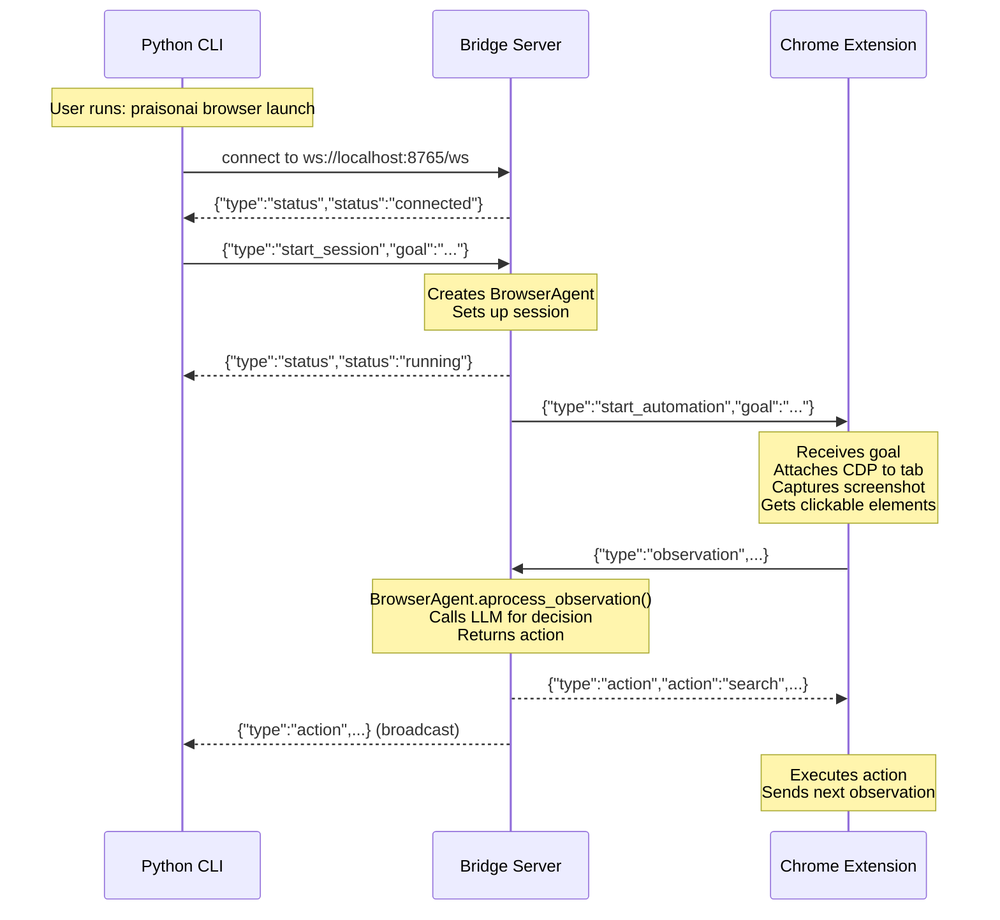

# Browser Extension Architecture

The PraisonAI browser automation uses a 3-layer architecture for AI-powered browser control.

## Overview



## Components

### 1. Python CLI
Launches Chrome and initiates automation sessions.

```bash
# Simple usage
praisonai browser launch "go to google and search for AI"

# Force extension mode
praisonai browser launch "go to google" --engine extension
```

### 2. Bridge Server
FastAPI WebSocket server that routes messages and hosts the BrowserAgent.

```python
from praisonai.browser import BrowserServer

server = BrowserServer(port=8765)
server.start()  # Starts on http://localhost:8765
```

### 3. Chrome Extension
Manifest V3 extension with background service worker.

- **CDP Debugger**: Controls page via Chrome DevTools Protocol
- **Screenshot Capture**: Sends JPEG images to LLM for vision
- **Element Detection**: Finds clickable elements for agent

## Message Types

| Type | Direction | Description |
|------|-----------|-------------|
| `start_session` | CLI → Server | Start new automation |
| `observation` | Ext → Server | Page state snapshot |
| `action` | Server → Ext | Next action to execute |
| `status` | Server → Both | Session status updates |
| `stop_session` | Any → Server | End session |

## Troubleshooting

### Extension Not Connecting

```bash
# Check if bridge server is running
curl http://localhost:8765/health

# Kill stale processes
pkill -f "praisonai_chrome_"
```

### Debug Mode

```bash
praisonai browser launch "test" --debug
```

This enables verbose logging and saves screenshots to `~/.praisonai/browser_screenshots/`.
