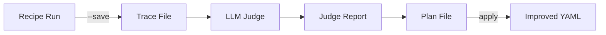

## Overview

LLM as Judge evaluates your agent workflows using AI to analyze performance, detect issues, and suggest improvements. It works with [Context Replay](/features/replay) traces to provide deep insights.



## Quick Start

<Steps>
  <Step title="Run with Trace">
    ```bash
    praisonai recipe run my-recipe --save --name my-trace
    ```
  </Step>
  <Step title="Judge the Trace">
    ```bash
    praisonai recipe judge my-trace --yaml agents.yaml
    ```
  </Step>
  <Step title="Apply Improvements">
    ```bash
    praisonai recipe apply judge_plan.yaml --confirm
    ```
  </Step>
</Steps>

## Evaluation Criteria

The judge evaluates each agent on **6 criteria**:

| Criterion | Score | Description |
|-----------|-------|-------------|
| **Task Achievement** | 1-10 | Did the agent accomplish its goal? |
| **Context Utilization** | 1-10 | Was the context effectively used? |
| **Output Quality** | 1-10 | Is the output high quality and relevant? |
| **Instruction Following** | 1-10 | Did the agent follow specific instructions? |
| **Hallucination** | 1-10 | 10=no fabrication, 1=severe hallucination |
| **Error Handling** | 1-10 | How well did the agent handle errors? |

## How It Works


## CLI Commands

### Judge a Trace

```bash
praisonai recipe judge <trace-id> [OPTIONS]
```

**Options:**
| Option | Description |
|--------|-------------|
| `--yaml FILE` | YAML file for context-aware evaluation |
| `--output FILE` | Save plan to specific file |
| `--model MODEL` | LLM model for judging (default: gpt-4o-mini) |

### Apply Improvements

```bash
praisonai recipe apply <plan-file> [OPTIONS]
```

**Options:**
| Option | Description |
|--------|-------------|
| `--confirm` / `-c` | Apply without confirmation |
| `--dry-run` | Preview changes without applying |
| `--fix-ids IDS` | Apply specific fixes only |
| `--no-backup` | Skip creating backup |

## Example Output

### Judge Report

```bash
praisonai recipe judge run-abc123 --yaml agents.yaml
```

```
============================================================
  LLM JUDGE REPORT: run-abc123
============================================================

  Timestamp: 2026-01-24T06:01:33
  Agents Evaluated: 3
  Overall Score: 7.86/10

  AGENT SCORES:
    Research Agent:
      Task Achievement: 8.0/10
      Context Utilization: 7.0/10
      Output Quality: 8.0/10
      Instruction Following: 9.0/10
      Hallucination: 8.0/10
      Error Handling: 10.0/10
      Overall: 8.33/10
      Tool Calls (1):
        - tavily_search: completeness=9.0/10

    Writer Agent:
      Task Achievement: 8.0/10
      Context Utilization: 9.0/10
      Output Quality: 8.0/10
      Instruction Following: 9.0/10
      Hallucination: 9.0/10
      Error Handling: 10.0/10
      Overall: 8.83/10

  CONTEXT FLOW:
    Research Agent → Writer Agent: 10.0/10 ✓

  RECOMMENDATIONS:
    - Research Agent: Include more specific citations
    - Writer Agent: Ensure all sections are complete

============================================================
```

### Plan Preview

```bash
praisonai recipe apply judge_plan.yaml --dry-run
```

```
============================================================
  PREVIEW: Changes to be applied
============================================================
  File: agents.yaml
  Fixes: 4

  [MEDIUM] fix_abc123
    Agent: Research Agent
    Type: append_instruction
    Path: agents.Research Agent.instructions
    New: IMPROVEMENT: Include specific citations...

  [LOW] fix_def456
    Agent: Writer Agent
    Type: append_instruction
    Path: agents.Writer Agent.instructions
    New: IMPROVEMENT: Ensure all sections complete...

============================================================
🔍 Dry run - no changes applied
```

## Tool Evaluation

Each tool call is evaluated for:

- **Input Quality** - Was the input well-formed?
- **Output Utilization** - Was the output fully used?
- **Result Completeness** - Was the full result captured?
- **Error Detection** - Were there any errors?

```
Tool Calls (2):
  - tavily_search: completeness=9.0/10
  - create_wp_post: completeness=8.0/10
    Issues: unexpected keyword argument
```

## Context Flow Analysis

The judge tracks how context flows between agents:


**Scores:**
- `10/10 ✓` - Full context passed
- `5-9/10` - Partial context
- `<5/10 ⚠️` - Content loss detected

## Content Loss Detection

The judge detects when important content is lost:

```
⚠️  CONTENT LOSS DETECTED:
  - Tool 'tavily_search' result was truncated
  - LLM response was truncated for agent 'Writer'
```

## Fix Types

The judge generates different fix types:

| Fix Type | Description |
|----------|-------------|
| `append_instruction` | Add guidance to existing instructions |
| `add_expected_output` | Specify expected output format |
| `modify_context_config` | Adjust context settings |
| `suggestion` | General improvement suggestion |

## Best Practices

<CardGroup cols={2}>
  <Card title="Run Multiple Times" icon="repeat">
    Judge the same trace multiple times to get consistent scores
  </Card>
  <Card title="Use YAML Context" icon="file-code">
    Always provide `--yaml` for context-aware evaluation
  </Card>
  <Card title="Review Before Apply" icon="eye">
    Use `--dry-run` to preview changes before applying
  </Card>
  <Card title="Backup Your Files" icon="copy">
    The apply command creates backups by default
  </Card>
</CardGroup>

## Integration with Recipes

```bash
# Full workflow: run → judge → apply
praisonai recipe run my-recipe --save --name test-run
praisonai recipe judge test-run --yaml agents.yaml --output plan.yaml
praisonai recipe apply plan.yaml --dry-run
praisonai recipe apply plan.yaml --confirm
```

## Programmatic Usage

```python
from praisonai.replay import ContextTraceReader, ContextEffectivenessJudge
from praisonai.replay.judge import generate_plan_from_report, format_judge_report

# Load trace
reader = ContextTraceReader()
events = reader.read_trace("my-trace")

# Judge
judge = ContextEffectivenessJudge(model="gpt-4o-mini")
report = judge.judge_trace(events, session_id="my-trace", yaml_file="agents.yaml")

# Display
print(format_judge_report(report))

# Generate plan
plan = generate_plan_from_report(report, yaml_file="agents.yaml")
```
