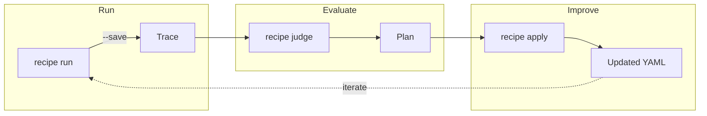
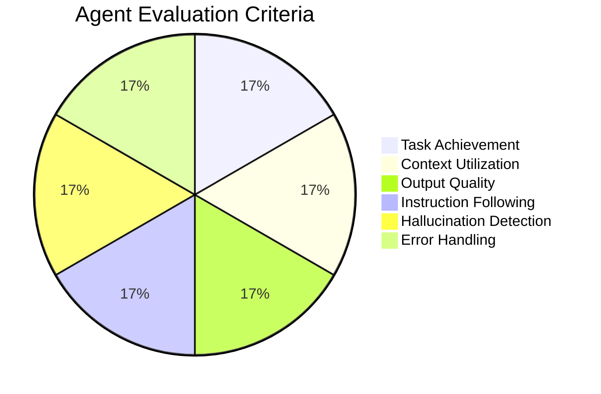

## Overview

The Recipe Workflow provides a complete cycle for running, evaluating, and improving agent configurations.



## Commands

### Run a Recipe

```bash
praisonai recipe run <recipe-name> [OPTIONS]
```

| Option | Description |
|--------|-------------|
| `--save` | Save execution trace |
| `--name NAME` | Custom trace name |
| `--var KEY=VALUE` | Set variables |
| `--debug` | Enable debug output |
| `--verbose` | Verbose output |

**Example:**
```bash
praisonai recipe run ai-topic-gatherer --save --name my-trace --var topic="AI 2026"
```

### Judge a Trace

```bash
praisonai recipe judge <trace-id> [OPTIONS]
```

| Option | Description |
|--------|-------------|
| `--yaml FILE` | YAML for context-aware evaluation |
| `--output FILE` | Output plan file |
| `--model MODEL` | Judge model (default: gpt-4o-mini) |

**Example:**
```bash
praisonai recipe judge my-trace --yaml agents.yaml --output plan.yaml
```

### Apply Improvements

```bash
praisonai recipe apply <plan-file> [OPTIONS]
```

| Option | Description |
|--------|-------------|
| `--confirm` / `-c` | Apply without confirmation |
| `--dry-run` | Preview only |
| `--fix-ids IDS` | Apply specific fixes |
| `--no-backup` | Skip backup |

**Example:**
```bash
# Preview changes
praisonai recipe apply plan.yaml --dry-run

# Apply with confirmation
praisonai recipe apply plan.yaml --confirm
```

## Complete Workflow

<Steps>
  <Step title="Run Recipe with Trace">
    ```bash
    praisonai recipe run ai-wordpress-post-generator \
      --save --name wp-test \
      --var topic="AI News"
    ```
  </Step>
  
  <Step title="Judge the Execution">
    ```bash
    praisonai recipe judge wp-test \
      --yaml agents.yaml \
      --output improvements.yaml
    ```
  </Step>
  
  <Step title="Review Suggestions">
    ```bash
    praisonai recipe apply improvements.yaml --dry-run
    ```
  </Step>
  
  <Step title="Apply Improvements">
    ```bash
    praisonai recipe apply improvements.yaml --confirm
    ```
  </Step>
  
  <Step title="Re-run and Verify">
    ```bash
    praisonai recipe run ai-wordpress-post-generator \
      --save --name wp-test-v2 \
      --var topic="AI News"
    ```
  </Step>
</Steps>

## Evaluation Metrics

The judge evaluates each agent on 6 criteria:



| Metric | Description |
|--------|-------------|
| Task Achievement | Did the agent complete its goal? |
| Context Utilization | Was context effectively used? |
| Output Quality | Is output high quality? |
| Instruction Following | Did agent follow instructions? |
| Hallucination | 10=accurate, 1=fabricated |
| Error Handling | How well were errors handled? |

## Fix Types

The judge generates actionable fixes:

| Type | Description |
|------|-------------|
| `append_instruction` | Add guidance to instructions |
| `add_expected_output` | Specify output format |
| `modify_context_config` | Adjust context settings |
| `suggestion` | General improvement |

## Example Output

### Judge Report

```
============================================================
  LLM JUDGE REPORT: wp-test
============================================================

  Overall Score: 7.86/10
  Agents Evaluated: 6

  AGENT SCORES:
    Research Agent:
      Task Achievement: 8.0/10
      Context Utilization: 7.0/10
      Output Quality: 8.0/10
      Instruction Following: 9.0/10
      Hallucination: 8.0/10
      Error Handling: 10.0/10
      Overall: 8.33/10

  CONTEXT FLOW:
    Research Agent → Writer Agent: 10.0/10 ✓
    Writer Agent → Publisher: 10.0/10 ✓

  RECOMMENDATIONS:
    - Research Agent: Include specific citations
    - Writer Agent: Ensure all sections complete
============================================================
```

### Plan Preview

```
============================================================
  PREVIEW: Changes to be applied
============================================================

  [MEDIUM] fix_abc123
    Agent: Research Agent
    Type: append_instruction
    Path: agents.Research Agent.instructions
    New: IMPROVEMENT: Include specific citations...

  [LOW] fix_def456
    Agent: Writer Agent
    Type: append_instruction
    New: IMPROVEMENT: Ensure sections complete...

============================================================
```

## Best Practices

<CardGroup cols={2}>
  <Card title="Save All Runs" icon="floppy-disk">
    Always use `--save` to capture traces for analysis
  </Card>
  <Card title="Name Your Traces" icon="tag">
    Use `--name` for easy identification
  </Card>
  <Card title="Preview First" icon="eye">
    Always `--dry-run` before applying
  </Card>
  <Card title="Iterate" icon="rotate">
    Run → Judge → Apply → Repeat
  </Card>
</CardGroup>

## Viewing Traces

Use the replay commands to inspect traces:

```bash
# List all traces
praisonai replay list

# View trace details
praisonai replay context my-trace --dump

# Full content (no truncation)
praisonai replay context my-trace --dump --full

# Statistics
praisonai replay context my-trace --stats
```

## Related

- [Context Replay](/features/replay) - Trace capture and viewing
- [LLM as Judge](/features/llm-judge) - Evaluation details
